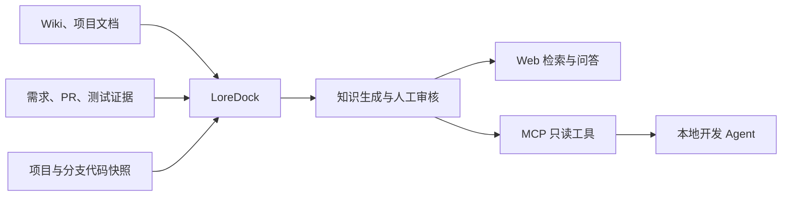

# LoreDock

> 面向开发者与本地 Agent 的项目业务上下文知识平台。

LoreDock 用于把散落在公司 Wiki、项目文档、需求、PR、Commit、测试记录和代码快照中的信息，沉淀为可维护、可检索、可引用的团队知识。

它重点回答代码本身难以回答的问题：业务是什么、为什么这样设计、有哪些约束、过去踩过什么坑，以及一次需求最终由哪些代码实现。

## 当前状态

项目目前处于 **MVP 规格设计阶段**，尚未提供可运行版本。当前仓库主要包含需求基线、技术调研、OpenSpec 配置以及面向编码 Agent 的协作规范。

## 目标场景

- 管理通用业务知识、项目知识和分支级知识；
- 导入并改善公司内部 Wiki 内容的检索体验；
- 根据项目、分支和 Commit 管理轻量代码快照；
- 提供带来源引用、证据不足时能够拒答的 Web 问答；
- 将“需求文档—PR/Commit—代码实现—测试证据”整理为可审核的知识文档；
- 通过 MCP 为 Claude Code、Codex 等本地 Agent 提供业务上下文；
- 让本地 Agent 以开发者工作区中的最新代码为事实，LoreDock 只补充代码中缺失的业务背景和历史决策。

## MVP 工作流



知识 Agent 只能读取知识和代码、生成草稿，不得绕过人工审核直接发布正式知识。

## 计划中的核心能力

### 知识管理

- Markdown/纯文本知识的新建、导入、编辑、审核、发布和归档；
- 通用、项目、分支三级知识范围；
- 来源、版本、更新时间和过期状态管理；
- 自动生成内容与人工维护内容分离。

### 搜索与问答

- 关键词、向量语义和代码全文混合检索；
- 项目与分支范围隔离；
- 回答展示知识文档、分支、Commit 和文件路径等来源；
- 证据不足时拒答并记录知识缺口。

### 需求到实现的知识沉淀

- 导入需求材料、PR 信息、Diff、变更文件和测试说明；
- 生成需求条目与实现文件之间的映射；
- 整理业务规则、调用链、数据变化、兼容约束和测试证据；
- 人工审核通过后才进入正式知识索引。

### MCP

MVP 计划通过 Streamable HTTP 暴露只读工具：

- `knowledge_search`：检索业务知识；
- `document_read`：读取指定知识文档；
- `code_search`：搜索指定项目和分支的代码快照。

## 技术方向

| 层次 | 计划采用的技术 |
|---|---|
| 前端 | Vue 3、TypeScript、Vite |
| 后端 | Java 21、Spring Boot |
| 业务数据库与向量 | PostgreSQL、pgvector |
| 代码全文检索 | Apache Lucene |
| 大模型 | OpenAI-compatible 模型接口 |
| Embedding | CPU 可运行的中文向量模型 |
| MCP | Streamable HTTP |
| 部署 | Docker Compose、内网单机部署 |

技术选型仍以已确认的 OpenSpec 规格为准，调研文档中的建议不自动等同于最终实现。

## 开发方式

项目采用 **SDD + TDD**：

1. 先通过 OpenSpec 明确 proposal、specs、design 和 tasks；
2. 后端先定义接口与契约，再编写实现；
3. 根据规格先编写有业务意义的失败测试；
4. 编写使测试通过的最小实现；
5. 在测试保护下重构并完成验证；
6. 同步规格并归档 change。

测试数量不是目标。每个测试用例都必须说明业务目的和要防止的回归。完整规则参见 [AGENTS.md](AGENTS.md)，Claude Code 使用说明参见 [CLAUDE.md](CLAUDE.md)。

## 文档

- [MVP 需求基线](docs/product/项目业务上下文知识库_MVP需求文档_v1.0.md)
- [MVP 选题说明](docs/product/项目业务上下文知识库_MVP_选题说明.md)
- [Java 技术栈调研](docs/research/Java技术栈调研与MVP落地建议.md)
- [开源代码知识库项目调研](docs/research/开源代码知识库项目调研_v0.1.md)
- [文档目录说明](docs/README.md)

## 仓库结构

```text
LoreDock/
├── .claude/       Claude Code 的 OpenSpec 命令与技能
├── .codex/        Codex 的 OpenSpec 技能
├── docs/          产品文档、调研资料和历史归档
├── openspec/      当前规格、变更工件和 OpenSpec 配置
├── AGENTS.md      所有编码 Agent 的统一开发规范
└── CLAUDE.md      Claude Code 执行说明
```

## 信息安全

本仓库计划公开发布。请勿提交以下内容：

- 公司内部源代码或未脱敏的 Diff；
- 公司 Wiki 原文、内部需求文档或会议记录；
- Token、密码、密钥、内部域名和网络地址；
- 客户、员工或其他真实敏感数据。

公开仓库只保存通用产品实现、脱敏示例和公开文档；公司内部数据仅在内网部署环境中处理。

## License

开源许可证尚未确定。在正式发布首个版本前补充许可证文件。

