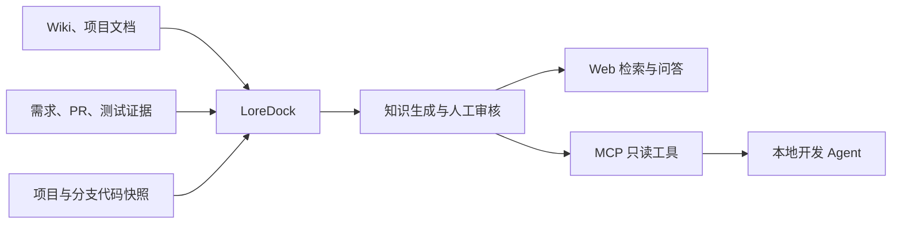

# LoreDock

> 面向开发者与本地 Agent 的项目业务上下文知识平台。

LoreDock 用于把散落在公司 Wiki、项目文档、需求、PR、Commit、测试记录和代码快照中的信息，沉淀为可维护、可检索、可引用的团队知识。

它重点回答代码本身难以回答的问题：业务是什么、为什么这样设计、有哪些约束、过去踩过什么坑，以及一次需求最终由哪些代码实现。

## 当前状态

MVP 开发计划 T1“工程骨架与基础设施”、T2“认证、项目与分支管理”、T3“知识文档完整生命周期”、T4“代码快照与 Lucene 检索”、T5“知识关键词、语义与混合检索”和 T6A“单 Agent 问答运行时”已完成。当前提供严格按通用、项目和分支隔离的知识/代码检索，以及固定 Skill、固定活动版本、只读工具白名单、可信引用、拒答、运行事实和持久事件。T7 将把该应用能力接入 Web；用户注册、用户表和账号管理后台不在 MVP 范围内。

## 目标场景

- 管理通用业务知识、项目知识和分支级知识；
- 导入并改善公司内部 Wiki 内容的检索体验；
- 根据项目、分支和 Commit 管理轻量代码快照；
- 提供带来源引用、证据不足时能够拒答的 Web 问答；
- 将“需求文档—PR/Commit—代码实现—测试证据”整理为可审核的知识文档；
- 通过 MCP 为 Claude Code、Codex 等本地 Agent 提供业务上下文；
- 让本地 Agent 以开发者工作区中的最新代码为事实，LoreDock 只补充代码中缺失的业务背景和历史决策。

## MVP 工作流



知识 Agent 只能读取知识和代码、生成草稿，不得绕过人工审核直接发布正式知识。

## 计划中的核心能力

### 知识管理

- Markdown/纯文本知识的新建、导入、编辑、审核、发布和归档；
- 通用、项目、分支三级知识范围；
- 来源、版本、更新时间和过期状态管理；
- 自动生成内容与人工维护内容分离。

### 搜索与问答

- 关键词、向量语义和代码全文混合检索；
- 项目与分支范围隔离；
- 回答展示知识文档、分支、Commit 和文件路径等来源；
- 证据不足时拒答并记录知识缺口。

### 需求到实现的知识沉淀

- 导入需求材料、PR 信息、Diff、变更文件和测试说明；
- 生成需求条目与实现文件之间的映射；
- 整理业务规则、调用链、数据变化、兼容约束和测试证据；
- 人工审核通过后才进入正式知识索引。

### MCP

MVP 计划通过 Streamable HTTP 暴露只读工具：

- `knowledge_search`：检索业务知识；
- `document_read`：读取指定知识文档；
- `code_search`：搜索指定项目和分支的代码快照。

## 技术方向

| 层次 | 计划采用的技术 |
|---|---|
| 前端 | Vue 3、TypeScript、Vite |
| 后端 | Java 21、Spring Boot |
| 业务数据库与向量 | PostgreSQL、pgvector |
| 代码全文检索 | Apache Lucene |
| 大模型 | OpenAI-compatible 模型接口 |
| Embedding | CPU 可运行的中文向量模型 |
| MCP | Streamable HTTP |
| 本地开发 | 前后端运行于宿主机，Docker Compose 仅运行数据库和后续中间件 |
| 目标部署 | Docker Compose、内网单机部署 |

技术选型仍以已确认的 OpenSpec 规格为准，调研文档中的建议不自动等同于最终实现。

### T1–T6A 冻结版本矩阵

以下版本均为 2026-07-29 从官方发布源核验的 GA 版本。JDK 21 和 Node.js 24 安装在开发机，Maven 使用仓库 Wrapper；Docker 只承载 PostgreSQL/pgvector 等服务依赖。

| 组件 | 冻结版本 | 锁定位置 |
|---|---:|---|
| Java | 21.0.12 | Maven Enforcer、本地运行环境 |
| Maven | 3.9.12 | Maven Wrapper |
| Spring Boot | 3.5.16 | `backend/pom.xml` Parent |
| Spring AI BOM | 1.1.2 | `backend/pom.xml` |
| Spring AI Alibaba | 1.1.2.3 | `backend/pom.xml` BOM 与 Agent Framework |
| Apache Lucene | 10.5.0 | `backend/pom.xml` 属性；T4 使用 core、analysis-common、highlighter 最小模块 |
| Flyway | 11.7.2 | `backend/pom.xml` 属性 |
| Testcontainers | 2.0.5 | `backend/pom.xml` BOM |
| MyBatis-Plus | 3.5.17 | `backend/pom.xml`，使用 Spring Boot 3 Starter |
| Lombok | 1.18.46 | `backend/pom.xml` |
| Sa-Token | 1.45.0 | `backend/pom.xml`，使用 Spring Boot 3 Starter |
| Spring Security Crypto | 跟随 Spring Boot 3.5.16 | 仅使用 BCrypt，不启用 Spring Security 认证链 |
| 问答模型 | `deepseek-v4-flash` | DeepSeek OpenAI 兼容 Chat Completions；部署 secret 注入 |
| Apache Commons Compress | 1.28.0 | `backend/pom.xml`；Apache-2.0，仅用于 ZIP 中央目录与条目类型检查 |
| ONNX Runtime | 1.28.0 | `backend/pom.xml`；MIT，T5 离线 CPU Embedding |
| DJL Hugging Face Tokenizers | 0.36.0 | `backend/pom.xml`；Apache-2.0，只读取本地 `tokenizer.json` |
| BAAI/bge-small-zh-v1.5 | revision `7999e1d` | 运维离线准备；MIT；SHA-256 由环境变量锁定 |
| PostgreSQL / pgvector | 17 / 0.8.1 | `pgvector/pgvector:0.8.1-pg17` |
| Node.js | 24.18.0 | `.nvmrc`、`.node-version`、本地运行环境 |
| npm | 11.16.0 | `frontend/package.json` |
| Vue | 3.5.40 | `frontend/package.json` |
| Vue Router | 5.2.0 | `frontend/package.json` |
| TypeScript | 6.0.3 | `frontend/package.json`，与 `vue-tsc` 3.3.8 兼容的最新 GA |
| Vite | 8.1.5 | `frontend/package.json` |
| Geist / Geist Mono | 1.7.2 | `frontend/src/assets/fonts`，自托管 WOFF2 与 OFL 许可证 |

版本选择遵循 `openspec/changes/establish-project-foundation/design.md`：使用正式发布版并精确锁定，不使用动态范围、SNAPSHOT 或 Milestone。Spring AI 和 Lucene 在 T1 只冻结兼容基线，不提前接入业务流程。

## 本地启动

前置条件：Docker Desktop、JDK 21 和 Node.js 24。macOS Homebrew 默认路径已写入脚本，也可以分别通过 `LOREDOCK_JAVA_HOME`、`LOREDOCK_NODE_BIN` 覆盖。

```bash
cp .env.example .env
# 先按下文说明替换 .env 中的账号 BCrypt 哈希和 MCP Token 摘要
./scripts/dev.sh
```

脚本只用 Docker 启动 PostgreSQL/pgvector；Spring Boot 和 Vite 直接在宿主机运行，代码修改可使用各自的本地开发能力。首次启动会执行 `npm ci`，Flyway 会在后端启动时自动迁移空库。

- 前端：<http://localhost:5173>
- 后端状态：<http://localhost:8080/api/v1/system/status>
- liveness：<http://localhost:8080/actuator/health/liveness>
- readiness：<http://localhost:8080/actuator/health/readiness>

### 认证配置

后端必须恰好配置一个 `ADMIN` 和一个 `MEMBER`。用户名由 `LOREDOCK_ADMIN_USERNAME` / `LOREDOCK_MEMBER_USERNAME` 指定，密码只允许以带盐 BCrypt 哈希形式保存。可在本机使用 Apache `htpasswd` 交互生成（输出中仅有哈希）：

```bash
read -rsp "Password: " LOREDOCK_HASH_INPUT; echo
htpasswd -bnBC 12 "" "$LOREDOCK_HASH_INPUT" | tr -d ':\n'; echo
unset LOREDOCK_HASH_INPUT
```

为 MCP 客户端生成至少 256 bit 的高熵原始 Token，只把其小写 SHA-256 摘要填入 `LOREDOCK_MCP_TOKEN_SHA256`。原始 Token 应保存在客户端密钥库，不得写入仓库或服务端配置。

```bash
openssl rand -hex 32
read -rsp "MCP token: " LOREDOCK_MCP_INPUT; echo
printf '%s' "$LOREDOCK_MCP_INPUT" | shasum -a 256 | awk '{print $1}'
unset LOREDOCK_MCP_INPUT
```

Web 会话 Cookie 名为 `loredock_session`，使用 `HttpOnly`、`SameSite=Strict` 和全站 `/` 路径。本地 HTTP 保持 `LOREDOCK_WEB_COOKIE_SECURE=false`；生产 HTTPS 必须设为 `true`。会话当前仅保存在单实例内存中，应用重启后旧 Cookie 会失效并要求重新登录。

如需准备无敏感内容的验收项目，同时启用 `demo` profile 与显式开关：

```bash
export SPRING_PROFILES_ACTIVE=demo
export LOREDOCK_DEMO_SEED_ENABLED=true
./scripts/dev.sh
```

准备器可重复执行；默认 profile 或开关为 `false` 时不会写入演示数据。

### 离线 Embedding 模型

语义与混合检索使用 `BAAI/bge-small-zh-v1.5` 的锁定 ONNX 导出物。仓库不提交约 91 MiB 的模型文件，也不会在运行时下载。运维人员应在受控环境取得 revision `7999e1d3359715c523056ef9478215996d62a620` 的 `model.onnx` 与 `tokenizer.json`，确认模型许可为 MIT，并在部署目录中离线保存。至少为模型、tokenizer 和运行时原生库预留 512 MiB 内存；本次 Apple Silicon 开发机实测进程上限为 4 GiB、冷初始化约 4.44 秒，预热查询最大 16 毫秒。

```bash
shasum -a 256 models/bge-small-zh-v1.5/model.onnx
# 期望：3a40c6eab3abdf2bd07651031a36038c2dfaf4ebb8d62ddc78f2324b2ff4389a
```

将 `.env.example` 中的两个本地 `file:` URI 与摘要复制到实际 `.env`。首次启用 T5 后，管理员必须触发一次知识索引重建；只有带完整搜索元数据的新 `ACTIVE` generation 才能响应搜索。模型缺失、不可读或摘要不符时，KEYWORD 仍可使用已有完整检索代次，SEMANTIC/HYBRID 明确返回 `KNOWLEDGE_EMBEDDING_UNAVAILABLE`（503），服务不会降级为伪语义结果。

按 `Ctrl+C` 停止前后端。数据库默认继续运行，使用以下命令停止或再次启动：

```bash
docker compose stop database
docker compose up --detach --wait database
```

如需分开运行，先启动数据库，再分别执行：

```bash
cd backend
JAVA_HOME=/opt/homebrew/opt/openjdk@21/libexec/openjdk.jdk/Contents/Home ./mvnw spring-boot:run
```

```bash
cd frontend
PATH=/opt/homebrew/opt/node@24/bin:$PATH npm run dev
```

### T6A 单 Agent 运行配置

`project_qa` 默认关闭，且 T6A 只提供后端应用契约，Web 入口由 T7 接入。启用前应先完成知识索引和目标分支代码快照准备，再通过部署 secret 注入模型密钥：

```bash
export LOREDOCK_AGENT_ENABLED=true
read -rsp "DeepSeek API key: " LOREDOCK_AGENT_MODEL_API_KEY; echo
export LOREDOCK_AGENT_MODEL_API_KEY
```

不要把实际密钥写入 `.env.example`、YAML、数据库、测试或日志。模型名固定为 `deepseek-v4-flash`，默认入口为 DeepSeek 官方 OpenAI 兼容入口；请求不能覆盖模型、端点、项目、分支、commit、知识 generation 或运行限制。若只验证应用、Fake Model 和数据库链路，保持 Agent 关闭即可，不需要外部调用。

运行开始时会固定 `project_qa` Skill、项目、实际分支、活动代码 snapshot/commit、活动知识 generation、模型与策略版本。唯一允许的工具是 `knowledge_search`、`code_search` 和 `code_snippet_read`。业务规则回答至少引用知识，当前实现回答至少引用固定快照代码，混合回答必须同时引用两类证据；证据不足、无快照、越界或引用无效时返回“当前知识库没有足够依据”及稳定原因码。

运行采用专用有界执行器，默认最多 8 步、8 次模型调用、90 秒、每工具 10 条结果、24000 字上下文和 8000 字回答。应用会先聚合并校验结构与引用，再持久化 `ANSWER_DELTA`；阶段、工具、来源、拒答和终态事件可以按序号续读。后端重启会把遗留 `ACCEPTED/RUNNING` 运行终结为 `AGENT_RUN_INTERRUPTED`，T6A 不自动重放模型；检查点恢复属于 T6B。

常见故障按稳定错误处理：

- 未开启、缺少模型 secret 或 Skill 不可用：检查 `LOREDOCK_AGENT_ENABLED`、部署 secret 和启动日志，不要在日志中打印密钥；
- `AGENT_RUNTIME_BUSY`：等待已有运行结束，或在确认机器容量后调整专用执行器；
- `AGENT_EVIDENCE_VERSION_CHANGED`：运行期间知识 generation 或代码 snapshot 已切换，应提交新运行；
- `CODE_SNAPSHOT_NOT_INDEXED`：目标分支没有活动快照，只能回答人工知识，不能声称当前实现；
- `AGENT_CITATION_INVALID`：模型引用不属于本次保留证据，服务端会拒绝模型正文；
- `AGENT_RUN_TIMEOUT` 或模型不可用：运行保留实际计数与脱敏错误，现有文档浏览、知识搜索和代码搜索不受影响。

数据库备份包含 Skill 版本、运行、事件、工具摘要、证据和引用元数据；对象存储还包含内置 Skill 内容。两者应与既有知识/代码备份在同一静默写入窗口保存。详见 [T6A 单 Agent 兼容性与运行架构](docs/architecture/T6A单Agent兼容性验证.md)。

## 测试与验收

```bash
cd backend
JAVA_HOME=/opt/homebrew/opt/openjdk@21/libexec/openjdk.jdk/Contents/Home ./mvnw test
JAVA_HOME=/opt/homebrew/opt/openjdk@21/libexec/openjdk.jdk/Contents/Home ./mvnw verify -Pintegration
```

集成测试使用 Testcontainers 启动真实 PostgreSQL/pgvector，不使用 H2。

显式正式基准还需要本地离线模型；它会使用真实重建器、pgvector 和生产搜索应用端口，机器结果写入 `backend/target/knowledge-search-benchmark-result.json`：

```bash
cd backend
JAVA_HOME=/opt/homebrew/opt/openjdk@21/libexec/openjdk.jdk/Contents/Home ./mvnw \
  -Dloredock.benchmark=true \
  -Dloredock.benchmark.model-dir=/path/to/bge-small-zh-v1.5 \
  -Dit.test=KnowledgeSearchBenchmarkIT \
  test-compile failsafe:integration-test failsafe:verify
```

缺少显式开关时正式基准按条件跳过；设置开关却缺少模型、查询失败、运行中 generation/配置变化、HYBRID Top-5 低于 80%、发生范围/生命周期泄漏或预热查询超过 3 秒时，执行会失败而不会生成伪通过结果。最新人工审查报告见 [T5 知识混合检索基准报告](docs/quality/T5知识混合检索基准报告.md)。

```bash
cd frontend
PATH=/opt/homebrew/opt/node@24/bin:$PATH npm test
PATH=/opt/homebrew/opt/node@24/bin:$PATH npm run build
PATH=/opt/homebrew/opt/node@24/bin:$PATH npm audit --audit-level=high
```

完整本地栈验收可执行 `./scripts/smoke-test.sh`。它使用隔离数据库卷和临时对象目录，验证空库迁移、前后端访问、重启持久性以及停库后的存活/就绪语义，结束后自动清理测试资源。

### T2 HTTP 入口

- Web 认证：`POST /api/auth/login`、`GET /api/auth/session`、`POST /api/auth/logout`；
- 已登录只读查询：`GET /api/projects`、`GET /api/projects/{identifier}?branch=...`；
- 管理员项目管理：`/api/admin/projects/**`；
- MCP 认证边界：`/mcp/**`，使用 `Authorization: Bearer <token>`。T2 仅实现前置校验，尚未提供 MCP 工具。

前端是电脑浏览器页面，通过 Vite 同站代理访问 `/api`。项目、分支、知识文档、生命周期状态和身份始终使用真实 API；T4 已提供后端代码快照接口，完整管理页面仍属于 T12。

### T3 知识文档入口与运行边界

- 已登录只读浏览：`GET /api/knowledge-documents` 与 `GET /api/knowledge-documents/{id}`，必须明确 `GLOBAL` 或项目/分支上下文；
- 管理员文档管理：`/api/admin/knowledge-documents/**`，包含创建、编辑、发布、归档和同范围替代；
- 管理员导入：`POST /api/admin/knowledge-document-imports`，支持严格 UTF-8 的 `.md`、`.markdown`、`.txt` 和包含 Markdown 的 `.zip`；
- 管理员重建：`/api/admin/knowledge-index-jobs`，同一单实例内的活动重建使用 single-flight 复用任务 ID。

默认单文件上传上限为 20 MiB，multipart 请求上限为 21 MiB；反向代理必须至少允许 21 MiB，且不得把更大的代理上限当成应用层配额。ZIP 默认最多 200 个条目、单项展开 2 MiB、累计展开 50 MiB、压缩比 100:1；结构损坏、加密/分卷、重复规范化路径或超额会在创建文档前整批拒绝。

重建在一个 PostgreSQL `REPEATABLE READ` 快照中构建新 generation，验证后原子切换 `ACTIVE`。失败会保留上一个成功 generation 供浏览；归档和范围变更还会在读取时做实时资格复核。single-flight 只保证 MVP 单 JVM 部署，多实例部署前必须增加分布式互斥。

### T4 代码快照入口与运行边界

- 管理员上传与查询：`POST /api/admin/code-snapshots`、`GET /api/admin/code-snapshots`、`GET /api/admin/code-snapshot-jobs/{jobId}`；
- 管理员重建活动快照：`POST /api/admin/code-snapshots/{snapshotId}/reindex`；
- 已登录成员活动状态、检索和片段：`GET /api/projects/{identifier}/code-snapshot`、`GET /api/projects/{identifier}/code-search`、`GET /api/projects/{identifier}/code-snippets`。

上传只接受与扩展名、MIME 和魔数一致的 ZIP，默认外层上限 100 MiB。后台先校验完整中央目录，再逐文件流入 Lucene，不按 ZIP 条目名落盘；默认最多 50000 个条目、单个结构性展开 100 MiB、累计声明展开 1 GiB、压缩比 100:1，且只索引不超过 2 MiB 的完整严格 UTF-8 文本。`.git`、依赖/构建/缓存目录、环境文件、证书、私钥、明显密钥名、二进制和非法 UTF-8 文件不会进入索引，也不能通过片段接口旁路读取。

Lucene 目录先写入 `<generation>.building`，关闭并重开验证后才原子发布为 UUID 目录；数据库随后在短事务中切换活动快照和 generation。失败保留旧活动入口。工作目录与索引目录由 `LOREDOCK_CODE_SNAPSHOT_WORK_ROOT`、`LOREDOCK_CODE_SNAPSHOT_INDEX_ROOT` 控制，二者不得重叠，也不得由请求指定。

### T5 知识搜索入口与运行边界

- 已登录知识搜索：`GET /api/knowledge-search`，明确使用 `GLOBAL` 或 `PROJECT` 上下文；项目查询的空分支固定为 `main`；
- 模式：`KEYWORD`、`SEMANTIC`、`HYBRID`，默认 `HYBRID`；支持标签全包含、格式和来源过滤；
- 服务固定一次请求的完整活动 generation，在候选 SQL 中强制通用/项目/分支范围，再按当前事实表复核发布和范围资格；复核删除结果后不补入越界候选；
- 返回有限片段、来源、更新时间、相关性和匹配方式，不返回完整正文、向量、对象键或内部配置；项目分支没有代码快照时仍返回允许的人工知识，并携带 `CODE_SNAPSHOT_NOT_INDEXED`。

搜索返回 `KNOWLEDGE_INDEX_UNAVAILABLE`（503）时，先确认 T5 部署后是否成功执行过一次重建，以及 `knowledge_index_generation` 的 `ACTIVE` 记录是否有匹配的完整 `knowledge_search_generation` 元数据；不得手工激活 BUILDING。新重建失败会清理未完成 generation 并保留旧 ACTIVE。若 `KNOWLEDGE_EMBEDDING_UNAVAILABLE`（503），核对本地资源可读性、模型 SHA-256、512 维 `sentence_embedding` 输出和内存，不要改成 HTTP URI或关闭校验。

## 数据迁移、备份与故障排查

- Flyway 是表结构变更的唯一入口。不得修改已经执行的 `V*__*.sql`；需要变更时追加新迁移。checksum 不匹配时应恢复历史迁移原文并新增迁移，不要直接执行 `repair` 掩盖差异。
- `readiness` 失败而 `liveness` 成功，通常表示 PostgreSQL 不可用。先检查 `docker compose ps` 和 `docker compose logs database`，再核对 `.env` 的端口、库名和账号。
- 端口冲突时调整 `.env`；若修改后端端口，还需同步 Vite 代理目标。构建工具链错误时确认 `java -version` 为 21、`node --version` 为 24。
- 后端以 `Identity configuration is invalid` 拒绝启动时，检查是否恰好配置两个不同用户名、一个 ADMIN/一个 MEMBER、有效 BCrypt 哈希和 64 位小写十六进制 MCP Token 摘要。错误日志不会回显具体凭据。
- 页面登录成功但刷新后失效时，先确认前后端使用同站代理，生产 HTTPS 环境已开启 Secure Cookie，且期间后端进程没有重启。
- 上传被 413 拒绝时，同时核对反向代理、Spring multipart 和 `LOREDOCK_KNOWLEDGE_IMPORT_*` 业务配额；以最小的一层为实际上限。
- 重新索引失败时，依据任务 ID 查看脱敏摘要；不要手工修改 generation 状态，普通浏览会继续使用上一个成功索引。
- 知识搜索重建失败时，先按任务 ID、generation UUID、模型摘要和错误码排查资源或容量；旧 ACTIVE 仍提供查询。数据库备份已包含事实文档、搜索 generation、分块、关键词和向量；恢复后必须核对活动代次计数与模型摘要，若派生索引不完整则通过管理员入口重建，不手工拼接向量。
- 代码搜索返回 503 时，先确认活动 generation 的 UUID 目录存在且进程可读；不要手工把 `.building` 重命名为活动目录。原始 ZIP 仍在对象存储时，应通过活动快照重建接口恢复。
- 启动日志出现代码索引恢复清理告警时，记录 generation UUID 并检查索引根权限与磁盘空间；单个孤儿清理失败不会替换活动索引，可在解除占用后重启幂等重试。
- 默认 profile 使用便于本地调试的文本控制台日志；生产环境以 `--spring.profiles.active=prod` 启动后启用 Logstash JSON，供日志采集系统解析。
- 数据库备份可执行 `docker compose exec -T database pg_dump -U loredock -d loredock -Fc > loredock.dump`；原始导入文件和代码 ZIP 位于 `LOREDOCK_STORAGE_ROOT`（默认 `data/objects`），必须与数据库来自同一静默写入窗口。`LOREDOCK_CODE_SNAPSHOT_INDEX_ROOT` 是可由原始 ZIP 重建的派生数据：需要恢复后立即查询时一并备份，否则恢复数据库与对象后逐个重建活动快照。`LOREDOCK_CODE_SNAPSHOT_WORK_ROOT` 是临时目录，不应备份。
- T1 后台任务是单实例、进程内有界执行器，不提供分布式调度或自动重放。重启只会把失去心跳的 `RUNNING` 任务终结为 `FAILED/PROCESS_INTERRUPTED`。

更完整的运行约定见 [T1 工程与基础设施架构](docs/architecture/T1工程与基础设施.md)、[T4 代码快照与 Lucene 检索](docs/architecture/T4代码快照与Lucene检索.md) 与 [T5 知识混合检索](docs/architecture/T5知识混合检索.md)。

## 开发方式

项目采用 **SDD + TDD**：

1. 先通过 OpenSpec 明确 proposal、specs、design 和 tasks；
2. 后端先定义接口与契约，再编写实现；
3. 根据规格先编写有业务意义的失败测试；
4. 编写使测试通过的最小实现；
5. 在测试保护下重构并完成验证；
6. 同步规格并归档 change。

测试数量不是目标。每个测试用例都必须说明业务目的和要防止的回归。完整规则参见 [AGENTS.md](AGENTS.md)，Claude Code 使用说明参见 [CLAUDE.md](CLAUDE.md)。

## 文档

- [MVP 需求基线](docs/product/项目业务上下文知识库_MVP需求文档_v1.0.md)
- [MVP 功能开发计划](docs/product/LoreDock_MVP功能开发计划.md)
- [MVP 选题说明](docs/product/项目业务上下文知识库_MVP_选题说明.md)
- [Java 技术栈调研](docs/research/Java技术栈调研与MVP落地建议.md)
- [开源代码知识库项目调研](docs/research/开源代码知识库项目调研_v0.1.md)
- [文档目录说明](docs/README.md)

## 仓库结构

```text
LoreDock/
├── .claude/       Claude Code 的 OpenSpec 命令与技能
├── .codex/        Codex 的 OpenSpec 技能
├── backend/       Java 21 / Spring Boot 后端
├── frontend/      Vue 3 / TypeScript / Vite 前端
├── scripts/       本地开发与全栈冒烟脚本
├── compose.yaml   PostgreSQL/pgvector 等本地服务依赖
├── docs/          产品文档、调研资料和历史归档
├── openspec/      当前规格、变更工件和 OpenSpec 配置
├── AGENTS.md      所有编码 Agent 的统一开发规范
└── CLAUDE.md      Claude Code 执行说明
```

## 信息安全

本仓库计划公开发布。请勿提交以下内容：

- 公司内部源代码或未脱敏的 Diff；
- 公司 Wiki 原文、内部需求文档或会议记录；
- Token、密码、密钥、内部域名和网络地址；
- 客户、员工或其他真实敏感数据。

公开仓库只保存通用产品实现、脱敏示例和公开文档；公司内部数据仅在内网部署环境中处理。

## License

开源许可证尚未确定。在正式发布首个版本前补充许可证文件。
