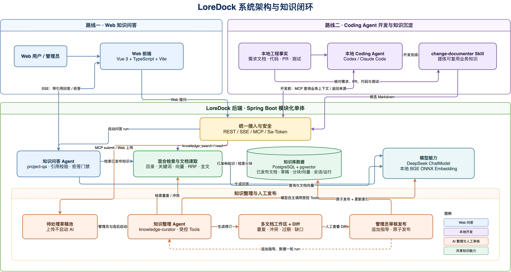
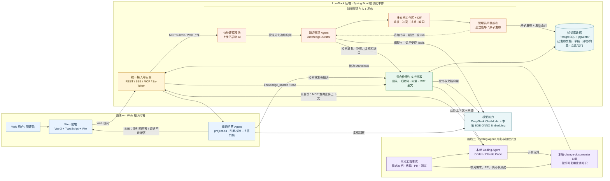

# LoreDock 当前 MVP 系统架构图

> 本图依据 2026-08-12 的需求基线、MVP 开发计划和当前代码整理，用于毕业答辩。它表达当前已实现的逻辑架构，不代表未来规划或生产部署拓扑。

## 1. 总图要表达的两条路线

这张图同时表达系统架构和知识闭环，但不展开 Controller、Service、Mapper、线程池、Skill Registry、Tool Callback、Checkpoint 等实现细节。

### 路线一：Web 知识问答

```text
Web 用户提问 → 知识问答 Agent → 检索已发布知识 → 模型生成 → 引用校验
→ SSE 返回带引用回答；证据不足则拒答
```

### 路线二：Coding Agent 开发与知识沉淀

```text
需求文档 / 本地代码 / PR / 测试
→ Coding Agent 开发前通过 MCP 查询业务上下文
→ 完成开发
→ 本地 change-documenter Skill 提炼候选 Markdown
→ 上传待处理草稿
→ 管理员勾选后启动知识整理 Agent
→ 检索重复、冲突、过期和缺口
→ 生成多文档工作区与 Diff
→ 管理员审核并原子发布
→ 更新索引，成为后续问答和开发可复用的知识
```

当前答辩图保留 14 个业务节点，并把知识问答与知识整理明确画成两个独立 Agent。代码快照/Lucene 和本地对象存储不进入本图。

## 2. 答辩版总体架构



可编辑源文件：[`LoreDock系统架构图.drawio`](./LoreDock系统架构图.drawio)。

### Mermaid 可维护源图



## 3. 答辩时的核心讲法

LoreDock 采用 **Vue 前端 + Spring Boot 模块化单体 + PostgreSQL/pgvector**。系统没有拆成微服务，各业务模块内部遵循 `Controller → Service → Mapper → PostgreSQL`，跨模块通过 `api` 契约协作。

当前有两类入口：Web 面向管理员和组内成员，提供知识管理、带引用问答、知识整理与人工发布；MCP 面向本地 Coding Agent，只提供受范围约束的已发布知识查询和候选 Markdown 提交。两类入口复用同一套知识、项目范围和草稿 Service，避免形成两套业务规则。

知识问答路线由 `qa` 创建会话与轮次，`agent` 直接装配 Spring AI Alibaba `ReactAgent`、本地 `project-qa` Skill 和只读知识检索 Tool。Agent 只使用当前项目与通用范围内的已发布文档，调用 ChatModel 生成结果，再由服务端完成证据与引用校验；证据不足时返回拒答。

知识沉淀路线从开发者本地开始：Coding Agent 在开发前通过 MCP 查询业务上下文，开发完成后由 `change-documenter` Skill 只读核对需求、PR、代码和测试，生成候选 Markdown。平台上传只创建待处理草稿；管理员勾选后，独立的 `knowledge-curator` Agent 才会检索重复、冲突、过期和缺口，修订多文档工作区并生成 Diff。Agent 没有发布 Tool，最终必须由管理员审核后原子发布并更新索引。

混合检索不依赖 Elasticsearch：文档在本地使用 BGE ONNX 模型生成向量，关键词候选和 pgvector 向量候选在 PostgreSQL 中完成，并通过 RRF 融合。代码快照与 Lucene 仅保留为默认关闭的实验能力，不属于当前答辩主链路。

## 4. 当前范围与已知边界

- 当前是单应用实例和单 PostgreSQL 数据库，后台任务不是分布式调度。
- Web 流程不暴露分支操作，后端统一解析到默认 `main`；项目问答检索“当前项目知识 + 通用知识”。
- ChatModel 可以关闭；模型不可用时普通知识浏览和检索仍是独立能力。
- PostgreSQL 保存知识文档、草稿、检索分块/向量、问答与 Agent 事件，以及 Spring AI Alibaba Graph Checkpoint。
- 当前开发计划中 T1～T9 的代码已完成，T8 仍需真实模型演示验收，T10 集成部署与最终答辩验收尚未完成。

## 5. 对应代码与文档依据

- 产品范围：`docs/product/项目业务上下文知识库_MVP需求文档_v1.0.md`
- 实施状态：`docs/product/LoreDock_MVP功能开发计划.md`
- 模块边界：`docs/architecture/LoreDock核心业务链路与模块边界.md`
- 前端入口：`frontend/src/router/index.ts`
- 后端模块：`backend/src/main/java/io/github/loredock/`
- Agent 装配：`agent/service/impl/ProjectQaAgentExecutor.java`、`agent/service/KnowledgeCurationRunExecutor.java`
- MCP 工具：`knowledge/controller/KnowledgeMcpController.java`
- 数据结构：`backend/src/main/resources/db/migration/`
- 运行配置：`backend/src/main/resources/application.yml`、`compose.yaml`
