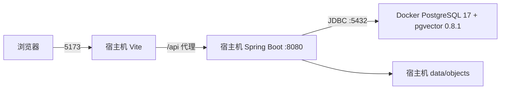
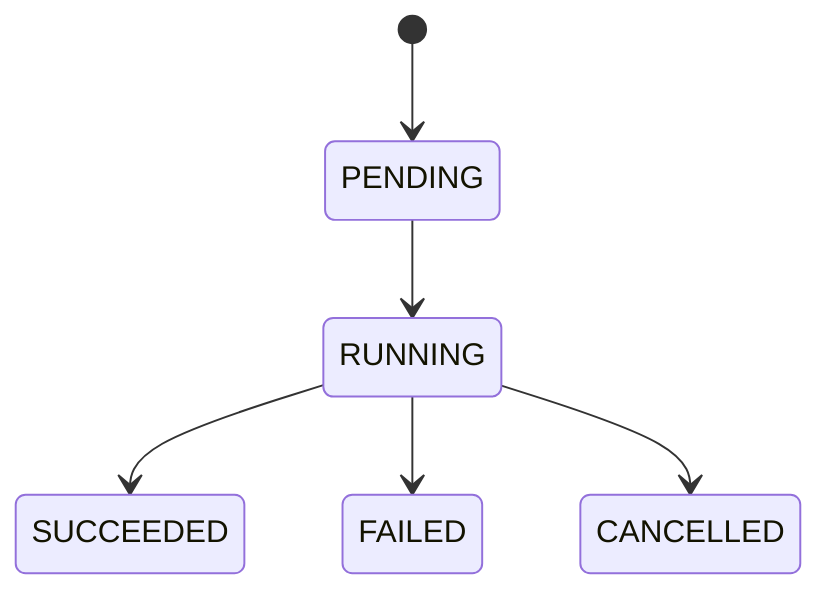

# T1 工程与基础设施

本文记录 MVP 开发计划 T1 已实现的工程结构和运行约束。后续任务改变接口、数据结构或关键技术决策时，必须先更新对应 OpenSpec change。

## 1. 本地运行拓扑



本地开发不构建前后端容器镜像。`compose.yaml` 只管理 PostgreSQL/pgvector 及后续可能增加的中间件；`scripts/dev.sh` 负责统一启动依赖、Spring Boot 和 Vite。生产部署形态不在 T1 内冻结。

## 2. 后端结构和依赖方向

后端采用“按业务能力分包，模块内部严格 MVC”的结构，不把所有 Controller、Service、Mapper 混放到全局技术层目录。主调用方向固定为 `Controller → Service → Mapper → PostgreSQL`，不设置 Repository 层。

```text
io.github.loredock
├── platform
│   ├── web            API 错误、trace、状态接口
│   ├── time           UTC 时间公共配置
│   └── persistence    MyBatis/PostgreSQL 公共支持
├── project
│   ├── controller     HTTP 入口
│   ├── service        项目与分支业务逻辑
│   ├── mapper         MyBatis-Plus Mapper
│   └── model          entity/enums/dto（Request、Response 等载体）
├── knowledge          同样按 controller/service/mapper/model 组织
├── code               同样按 controller/service/mapper/model 组织
├── agent              service/mapper/model/config/skill/scheduler
├── qa                  controller/service/mapper/model/config/scheduler
└── storage/job/...     按实际职责保留 MVC 子包
```

Controller 只负责协议解析、认证上下文和响应映射；Service 集中业务规则与事务；Mapper 只保存 MyBatis 接口；持久化实体和 HTTP 载体进入模块自己的 `model` 子包，不默认创建 `command`、`result`、`snapshot`、`converter` 子包。Service 可以直接访问本模块 Mapper；跨模块只能引用对方模块的 `api` 契约包（Service 接口与最小稳定契约类型），禁止跨模块访问 Mapper、Entity 或 Service 实现。只为标准 `ChatModel`、`EmbeddingModel`、Agent Runtime、Agent 定义和对象存储等真实替换边界保留接口。

数据库访问统一使用 MyBatis-Plus。SQL 优先由 `BaseMapper` 和 Lambda Wrapper 的 Java API 表达，Java API 不清楚时才允许 Mapper 方法注解 SQL，禁止 XML Mapper。持久化 Entity 与 API DTO 分离；Entity 位于 `model/entity`，并以 `@TableName`、`@TableId(type = IdType.AUTO)`、每字段 `@TableField` 显式绑定 Flyway 表结构。

## 3. 数据模型与迁移

Flyway 是结构变更的唯一入口，MyBatis-Plus 和 Spring AI Alibaba 运行时都不得自动建表。当前快速迭代阶段只维护 `V1__create_loredock_baseline.sql`：全新 PostgreSQL 初始化后创建 17 张业务表和 2 张 Graph checkpoint 表。

所有表的数据库主键统一为 identity `BIGINT`，Java/HTTP/TypeScript 业务 ID 统一为 `Long`/`number`，关联列统一为 `BIGINT`。`graphthread.thread_id`、`graphcheckpoint.checkpoint_id` 等 UUID 仅是框架协议唯一键，不承担数据库主键职责。业务表按聚合保留，Agent 持久化只保留 `agent_run`、`agent_run_event` 和 `agent_evidence`；已删除 Skill 版本、工具调用、独立引用等无独立生命周期的表。

数据库表的完整保留与删除依据见 [后端精简重构基线与处置清单](后端精简重构基线与处置清单.md)，唯一事实结构见 `backend/src/main/resources/db/migration/V1__create_loredock_baseline.sql`。

时间字段使用 PostgreSQL `TIMESTAMPTZ`，Java 边界使用 `Instant`，JSON 和应用时钟统一按 UTC。数据库连接会话时区不作为业务时间语义来源。

创建和更新均写入 `created_at`、`updated_at`、`created_by`、`updated_by`。认证接入前操作者为明确的 `SYSTEM`；后续接入 Sa-Token 后由统一操作者端口提供真实身份。

## 4. 本地对象存储

`ObjectStorage` 是稳定应用端口，本地适配器执行以下流程：

1. 服务端生成 UUID 对象键，不使用原始文件名拼接路径；
2. 在受控根目录内流式写临时文件并计算 SHA-256；
3. 使用原子移动发布文件；
4. 通过 MyBatis-Plus 保存元数据；
5. 元数据失败时补偿删除文件，读取时以可用元数据为前置条件。

路径解析会拒绝绝对路径、路径穿越和符号链接逃逸。删除是幂等的；磁盘不可写、对象不存在及 IO 失败保留稳定错误语义。T1 不实现 S3/MinIO，但应用端口不依赖本地路径，后续可新增基础设施适配器。

## 5. 后台任务

任务状态机只允许：



提交先持久化，再交给有界线程池；容量拒绝会把记录终结为 `FAILED/CAPACITY_EXCEEDED`。进度只能单调更新到 99，成功时固定为 100。处理器异常按稳定错误码分类，摘要先脱敏再限长，不保存堆栈或输入正文。

应用启动时只把超过心跳阈值的 `RUNNING` 任务标记为 `FAILED/PROCESS_INTERRUPTED`，不会自动重放，因为处理器可能已有不可逆副作用。当前实现只面向单应用实例，不是分布式调度器。

## 6. Web、错误和运行状态

- `/api/v1/system/status` 只返回公开运行状态，不暴露连接串、环境变量或存储路径。
- `/actuator/health/liveness` 表示 Java 进程是否存活，不依赖数据库。
- `/actuator/health/readiness` 包含数据库检查，数据库不可用时必须失败。
- API 使用稳定错误码、字段错误和 trace ID；未知异常对客户端返回通用消息，服务端日志保留已脱敏上下文。
- trace ID 由请求头继承或生成，并写入结构化日志 MDC；Authorization、Token、密码、JDBC URL 和绝对路径进入日志前统一脱敏。
- 默认 profile 输出适合宿主机开发的可读文本日志；`prod` profile 输出 Logstash JSON。格式切换不改变 logger、MDC、trace ID 或脱敏规则。

## 7. 备份、恢复和限制

数据库与 `data/objects` 是两类独立持久数据。备份时先停止产生新写入，在同一静默窗口执行 `pg_dump` 并复制对象目录；代码 Lucene 目录是可重建派生数据，可按恢复时效决定是否备份。classpath Agent 定义随代码仓库和制品发布，不在数据库或对象存储中单独备份。

旧 UUID/多迁移开发库不兼容当前快速迭代基线。需要保留材料时先导出旧库和对象目录，随后执行 `docker compose down --volumes` 并通过 `./scripts/dev.sh` 从单一 V1 重建；旧 dump 只用于人工取数，不能整体恢复到新结构。恢复当前基线备份后，应核对 Flyway V1、17 张业务表、2 张 Graph 表和对象元数据，再按需重建知识/代码派生索引。

T1 已知限制：

- 只支持本地文件对象存储和单应用实例；
- 后台任务不自动重试、不分布式认领；
- 认证为固定配置账户（ADMIN/MEMBER），使用 Sa-Token 会话与 BCrypt 密码哈希，不提供注册、找回密码和细粒度权限；
- 当前已接入 Lucene、Spring AI 标准模型接口和 Spring AI Alibaba Agent Runtime；MCP 仍未提供工具，且当前阶段不做 MCP 身份校验；
- 对象文件与数据库无法形成跨资源原子事务，当前通过发布顺序和补偿降低不一致风险。
