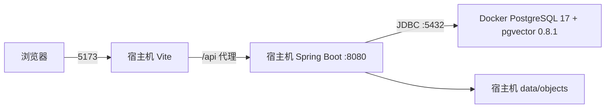
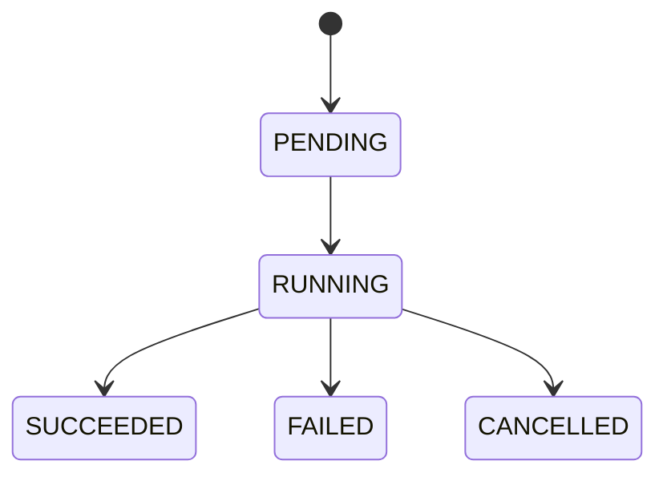

# T1 工程与基础设施

本文记录 MVP 开发计划 T1 已实现的工程结构和运行约束。后续任务改变接口、数据结构或关键技术决策时，必须先更新对应 OpenSpec change。

## 1. 本地运行拓扑



本地开发不构建前后端容器镜像。`compose.yaml` 只管理 PostgreSQL/pgvector 及后续可能增加的中间件；`scripts/dev.sh` 负责统一启动依赖、Spring Boot 和 Vite。生产部署形态不在 T1 内冻结。

## 2. 后端结构和依赖方向

后端采用按业务能力分包，每个功能内部再分层。它属于 MVC Web 应用，但不会把所有 Controller、Service、Mapper 混放到全局技术层目录。

```text
io.github.loredock
├── platform
│   ├── web            API 错误、trace、状态接口
│   ├── audit          操作者和审计元数据
│   ├── time           UTC 时钟端口
│   └── persistence    PostgreSQL 公共类型处理
├── storage
│   ├── domain         对象元数据和值对象
│   ├── application    ObjectStorage 与仓储端口
│   └── infrastructure
│       ├── filesystem 本地文件实现和路径安全
│       └── persistence MyBatis-Plus 实体与 Mapper
└── job
    ├── domain         状态机、快照和领域异常
    ├── application    提交/查询端口、有界执行器和失败分类
    └── infrastructure
        └── persistence MyBatis-Plus 实体与 Mapper
```

依赖方向为 Web/基础设施调用应用层，应用层使用领域模型和端口，持久化与文件系统适配器实现应用端口。领域层不引用 Spring、Mapper、文件系统或 Web 异常。任务领域异常在应用边界被转换为稳定失败码。

数据库访问统一使用 MyBatis-Plus。SQL 优先由 `BaseMapper` 和 Lambda Wrapper 的 Java API 表达，Java API 不清楚时才允许 Mapper 方法注解 SQL，禁止 XML Mapper。持久化实体和领域/API 模型分离；实体使用 Lombok，并以 `@TableName`、`@TableId`、每字段 `@TableField` 显式绑定 Flyway 表结构。

## 3. 数据模型与迁移

Flyway 是结构变更的唯一入口，应用启动时先校验并执行只追加迁移，MyBatis-Plus 不自动建表。当前迁移创建 `vector` 扩展和两张基础表：

| 表 | 用途 | 关键约束 |
|---|---|---|
| `stored_object` | 对象文件的可读取元数据 | UUID 主键、安全对象键唯一、状态与 SHA-256 格式约束、审计时间有序 |
| `background_job` | 单实例后台任务状态 | 状态/进度/生命周期约束、可关联输入对象、状态与心跳索引 |

时间字段使用 PostgreSQL `TIMESTAMPTZ`，Java 边界使用 `Instant`，JSON 和应用时钟统一按 UTC。数据库连接会话时区不作为业务时间语义来源。

创建和更新均写入 `created_at`、`updated_at`、`created_by`、`updated_by`。认证接入前操作者为明确的 `SYSTEM`；后续接入 Sa-Token 后由统一操作者端口提供真实身份。

## 4. 本地对象存储

`ObjectStorage` 是稳定应用端口，本地适配器执行以下流程：

1. 服务端生成 UUID 对象键，不使用原始文件名拼接路径；
2. 在受控根目录内流式写临时文件并计算 SHA-256；
3. 使用原子移动发布文件；
4. 通过 MyBatis-Plus 保存元数据；
5. 元数据失败时补偿删除文件，读取时以可用元数据为前置条件。

路径解析会拒绝绝对路径、路径穿越和符号链接逃逸。删除是幂等的；磁盘不可写、对象不存在及 IO 失败保留稳定错误语义。T1 不实现 S3/MinIO，但应用端口不依赖本地路径，后续可新增基础设施适配器。

## 5. 后台任务

任务状态机只允许：



提交先持久化，再交给有界线程池；容量拒绝会把记录终结为 `FAILED/CAPACITY_EXCEEDED`。进度只能单调更新到 99，成功时固定为 100。处理器异常按稳定错误码分类，摘要先脱敏再限长，不保存堆栈或输入正文。

应用启动时只把超过心跳阈值的 `RUNNING` 任务标记为 `FAILED/PROCESS_INTERRUPTED`，不会自动重放，因为处理器可能已有不可逆副作用。当前实现只面向单应用实例，不是分布式调度器。

## 6. Web、错误和运行状态

- `/api/v1/system/status` 只返回公开运行状态，不暴露连接串、环境变量或存储路径。
- `/actuator/health/liveness` 表示 Java 进程是否存活，不依赖数据库。
- `/actuator/health/readiness` 包含数据库检查，数据库不可用时必须失败。
- API 使用稳定错误码、字段错误和 trace ID；未知异常对客户端返回通用消息，服务端日志保留已脱敏上下文。
- trace ID 由请求头继承或生成，并写入结构化日志 MDC；Authorization、Token、密码、JDBC URL 和绝对路径进入日志前统一脱敏。
- 默认 profile 输出适合宿主机开发的可读文本日志；`prod` profile 输出 Logstash JSON。格式切换不改变 logger、MDC、trace ID 或脱敏规则。

## 7. 备份、恢复和限制

数据库卷与 `data/objects` 是两类独立持久数据。备份时先停止产生新写入，在同一静默窗口执行 `pg_dump` 并复制对象目录；恢复时也必须成对恢复。只复制数据库卷或只复制对象目录，都可能造成元数据与文件不一致。

T1 已知限制：

- 只支持本地文件对象存储和单应用实例；
- 后台任务不自动重试、不分布式认领；
- 尚未实现 Sa-Token 认证和 BCrypt 密码保存，这些属于 T2；
- 尚未接入 Lucene、Spring AI、Embedding 和 MCP，T1 只冻结相关版本或边界；
- 对象文件与数据库无法形成跨资源原子事务，当前通过发布顺序和补偿降低不一致风险。
