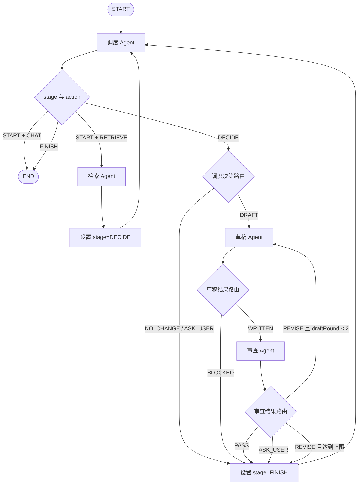

# 知识整理多 Agent 图编排设计

| 属性 | 内容 |
|---|---|
| 文档版本 | v0.6 |
| 文档日期 | 2026-08-29 |
| 文档状态 | 开发设计草案，进入实现前需建立 OpenSpec change |
| 当前范围 | 管理员人工发起的知识整理任务 |
| 核心约束 | 使用 StateGraph 编排四个 Agent，并使用 PostgreSQL 持久化 Graph Checkpoint |
| 延期范围 | 自动触发、长期记忆驱动决策、再次质量评估 |
| 现有基线 | [`Markdown知识提交与冲突整理详细流程.md`](../product/Markdown知识提交与冲突整理详细流程.md)、[`项目业务上下文知识库_MVP需求文档_v1.0.md`](../product/项目业务上下文知识库_MVP需求文档_v1.0.md) |

## 1. 背景

当前知识整理链路由单个 `knowledge-curator` Agent 完成候选材料读取、正式知识检索、重复或冲突判断、下一步动作选择、草稿写入和结果自查。人工上传、工作草稿、Diff 审核和发布主流程已经具备，但单 Agent 同时承担“找事实、做决定、执行写入、证明写入正确”四类职责，前序判断容易影响后续写入和自审。

现有固定评估暴露出的主要问题不是完全找不到相关知识，而是检索之后的动作选择和写入审查仍不稳定：

- 有的场景已经找到足够依据，本应整理草稿，却因为过度保守转为询问用户；
- 有的场景已经识别出来源不完整，仍把未确认细节写入工作草稿；
- 写入 Agent 再审查自己的结果，容易延续原判断，无法稳定发现来源不足或偏离管理员要求的问题。

当前固定数据集包含 8 条知识整理用例，其中 6 条是重复、冲突或缺失问题用例。该快照中问题识别正确率为 100%，问题用例动作正确率为 `4/6 = 66.7%`；4 条冲突或缺失高风险用例中有 1 条发生未确认事实写入。这里的数据只用于说明设计动机，不代表生产效果，本次开发也不重新执行质量评估。

因此本次改造的重点不是替换现有检索和草稿能力，而是拆开职责：检索 Agent 只提交证据事实，调度 Agent 结合管理员目标决定下一步，草稿 Agent 执行写入，审查 Agent 独立检查最新修订。Graph 固定合法顺序并持久化执行状态，正式发布仍由管理员完成。

## 2. 设计结论

本功能采用一个显式 `StateGraph` 编排四个职责不同的 `ReactAgent`：

- 调度 Agent：先识别闲聊或知识整理意图；知识整理场景在检索完成后决定询问用户、生成草稿或无需修改，并汇总最终结果；
- 检索 Agent：读取候选材料和现有知识，只报告重复、冲突、缺失和证据充分性，不决定下一步动作；
- 草稿 Agent：只根据检索结论和管理员意见创建或修改工作草稿；
- 审查 Agent：独立读取来源、最新草稿和 Diff，决定通过、返工或请求人工判断。

Graph 负责固定执行顺序、条件分支、最多两轮草稿返工和结束条件。Agent 只负责各节点内部的语义判断，不能决定跳过必要节点。

运行状态使用项目已经引入的 `PostgresSaver` 按 `RunnableConfig.threadId` 保存。草稿、来源、消息和 Tool 调用继续使用现有业务表，不新增通用任务信封、Evidence Bundle 表、Review Report 表或另一套业务状态机。

## 3. 本次范围

### 3.1 要完成的能力

1. 管理员创建知识整理任务后，后端启动一个持久化多 Agent Graph run。
2. 用户消息只是问候、致谢或不需要访问业务知识的普通对话时，调度 Agent 直接回复并结束本轮，不执行检索、草稿和审查节点。
3. 知识整理消息必须先经过调度和检索，再回到调度 Agent，由调度 Agent 根据检索结果和管理员目标决定 `ASK_USER`、`DRAFT` 或 `NO_CHANGE`。
4. 草稿产生新修订后必须经过审查 Agent，审查不通过时最多返工两轮。
5. 检索 Agent 报告未解决问题，或审查 Agent 认为必须人工判断时，由调度 Agent 决定结束本轮并向管理员提出具体问题。
6. 管理员补充意见后创建新的 run；新 run 读取同一会话的现有工作草稿和消息继续处理。
7. 进程异常或人工暂停后，能够使用同一 `threadId` 从 PostgreSQL Checkpoint 的下一节点恢复。
8. 正式发布继续由管理员在现有发布接口中完成，任何 Agent 都不获得发布 Tool。
9. 前端在现有任务时间线中实时展示调度、检索、草稿和审查 Agent 的公开执行阶段、状态、Tool 事实和文档 Diff；刷新或 SSE 重连后仍能恢复同一过程视图。

### 3.2 明确不做

- 不做定时扫描、事件订阅或无人触发的自动任务；
- 不让调度 Agent 根据长期用户记忆自行创建任务；
- 不实现自动发布；
- 不引入消息队列、A2A、分布式 Agent 服务或跨语言 Agent；
- 不新增 Agent 专属业务表；
- 不为本次功能建设通用 Workflow Runtime、通用状态机或通用 Agent 消息协议；
- 不在本次开发中开展单 Agent 与多 Agent 的再次评估、消融实验或指标调优。

自动化版本等待记忆管理模块完成后单独设计。本设计不为自动化预留空接口、定时器或临时记忆字段。

### 3.3 复杂度审查结论

| 设计项 | 结论 | 原因 |
|---|---|---|
| 四个 Agent | 保留 | 是本次功能目标 |
| `StateGraph` 条件编排 | 保留 | 保证检索、写入、审查顺序和返工上限 |
| `PostgresSaver` | 保留 | 满足中断恢复和状态持久化要求，项目已经引入 |
| 四类结构化节点结果 | 保留 | 调度决策和条件边需要稳定、可解析的路由依据 |
| 一个 Graph Factory | 保留 | 集中组装 Agent、Tool 白名单、Graph 和 Saver |
| 多 Agent 过程时间线 | 保留 | 复用现有公开 Agent Event、任务 SSE 和任务页，不新增页面或过程表 |
| 单独的闲聊分类器或第二套 Chat Service | 删除 | 复用调度 Agent 的 `START` 输出和 Graph 短路边即可 |
| 通用任务信封和 Agent 消息总线 | 删除 | 单进程 Graph State 已能完成节点交接 |
| Evidence Bundle、Review Report 专表 | 删除 | Checkpoint 和现有 Tool、草稿、消息表已经保存所需事实 |
| 新的数据库业务状态机 | 删除 | Graph 当前节点和现有 run 状态已经足够 |
| 队列、A2A、分布式 Agent 服务 | 删除 | 当前没有跨进程 Agent 通信需求 |
| 自动化和再次评估 | 延期 | 不属于本次功能开发完成条件 |

## 4. 现有能力复用

### 4.1 框架能力

项目锁定 Spring AI Alibaba `1.1.2.3`，本次直接使用：

| 需求 | 直接使用的框架能力 |
|---|---|
| 专家 Agent | `ReactAgent` |
| 图编排 | `StateGraph`、普通边、条件边、Agent `asNode()` |
| 节点输出 | `outputKey`、`outputType` |
| 状态合并 | `ReplaceStrategy`、`AppendStrategy` |
| Checkpoint | `PostgresSaver`、`CompileConfig` |
| 运行隔离 | `RunnableConfig.threadId` |
| 调用限制 | `ModelCallLimitHook`、`ToolCallLimitHook` |
| Tool 权限 | 每个 `ReactAgent` 的显式 `ToolCallback` 集合 |

不使用在线文档中但项目锁定版本不存在的 `SupervisorAgent`，也不自行实现 Supervisor Runtime。

### 4.2 现有 LoreDock 能力

继续复用：

- `KnowledgeCurationRunExecutor` 的 run 生命周期、超时、错误映射和最终消息投影；
- `KnowledgeCurationTools` 的候选读取、知识检索、草稿读写和 Diff Tool；
- `KnowledgeTaskServiceImpl` 的会话、继续处理、暂停、停止和人工发布入口；
- `knowledge_task_conversation`、`agent_run`、`knowledge_task_message`；
- `knowledge_tool_invocation`、`knowledge_task_event`；
- `knowledge_draft`、`knowledge_draft_revision`、`knowledge_draft_revision_source`；
- 当前 `PostgresSaver` 和 Graph Checkpoint 数据库结构。

## 5. Graph 结构



### 5.1 为什么保留确定性路由

Graph 负责安排 Agent 执行顺序，调度 Agent 负责检索之后的业务动作判断。两者的边界是：

- 调度 Agent 在 `START` 阶段先判断当前消息是可直接回复的 `CHAT`，还是需要进入知识整理流程的 `RETRIEVE`；
- `CHAT` 直接路由到 `END`，不执行检索、草稿和审查节点；
- 检索 Agent 只返回事实、证据状态和未解决问题，不输出 `DRAFT/ASK_USER/NO_CHANGE`；
- 调度 Agent 读取检索结果和管理员目标，输出结构化的下一步决定；
- Graph 校验调度决定是否满足安全条件，再执行对应条件边。

Graph 用条件边继续保证：

- 没有检索结果时不能进入草稿节点；
- 没有草稿新修订时不能进入审查节点；
- 草稿写入后不能跳过审查直接结束；
- 返工最多两轮；
- 任意结束路径都回到调度 Agent，由它生成面向管理员的最终说明。

这部分确定性是当前功能必需的安全边界，不扩展为通用工作流平台。

### 5.2 调度 Agent 的三次进入

同一个调度 Agent 节点在一个 Graph run 中最多进入三次：

1. `stage=START`：读取当前用户消息和必要会话摘要；闲聊返回 `CHAT` 和直接回复，知识整理返回 `RETRIEVE` 和检索任务说明；
2. `stage=DECIDE`：读取检索结果，结合管理员目标决定 `DRAFT`、`ASK_USER` 或 `NO_CHANGE`；
3. `stage=FINISH`：读取检索、调度决策、草稿和审查结果，生成最终总结或具体人工问题。

调度 Agent 没有业务 Tool，不直接检索或修改草稿。Graph 只接受与当前 stage 匹配的调度输出：`START` 只能选择 `CHAT/RETRIEVE`，`DECIDE` 才能选择知识整理动作，`FINISH` 只能结束本轮。

### 5.3 闲聊短路边界

`CHAT` 只用于不需要读取候选草稿、正式知识或工作草稿就能回答的普通对话，例如问候、致谢、确认助手是否在线。它仍创建现有 run，并经过调度 Agent 和父 Graph，因此消息、调用次数和最终回复继续按统一方式持久化，但不会走完整知识整理图。

以下内容不能归为 `CHAT`：

- 请求整理、合并、修改或检查知识文档；
- 询问候选材料、正式知识或当前草稿中的具体内容；
- 对上一轮草稿、冲突或审查结果提出修改意见；
- 同一消息同时包含闲聊和明确知识整理要求。

存在明确知识整理动作时优先返回 `RETRIEVE`。无法可靠判断时也进入 `RETRIEVE`，避免把真实整理请求误短路成无 Tool 闲聊。

## 6. Graph State

Graph State 只保存路由所需的短数据和业务记录引用，不保存完整候选文档、完整正式知识或完整草稿正文。

| Key | 类型 | 合并策略 | 含义 |
|---|---|---|---|
| `messages` | `List<Message>` | `AppendStrategy` | 调度 Agent 的公开消息和 Graph 必需输入 |
| `stage` | `START / DECIDE / FINISH` | `ReplaceStrategy` | 控制调度 Agent 的任务准备、动作决策和最终汇总 |
| `goal` | `String` | `ReplaceStrategy` | 本轮管理员目标 |
| `coordinationResult` | `AssistantMessage` | `ReplaceStrategy` | 调度 Agent 当前阶段的结构化输出 |
| `retrievalResult` | `AssistantMessage` | `ReplaceStrategy` | 检索 Agent 的结构化结果 |
| `draftResult` | `AssistantMessage` | `ReplaceStrategy` | 草稿 Agent 的结构化结果 |
| `reviewResult` | `AssistantMessage` | `ReplaceStrategy` | 审查 Agent 的结构化结果 |
| `draftRound` | `Integer` | `ReplaceStrategy` | 已完成的草稿写入轮数，最大 2 |
| `finishReason` | `String` | `ReplaceStrategy` | `CHAT/NO_CHANGE/PASS/ASK_USER/REVIEW_LIMIT/FAILED` |

Graph State 中的草稿只记录 `draftId + revision`，来源只记录现有的 evidence、selected draft、正式文档或用户消息 ID。节点需要正文时重新调用受控 Tool 读取。

四个 Agent 均使用 `asNode(true, false)` 接入父 Graph：`includeContents=true` 使每个 Agent 子图收到父 State 的 `messages`，作为它本轮唯一的用户输入；`returnReasoningContents=false` 只把最后一个结构化结果写回父 State，不把 Agent 内部循环的中间消息回传。由于父 `messages` 只保存本轮 `goal` 这一条用户消息（各 Agent 的输出都通过各自的 `outputKey` 写回 `coordinationResult/retrievalResult/draftResult/reviewResult`，不回写 `messages`），因此某个 Agent 的内部推理不会被当作下个 Agent 的历史消息，设计上“不继承前序 Agent 完整消息历史”的顾虑依然成立，只是通过 outputKey 隔离而非删除 messages 实现。

之所以必须把 `goal` 作为用户消息而不是塞进指令模板，是因为各 Agent 指令正文含 JSON 大括号与 `|`，框架模板渲染会解析失败，只能使用不做替换的 passthrough renderer；因此 `goal` 必须经由 `messages` 注入，否则调度 Agent 看不到“整理了哪份文档”，会把整理请求误判为 CHAT 而短路（实际联调发现的 bug）。

框架在 `asNode(true, false)` 下还会把每个 Agent 的最后一条结构化输出（原始 JSON）自动追加到父 `messages`，使下一环 Agent 的上下文出现无标签、且混入调度 Agent 自身早期 `stage=START/DECIDE` 输出的冗余 JSON，调度 Agent 因此难以识别所处阶段。为此在状态推进节点合成**带标签、可识别阶段**的上下文消息（§10.1 的 `set_decide`/`set_draft_context`/`set_review_context`/`set_finish`/`set_draft_round`），并让各 Agent 的指令优先读取这些带标签上下文；框架追加的原始 JSON 仍会存在，提示词要求 Agent 忽略其中的阶段字段、只认标签。

## 7. 四个 Agent 的职责与权限

### 7.1 调度 Agent

输入：管理员目标、当前 `stage`，以及当前阶段允许读取的专家节点结构化结果。

输出结构：

```json
{
  "stage": "START|DECIDE|FINISH",
  "action": "CHAT|RETRIEVE|DRAFT|ASK_USER|NO_CHANGE|END",
  "reason": "选择该动作的主要依据",
  "draftInstruction": "仅在 DRAFT 时提供给草稿 Agent 的具体写入要求",
  "question": "仅在 ASK_USER 时提供的具体问题",
  "summary": "面向管理员的阶段说明或最终总结"
}
```

约束：

- `START` 只能输出 `CHAT` 或 `RETRIEVE`；
- `CHAT` 必须在 `summary` 中给出可以直接展示给用户的完整回复，并且不得生成 `draftInstruction`；
- `DECIDE` 只能输出 `DRAFT/ASK_USER/NO_CHANGE`；
- `FINISH` 只能输出 `END`；
- `DRAFT` 必须说明采用哪些已支持事实、目标文档和写入边界；
- `ASK_USER` 必须提出无法由现有证据解决的具体问题；
- `NO_CHANGE` 必须说明为什么现有知识已经覆盖或候选内容没有可写入增量。

Tool：无业务 Tool。

禁止：直接检索、创建草稿、修改草稿、审查草稿和发布知识。

### 7.2 检索 Agent

允许 Tool：

- `selected_draft_list`、`selected_draft_read`；
- `knowledge_directory_list`、`knowledge_document_list`；
- `knowledge_search`、`knowledge_grep`、`knowledge_document_read`；
- `workspace_document_list`、`draft_read`，仅用于了解当前会话已有工作内容。

禁止 Tool：`draft_create`、`draft_update`、`draft_rename` 和任何发布能力。

输出结构：

```json
{
  "issueType": "DUPLICATE|CONFLICT|MISSING|NONE",
  "candidateTargetDocumentId": 710004,
  "facts": [
    {
      "statement": "允许写入或需要判断的事实",
      "support": "SUPPORTED|CONFLICTED|INSUFFICIENT",
      "sourceRefs": [
        {"type": "EVIDENCE|SELECTED_DRAFT|USER_MESSAGE", "id": 88}
      ]
    }
  ],
  "unresolvedQuestions": [],
  "summary": "只描述检索事实和证据状态，不给出下一步动作"
}
```

检索 Agent 可以说明“哪些事实已支持、哪些事实冲突、哪些信息缺失”，但不能输出 `DRAFT`、`ASK_USER` 或 `NO_CHANGE`。同一份检索结果在不同管理员目标下可能产生不同动作，最终决定必须由调度 Agent 作出。

### 7.3 草稿 Agent

输入：检索结果、调度 Agent 的 `DRAFT` 决定、管理员目标、上轮 Review finding（返工时）。

允许 Tool：

- `selected_draft_read`、`knowledge_document_read`；
- `workspace_document_list`；
- `draft_create`、`draft_read`、`draft_update`、`draft_rename`、`draft_diff`。

禁止：自由扩大检索范围、修改正式知识、发布知识。

草稿 Agent 只能写入检索结果中 `SUPPORTED` 且被调度 Agent 纳入 `draftInstruction` 的事实，或管理员消息明确确认的事实。发现输入不足时返回 `BLOCKED`，不能自行猜测。

输出结构：

```json
{
  "status": "WRITTEN|BLOCKED",
  "drafts": [
    {"draftId": 19, "revision": 3, "operation": "ADD|MODIFY"}
  ],
  "question": null,
  "summary": "实际保存的修改"
}
```

### 7.4 审查 Agent

输入：检索结果、调度决策、草稿结果、管理员目标。

允许 Tool：

- 检索 Agent 的全部只读 Tool；
- `workspace_document_list`、`draft_read`、`draft_diff`。

禁止 Tool：`draft_create`、`draft_update`、`draft_rename` 和任何发布能力。

审查 Agent 必须检查草稿结果列出的每个 `draftId + revision`，并核对：

- 新增或改变的事实是否有来源；
- 是否符合管理员要求；
- 是否仍包含未解决冲突或待确认细节；
- ADD/MODIFY、标题、目录和文档边界是否合理；
- 是否把问题、风险或执行过程写进了可发布正文。

输出结构：

```json
{
  "verdict": "PASS|REVISE|ASK_USER",
  "reviewedDrafts": [
    {"draftId": 19, "revision": 3}
  ],
  "findings": [
    {
      "code": "UNSUPPORTED_CLAIM|USER_INTENT_MISMATCH|UNRESOLVED_CONFLICT|DOCUMENT_BOUNDARY",
      "draftId": 19,
      "description": "具体问题",
      "suggestion": "可以直接执行的修改要求"
    }
  ],
  "question": null,
  "summary": "审查结论"
}
```

`PASS` 必须绑定草稿 Agent 本轮返回的全部最新修订。缺少草稿、修订不一致或输出无法解析时，不允许路由到 `PASS`。

## 8. 状态持久化与恢复

### 8.1 两层持久化

| 层次 | 保存内容 | 保存位置 |
|---|---|---|
| Graph 执行状态 | 当前节点、下一节点、Graph State、节点输出、返工轮数 | 现有 `PostgresSaver` Checkpoint |
| 业务事实 | 会话、run、公开消息、Tool 调用、草稿修订、修订来源、发布记录 | 现有 LoreDock 业务表 |

Checkpoint 解决“执行到哪里”；业务表解决“实际写了什么”。两者不互相复制完整正文。

### 8.2 threadId

- 每个 `agent_run` 使用现有稳定 `thread_id`；
- 父 Graph 使用该 `threadId` 保存 Checkpoint；
- 父 Graph 和四个 `ReactAgent` 使用同一个 `PostgresSaver` 实例；
- 子 `ReactAgent` 作为 Graph subgraph node，由框架生成隔离的子图标识；
- 恢复时必须使用原 run 的同一 `threadId`，不能创建新 thread 伪装恢复。

### 8.3 Checkpoint 时机

Graph 在调度、检索、草稿、审查和准备结束节点后设置框架 `interruptAfter` 边界。Executor 每次运行到边界后检查 `agent_run`：仍为 `RUNNING` 就使用同一 `threadId` 立即继续；为 `PAUSE_REQUESTED` 就投影为 `WAITING_FOR_USER` 并停止续跑；为 `CANCELLED` 就结束当前执行。该循环只负责驱动框架已持久化的下一节点，不自行计算业务路由。

人工暂停、进程退出或模型调用失败时：

- 已提交的草稿修订不会回滚；
- 已完成节点的 Graph State 保留；
- 恢复后从 Checkpoint 指向的下一节点继续；
- 如果节点发生外部写入但在 Checkpoint 前失败，依靠现有草稿幂等键和 `baseRevision` 防止重复写入。

### 8.4 人工补充不是同一 run 的恢复

调度 Agent 根据检索结果决定 `ASK_USER`，或审查 Agent 返回 `ASK_USER` 时，本 run 正常结束，任务会话仍为 `PROCESSING`。管理员回复后继续沿用现有机制创建新 run；新 run 重新建立 Graph State，并通过现有会话消息和工作区恢复业务上下文。

这与“进程异常后恢复同一 run”是两种不同语义，不能混用。

## 9. 路由和解析规则

条件边不能直接信任自然语言。每个专家 Agent 使用 `outputType` 约束最终结果，路由节点通过 Jackson 解析最终 `AssistantMessage.text`。这些字段是 Java 内部契约，直接使用 camelCase，不额外维护一套 snake_case 映射。

解析规则：

- 未知枚举、缺少必填字段或 JSON 无法解析：本 run 失败，错误码为稳定的模型结果错误；
- 检索结果包含动作字段：视为结构化结果无效，检索 Agent 不能替调度 Agent 决策；
- 调度 Agent 在 `DECIDE` 阶段输出 `DRAFT`，但没有任何 `SUPPORTED` fact 或没有 `draftInstruction`：拒绝进入草稿节点；
- 调度 Agent 在 `DECIDE` 阶段输出 `ASK_USER`，但没有具体问题：拒绝结束本轮；
- 调度 Agent 的输出动作与当前 stage 不匹配：本 run 失败，不根据自然语言修正；
- `CHAT` 不是在 `START` 阶段产生，或者同时包含 `draftInstruction`：视为无效调度结果；
- `CHAT` 路径出现任意知识业务 Tool 调用、草稿修订或专家节点输出：视为实现错误；
- `WRITTEN` 但没有 `draftId + revision`：拒绝进入审查节点；
- `PASS` 但 reviewed revision 与 draft result 不一致：视为 `REVISE`，达到上限后结束并提示人工；
- `REVISE` 必须至少有一条可执行 finding；
- `ASK_USER` 必须包含具体问题；
- `draftRound` 在 Graph 路由节点中递增，达到 2 后不再进入草稿节点。

只增加一个知识整理 Graph 结果模型文件，使用嵌套 record 表达调度、检索、草稿和审查四种结果，避免为每个字段建立多层 DTO。

## 10. 代码改动设计

### 10.1 新增 `KnowledgeCurationGraphFactory`

职责：

- 使用框架 `AgentSpecLoader` 读取并校验四个 Agent 的 Markdown 定义；
- 从现有 `ToolCallbackProvider` 按白名单筛选每个 Agent 的 Tool；
- 使用当前 run 的 `ToolContext` 构建四个 `ReactAgent`；
- 设置各 Agent 的 `outputKey`、结构化输出和既有调用限制 Hook；
- 构建 `StateGraph`、条件边和 `CompileConfig`；
- 将现有 `PostgresSaver` 注册为 CheckpointSaver；
- 在关键节点后配置框架 `interruptAfter`，提供可持久化的暂停边界；
- 返回编译后的 Graph 和本 run 使用的 Agent 定义摘要。

该类只组装框架组件，不实现模型/Tool 循环或通用工作流引擎。

### 10.2 修改 `KnowledgeAgentDefinitionService`

- 将单个 `knowledge-curator` Skill 定义替换为四个随应用发布的 Agent Markdown 定义；
- 校验 Agent 名称唯一、四个角色齐全；
- 校验每个 Agent 的 Tool 名称全部存在且与设计白名单一致；
- Agent 定义没有 tools 或包含未知 Tool 时启动失败，不能沿用框架“空列表代表全部 Tool”或“未知 Tool 静默忽略”的默认行为；
- 将四份定义内容的摘要写入现有 `agent_spec_digest`；
- 继续复用现有 `skill_digest`、`agent_spec_digest`、`tool_names` 字段，不修改数据库结构。

### 10.3 修改 `KnowledgeCurationRunExecutor`

- 将当前单个 `ReactAgent` 替换为 `CompiledGraph`；
- 首次执行输入 `goal`、`stage=START`、`draftRound=0`；检索节点完成后由普通 Graph 节点把 `stage` 更新为 `DECIDE`，结束前更新为 `FINISH`；
- `START + CHAT` 时直接把调度 Agent 的 `summary` 作为本轮最终回复并结束 Graph，不再创建第二套闲聊执行器；
- 继续使用当前 run 的 `RunnableConfig.threadId`；
- 从 Graph 最终状态取得调度 Agent 的最终 `AssistantMessage`；
- 根据 Graph 节点名和 `stage` 投影消息：调度 Agent 的 `START` 输出为公开进度，`DECIDE` 输出为调度决策，`FINISH` 输出为本轮最终回复；三个专家结果为 `SUB_AGENT` 消息；
- 将同一个 run 级模型和 Tool Interceptor 挂到四个 Agent，使用共享原子计数保证总调用记录和总限额覆盖所有节点，不新增每个 Agent 的独立配额配置；
- 保留当前超时、失败、取消、最终消息和 SSE 投影逻辑；
- Graph 每到一个 interrupt boundary 就检查 run 状态；没有暂停请求时立即续跑，有暂停请求时停止并等待恢复；
- 停止请求同时触发当前 Agent 的 `InterruptionHook`，并在下一个 Graph boundary 确认 `CANCELLED`；
- 恢复时调用同一 CompiledGraph 和同一 threadId；总超时按 run 首次开始时间计算，不能因分段续跑重新计时；
- 不在 Executor 中再写一套节点状态机。

### 10.4 保留 `KnowledgeCurationTools`

首版不拆分 Tool 类，只在 Graph Factory 中按名称生成不同 Agent 的 ToolCallback 列表。Tool 内已有的操作者、项目、会话和 run 范围校验继续作为最终安全边界。

### 10.5 Agent 定义资源

新增四份 classpath Markdown：

```text
backend/src/main/resources/agent-specs/knowledge-curation/
├── coordinator.md
├── retriever.md
├── drafter.md
└── reviewer.md
```

现有 `knowledge-curator` Skill 在多 Agent 默认流程完成后删除，避免两份提示同时描述同一流程。实现期间不保留运行时双链路或功能开关；需要对照时使用 Git 历史和独立评估任务。

### 10.6 数据库与公开过程事件

- 本次不新增 Flyway migration；
- 不新增 `knowledge_task_artifact`、Agent 状态表或 Review 表；
- Graph 节点开始和结束时写入现有 `agent_run_event`，事件类型使用 `AGENT_STAGE`，不把 Graph 节点伪装成 Tool；
- `AgentEvent.Payload.name` 使用稳定 Agent 名称 `coordinator/retriever/drafter/reviewer`；`phase` 区分调度 Agent 的 `START/DECIDE/FINISH`，并记录专家节点对应的 `RETRIEVE/DRAFT/REVIEW`；`status` 只使用 `RUNNING/COMPLETED/FAILED`；
- `summary` 只能保存从结构化结果投影出的有界公开摘要，不保存模型 Prompt、思维链、完整 Graph State、Checkpoint 内容或 Tool 原始返回；
- 每次 `AGENT_STAGE` 事件提交后，向现有 `knowledge_task_event` 追加 `AGENT_STAGE_UPDATED`，`subjectId` 继续使用 run ID。该事件只通知前端刷新快照，不复制 Agent Event 载荷；任务级 SSE 继续只发送已提交事件及单调递增游标；
- 三个专家节点需要展示的公开结果继续使用现有 `knowledge_task_message.role=SUB_AGENT` 和稳定 `subject_name` 投影，但不得把专家完整结构化 JSON 直接展示给用户；
- 最终回复继续使用 `COORDINATOR_AGENT`，并保留当前按 `run.definition.skillName` 识别最终消息的契约，避免破坏现有页面和历史任务；
- 现有 `knowledge_tool_invocation` 继续记录业务 Tool 的参数摘要、结果摘要和耗时；为让前端能在工具运行中即把工具归到正确的 Agent（而非仅靠阶段事件时间推断导致中途误归上一 Agent），为工具调用增加 `agent_node` 列记录执行该调用的 Agent 节点名，取自框架 `RunnableConfig.metadata["_AGENT_"]`（`subgraph_<节点名>` 去前缀）；Agent Stage 与 Tool 按公开事件顺序交错展示；
- 任务快照已经包含公开 `events`、`messages`、`toolInvocations` 和 `patchSets`，刷新页面和 SSE 重连后均从数据库重建，不依赖浏览器内存保存执行过程。

### 10.7 前端过程展示

复用现有 `KnowledgeTaskWorkspace` 的单列任务时间线和“执行过程”折叠区，不新增四个 Agent 页面，也不把固定 Graph 画成持续动画。每个 run 按公开事件顺序展示：

1. 调度 Agent：显示“识别任务”以及进入闲聊或知识整理流程的公开结果；
2. 检索 Agent：显示运行状态、问题类型、证据数量和公开摘要，具体 Tool 调用仍使用现有折叠卡片；
3. 调度 Agent：显示“决定下一步”以及 `生成草稿/询问用户/无需修改`；
4. 草稿 Agent：显示写入状态和本轮修改文档数，文档内容变化继续使用现有 Patch Set 和 Diff；
5. 审查 Agent：显示 `通过/需要返工/需要人工判断` 和公开问题摘要；
6. 发生返工时，按同一 run 内同类阶段事件的出现次数显示“第 2 轮草稿”和“第 2 轮审查”，不覆盖第一轮记录；
7. 调度 Agent：最终回复继续放在现有本轮结果卡片中，不重复显示一份完整正文。

阶段卡片只需要 `运行中/已完成/失败` 三种界面状态，尚未执行的条件分支不生成占位卡；run 的排队、等待用户和停止状态继续使用现有 run 状态展示。当前运行默认展开执行过程，终态运行沿用现有默认收起行为；失败节点保留已完成步骤，并与现有 run 失败卡片同时可见。

闲聊路径只展示“调度 Agent · 已完成”和最终回复，不生成空的检索、草稿、审查占位卡。前端不预画必经四步，因为条件分支可能在调度后直接结束。

前端需要完成的最小改动：

- 补全 `KnowledgeTask.events` 的 TypeScript 类型，使其与后端公开 `AgentEvent` 契约一致；
- 在 `KnowledgeTaskWorkspace` 中把 `AGENT_STAGE` 投影为阶段卡片，并将四个稳定 Agent 名称映射为“调度 Agent、检索 Agent、草稿 Agent、审查 Agent”；
- 继续复用现有 Tool 卡片、Patch Set、Diff 抽屉、最终回复和失败卡片；
- 收到 `AGENT_STAGE_UPDATED` SSE 后沿用现有任务游标去重和快照刷新机制；阶段事件在页面内使用 `runId + sequence` 去重；
- 页面只展示服务端白名单字段，不展示 Prompt、Graph State、Checkpoint、完整证据正文和任何隐藏推理。

## 11. 失败与幂等

- 检索和审查节点只读，可以按原 Checkpoint 重试；
- 草稿写入继续使用 `idempotencyKey + baseRevision`；
- 同一节点重放不得创建重复草稿或重复修订；
- 子 Agent 模型失败、Tool 越界或结构化结果错误时，本 run 失败并保留最后 Checkpoint；
- 超过模型调用、Tool 调用或总超时后结束 run，不继续返工；
- 任意失败都不能触发正式发布；
- 已提交草稿是业务事实，不因 Graph 失败删除或回滚。
- `CHAT` 短路只允许写入 run、Checkpoint 和对话消息，不得产生知识检索、草稿修订或发布副作用。

## 12. 测试与人工验收

本次不追求测试数量，也不按节点、枚举或页面状态穷举用例。自动化测试只保护会造成错误写入、越权、重复修订或错误恢复的关键业务行为；框架自身能力、Agent 中文标签、事件精确条数和前端样式不单独测试。

### 12.1 必须保留的自动化测试

优先扩展现有测试类，不为每种 Agent 和每条 Graph 边新建测试类。模型输出使用脚本化 Fake `ChatModel`，Checkpoint 场景使用 Testcontainers PostgreSQL 和真实 `PostgresSaver`。

| 业务场景 | 保护的业务目的与关键断言 |
|---|---|
| 有充分来源的新知识 | 真实经过检索、调度、草稿和审查；产生带来源的草稿修订和 Diff，但不自动发布 |
| 证据冲突或不足 | 调度 Agent 返回具体人工问题，不进入草稿节点，不写入未确认事实 |
| 审查持续不通过 | 最多返工两轮，不能进入第三轮，最后交给人工且不发布 |
| 普通闲聊 | 只有调度 Agent 回复，知识 Tool 调用数和草稿修订数均为 0 |
| Tool 权限边界 | 调度 Agent 无业务 Tool，检索和审查 Agent 无写 Tool，所有 Agent 均无发布 Tool；越权请求不能改变业务数据 |
| Checkpoint 恢复与写入幂等 | 使用同一 `threadId` 从已持久化下一节点恢复；草稿写入后发生中断也不能产生重复修订 |
| 无效结构化结果 | Graph 安全失败，不根据自然语言猜测路由，不产生发布记录 |

每个测试必须说明它防止的真实业务回归。相同路径上的路由顺序、事件投影、消息持久化和最终状态应在同一个业务测试中一起断言，不拆成多条只验证实现细节的测试。

现有知识任务测试只运行受本次改动直接影响的代表性回归：任务创建与继续处理、暂停恢复、停止和人工发布。不为已有稳定接口重复复制一套多 Agent 测试。

### 12.2 前端人工验收

前端不新增 Vitest 或端到端自动化测试，由开发者运行任务后人工观察：

- 正常路径按实际顺序出现调度、检索、草稿和审查 Agent，并能查看原有 Tool、Patch Set 和 Diff；
- 审查返工时两轮记录都保留；
- 闲聊只出现调度 Agent 和最终回复，不出现三个空步骤；
- 运行中刷新页面后过程仍能从持久化事件恢复；
- 页面不显示 Prompt、思维链、Checkpoint 或完整 Graph State。

人工验收只检查可观察行为和信息边界，不逐项检查 CSS、事件数量或内部字段。

具体步骤、前置准备与验收记录表见 [`知识整理多Agent人工验收清单.md`](./知识整理多Agent人工验收清单.md)。

## 13. 实施与验证顺序

1. 定义四个 Agent 的结构化结果和最小 Tool 白名单，组装 StateGraph 与 PostgresSaver；
2. 修改 Executor 接入 Graph、Checkpoint 恢复和公开阶段事件；
3. 接入现有任务页的多 Agent 过程展示；
4. 用第 12.1 节的关键业务场景补足自动化保护并运行受影响的现有回归；
5. 按第 12.2 节完成人工页面验收；
6. 同步 OpenSpec、MVP 需求、开发计划和详细流程文档。

## 14. 完成标准

- 四个 Agent 由显式 StateGraph 编排；闲聊只经过调度 Agent 后短路结束，知识整理时检索 Agent 只提交证据事实，调度 Agent 决定 `ASK_USER/DRAFT/NO_CHANGE`，合法路径和两轮上限由代码保证；
- Graph 使用真实 PostgreSQL Checkpoint，可在新 Graph 实例中恢复；
- Agent Tool 权限满足最小权限，任何 Agent 都没有发布 Tool；
- 草稿修订和来源继续写入现有业务表，没有新增重复持久化模型；
- 现有任务页能够实时展示四个 Agent 的公开执行顺序、状态、Tool 事实和 Diff，刷新或 SSE 重连后过程不丢失且不重复；
- 闲聊路径只显示调度 Agent 和最终回复，不伪造未执行的专家步骤；
- 页面和公开事件不包含 Prompt、思维链、Checkpoint、完整 Graph State 或 Tool 原始返回；
- 关键写入、人工判断、返工上限、权限、恢复幂等和安全失败场景有自动化测试保护；
- 前端多 Agent 过程按人工验收清单验证，不增加前端自动化测试；
- 暂停、恢复、停止、继续对话和人工发布的现有接口没有回归；
- 文档和代码不包含自动化任务、长期记忆或再次评估实现。

## 15. 与现有文档的关系

当前 MVP 需求和详细流程仍写明单 Agent。本设计文档不代表系统已经切换。进入实现前必须建立 OpenSpec change，明确替换：

- `FR-AGENT-10 单 Agent 边界`；
- `Markdown知识提交与冲突整理详细流程.md` 中的单 Agent 流程；
- MVP 开发计划中“不使用子 Agent”的描述；
- 当前 `knowledge-curator` Skill 和单 Agent Executor 接线。

实现完成并通过本设计中的功能测试后，再把相关文档更新为多 Agent 现状。再次质量评估作为后续独立任务，不作为本次功能开发的完成门禁。
