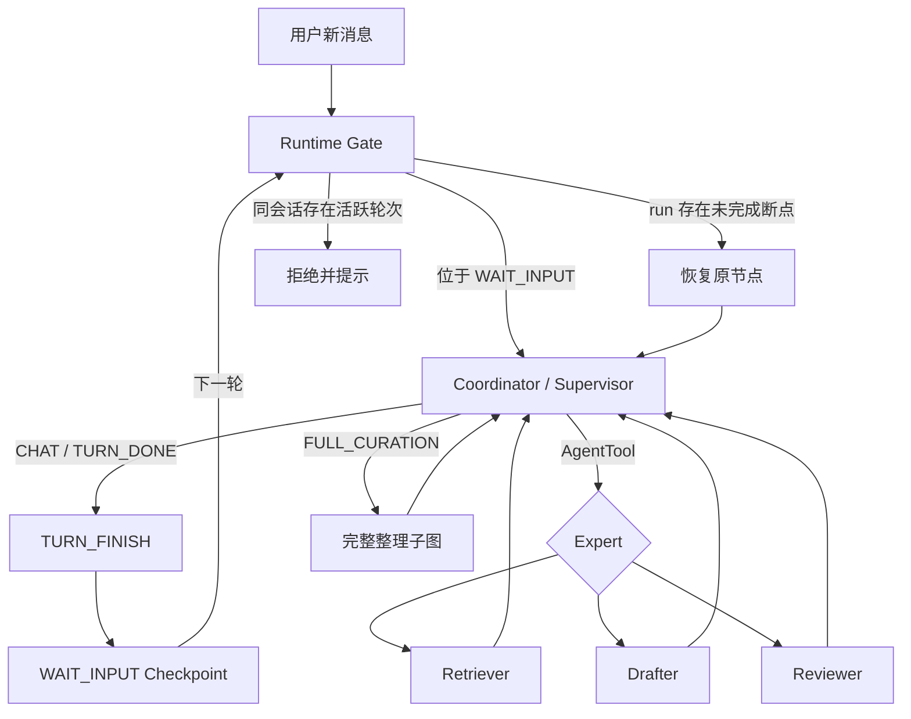
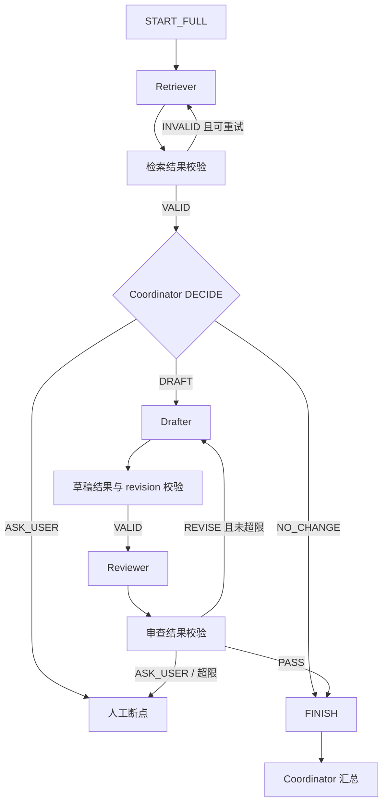
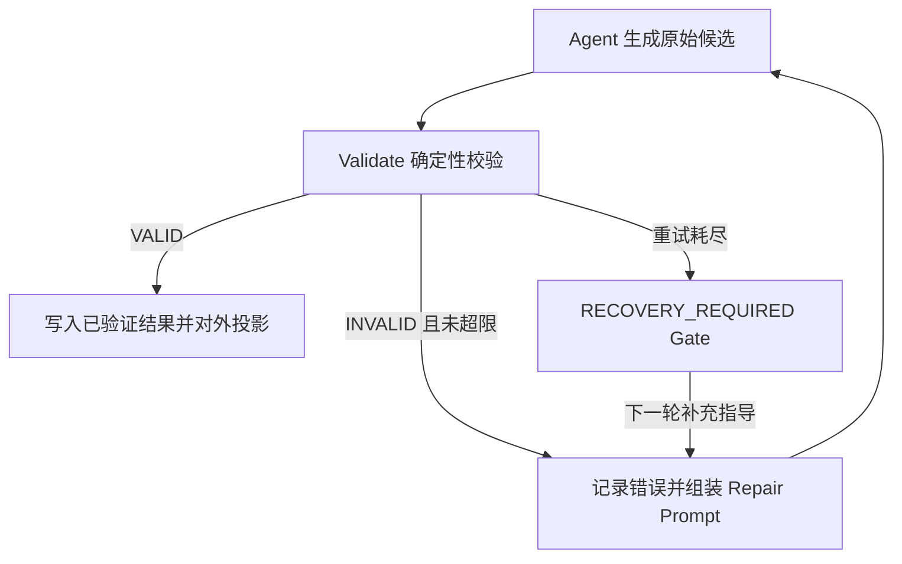

# 知识整理多路 Agent 会话编排设计

| 属性 | 内容 |
|---|---|
| 文档版本 | v0.3 |
| 文档日期 | 2026-08-30 |
| 文档状态 | 方案已确认，随 OpenSpec change `multiagent-conversation-orchestration` 进入实现 |
| 前置设计 | [知识整理多 Agent 图编排设计](./知识整理多Agent架构设计.md) |
| 适用范围 | 管理员在知识整理任务中的多轮对话、专家 Agent 直调、完整整理流程与断点恢复 |
| 核心结论 | 会话级父 Graph 保存状态，主 Agent 统一识别意图，子 Agent 可单独调用，高风险整理进入稳定子图。v0.3 相对 v0.2 确认六项决策：主 Agent 结构化 `MainTurnResult` 路由、允许直调后再进完整子图、直调路径不建独立 Validate 节点、顶层 messages 由 TURN_FINISH 重建（REPLACE）、定义版本复用 `agent_spec_digest`/`config_summary` 不新增列、会话级串行 |

## 1. 背景

现有知识整理已经将单 Agent 拆分为调度、检索、草稿和审查四个 `ReactAgent`，并通过显式 `StateGraph` 固定“检索 → 决策 → 起草 → 审查”的合法顺序。父 Graph 使用 `PostgresSaver` 在节点边界保存 Checkpoint，草稿、来源、Diff、公开消息和 Tool 调用仍保存在 LoreDock 现有业务表中。

这套设计保证了完整整理流程的基本稳定性，但实际多轮使用还有三个结构性问题：

1. 每个新 run 都生成新的 `threadId`，上一轮 Graph State 不会被下一轮继承；
2. 续聊通过把最近用户消息和调度 Agent 回复压成一段字符串重新启动，不是角色化消息和会话状态继承；
3. 无论用户只是查询、修改标题还是检查当前草稿，一旦不是闲聊就容易进入完整检索图，延迟和模型调用数不必要地增加。

同时，模型网络异常、结构化结果解析失败、进程重启和人工暂停尚未统一为可恢复的运行语义。部分错误会直接终止当前 run，用户只能创建新 run 并尝试通过文本历史恢复上下文。

## 2. 业界方案与选型结论

本设计采用混合编排（Hybrid Orchestration）：

- 用 Supervisor / Agents-as-Tools 提供对话级动态调度和专家直调；
- 用确定性 StateGraph 保证高风险整理流程的顺序、审查和返工上限；
- 用同一会话 `threadId` 和持久化 Checkpoint 支持多轮与断点继续；
- 子 Agent 默认无独立长期历史，由主 Agent 和父 Graph 控制上下文所有权。

该方式与主流框架的组合方向一致：

- [Spring AI Alibaba Agent Tool](https://v1100.java2ai.com/docs/frameworks/agent-framework/advanced/agent-tool/) 将专业 Agent 包装为主 Agent 可调用的 Tool；
- [Spring AI Alibaba Multi-agent](https://java2ai.com/docs/frameworks/agent-framework/advanced/multi-agent/) 同时提供路由、顺序、循环和自定义 Graph 编排；
- [OpenAI Agent Orchestration](https://openai.github.io/openai-agents-js/guides/multi-agent/) 区分“主 Agent 保持控制并调用专家”与“把会话交接给专家”两种模式；
- [LangChain Subagents](https://docs.langchain.com/oss/python/langchain/multi-agent/subagents) 由主 Agent 维护对话记忆，子 Agent 以隔离上下文执行；
- [LangChain Custom Workflow](https://docs.langchain.com/oss/python/langchain/multi-agent/custom-workflow) 支持将确定性图和 Agent 节点混合组合；
- [Azure Agent Orchestration Patterns](https://learn.microsoft.com/en-us/azure/architecture/ai-ml/guide/ai-agent-design-patterns) 建议按各阶段的确定性要求组合多种编排模式，而不是整个应用只使用一种模式。

不采用 Handoff 作为主模式，因为检索、草稿和审查 Agent 不应接管用户会话。主 Agent 始终是唯一对话口径，负责理解历史、选择路径、组合专家结果并输出最终回复。

## 3. 设计目标

### 3.1 必须完成

1. 同一知识整理会话使用稳定的 Graph `threadId`，多个 run 共享会话级状态。
2. 主 Agent 在每轮开始时基于当前消息、历史和工作区概况识别意图。
3. 主 Agent 可以单独调用 Retriever、Drafter 或 Reviewer，也可以进入稳定的完整整理子图。
4. 上一轮正常完成后，下一轮从 `WAIT_INPUT` Checkpoint 继续，不重建无关状态。
5. 当前轮暂停、进程重启或可恢复错误后，使用原 run、原 `threadId` 和原 Checkpoint 从下一节点继续。
6. 模型网络错误、结构化结果错误和 Tool 错误有分层、可观察、有上限的重试策略。
7. 正式发布仍由管理员使用现有接口完成，任何 Agent 都不获得发布 Tool。
8. 同一会话同一时间只允许一个活跃轮次：出现并发新轮请求时服务端拒绝并返回明确提示。

### 3.2 非目标

- 不建设通用 Workflow Runtime、Agent Registry 或自定义模型/Tool 循环；
- 不引入消息队列、A2A、跨进程子 Agent 或分布式调度；
- 不让子 Agent 直接与用户维护独立会话；
- 不把完整 Tool 输出、模型推理或全部候选正文长期保存到 Graph State；
- 不使用模型摘要替代人工决定、来源和草稿修订等业务事实；
- 不为尚未存在的自动化触发、多用户协作或无人发布预留空抽象。

## 4. 框架能力对照

项目当前锁定 Spring AI `1.1.2` 和 Spring AI Alibaba `1.1.2.3`。新设计应优先使用下列已存在能力。

| 需求 | 框架能力 | 设计决定 |
|---|---|---|
| 主与专家 Agent | `ReactAgent` | 直接使用 |
| 专家直调 | `AgentTool.create(ReactAgent)` | 将三个专家作为主 Agent Tool |
| 主 Agent 意图信号 | `outputType`/`outputKey`（与现有四 Agent 同机制） | 主 Agent 增加 `MainTurnResult` 结构化输出，条件边只按 `action` 路由 |
| 完整流程 | `StateGraph`、条件边、子图 | 保留显式业务子图 |
| 结构化结果 | `outputType`、`outputKey` | 直接使用，LoreDock 补充业务校验 |
| 状态持久化 | `PostgresSaver` | 只由会话级父 Graph 持有 |
| 断点边界 | `CompileConfig.interruptAfter` | 用于节点边界暂停与续跑 |
| 状态读写 | `StateSnapshot.config()`、`CompiledGraph.updateState()` | 用于精确恢复和注入新轮输入 |
| 调用上限 | `ModelCallLimitHook`、`ToolCallLimitHook` | 直接使用；限额按“1 次主 Agent + 最多 3 次专家直调”预算设计 |
| 模型传输重试 | `ModelRetryInterceptor` | 核验锁定版本流式行为后接入 |
| 只读 Tool 重试 | `ToolRetryInterceptor` | 仅允许幂等只读 Tool |
| 长历史压缩 | `SummarizationHook` | 不作为知识事实默认路径 |
| 子任务后台执行 | `TaskToolsBuilder` | 当前不使用，避免引入第二套任务生命周期 |
| 单次专家路由 | `LlmRoutingAgent` | 不作为主会话调度，主 Agent 需保持多轮上下文并支持多次调用 |

在本地 `1.1.2.3` 源码 JAR 中可用的是 `AgentTool`、`LlmRoutingAgent`、`StateGraph`、`PostgresSaver` 和各类 Hook/Interceptor，不应依赖本地不存在的 `SupervisorAgent` 类。Supervisor 语义由“主 `ReactAgent` + `AgentTool`”实现，不自建通用 Supervisor Runtime。

锁定版 `AgentTool` 的关键行为（已核验 1.1.2.3 源码）：子 Agent 的 `RunnableConfig` 从父配置派生且 `threadId` 为 `{父ThreadId}_{agent.name()}`（确定性），并清空 `checkPointId`/`nextNode`；调用返回子 Agent 最后一条 AssistantMessage 文本。这一机制决定了：

- 只要子 Agent 还持有 Saver，跨轮直调同一个专家会复用其旧 Checkpoint 链（同一确定性 threadId），继承旧的模型/Tool 历史——移除子 Agent Saver 是**正确性前提**，不是上下文整洁的可选优化；
- 父图对直调结果只能获得“子 Agent 最终回复文本”，不能再拿到子 Agent 的 typed 结构化对象（已在子 Agent 内部消费），因此直调路径的校验对象应收敛为主 Agent 输出的 `MainTurnResult`。

## 5. 运行身份与状态所有权

### 5.1 三级身份

| 身份 | 稳定性 | 职责 |
|---|---|---|
| `conversationId` | 整个知识整理会话不变 | 业务消息、草稿、发布和用户可见时间线 |
| `threadId` | 整个会话不变 | 父 Graph State 与 Checkpoint 命名空间 |
| `runId` | 每个正常用户轮次新建 | 本轮状态、耗时、Token、Tool 调用、错误和前端过程 |

可以使用确定性 `threadId = knowledge-task-conversation-{conversationId}`，不必为会话再新增一列。旧会话的未完成 run 继续使用其已保存的旧 `threadId`；旧会话开始新轮时，如果没有会话级 Checkpoint，则从业务消息与工作区重建一次初始会话状态。

### 5.2 三类 Graph State

| 范围 | 是否跨轮继承 | 建议字段 |
|---|---|---|
| 会话状态 | 是 | `originalGoal`、`messages`、`confirmedDecisions`、`workspaceRefs`、`historyTruncated` |
| 本轮状态 | 否，每轮替换 | `runId`、`currentInstruction`、`turnMode`、`directAgentCalls`、`turnResult` |
| 流程状态 | 未完成时继承 | `stage`、`nextNode`、`retrievalResult`、`draftResult`、`reviewResult`、`draftRound`、`retryState`、`validationState`、`lastValidatedNode` |

“继承上一轮 Graph State”不等于把所有临时字段永久追加。正常新轮必须保留会话状态，并清理上轮的检索候选、路由结果、返工次数和已解决错误。中途暂停或可恢复错误则不执行清理，直接恢复当前流程状态。

## 6. 顶层会话 Graph



### 6.1 Runtime Gate 优先于意图识别

每次收到用户输入后，先用确定性代码检查当前状态：

1. `WAITING_FOR_USER` 且存在未完成 Checkpoint：用户消息作为当前节点补充指导，恢复原 run；
2. 进程中断且 run 仍处于可恢复状态：按原 Checkpoint 重新调度；
3. 正常位于 `WAIT_INPUT`：创建新 run，注入本轮消息后交给主 Agent；
4. 用户明确取消或放弃当前流程：先完成取消状态转换，再决定是否开始新轮；
5. 同一 conversationId 已有非终态 run 或处于运行中的轮次：拒绝新轮次请求并返回“上一轮处理中”的明确提示，不并行执行，不依赖模型判断。

这一层不由模型决定。否则模型可能把“补充上一步所需信息”误判为全新任务，绕过断点。

### 6.2 主 Agent 调度方式

主 Agent 持有三个专家 AgentTool，不直接持有知识读写 Tool：

- `retrieve_expert`：检索候选、正式知识和当前工作区；
- `draft_expert`：根据明确指令和可用来源修改草稿；
- `review_expert`：审查指定 `draftId + revision` 的事实支持、用户意图和文档边界。

主 Agent 本身是结构化输出 Agent，最终输出 `MainTurnResult`，父图条件边只按它的 `action` 路由：

| action | 语义 | 校验 |
|---|---|---|
| `CHAT` | 不调用任何专家，直接回答会话或流程元问题 | `summary` 非空 |
| `FULL_CURATION` | 把本轮工作交给完整整理子图 | 子图执行固定的检索→决策→起草→审查链路 |
| `TURN_DONE` | 已按需调用一个或多个专家并组装最终回复 | `summary` 非空；若本轮直调过 Drafter，最终回复必须声明“已修改、未经专家审查” |

主 Agent 的第一次模型判断即为意图识别，可以：

- 不调用专家，直接输出 `CHAT` 结束本轮；
- 单独或按需调用多个专家，最后输出 `TURN_DONE`；
- 先直调专家（例如先看当前草稿），再在最终输出中转向 `FULL_CURATION` 进入完整子图——该组合允许的原因：真实对话中“先检查再全套整理”很常见；子图会重新检索与撰写，但草稿写入由幂等键与 `baseRevision` 保证不重复产生变更，代价只是重新计算与可观察的节点事件。

主 Agent 的每轮专家调用数受 `ToolCallLimitHook` 限制。完整整理子图一旦开始，主 Agent 不能在中途随意跳过检索、写入后审查或返工上限。

### 6.3 会话消息的归属与重建

顶层 Graph 的 `messages` 使用 REPLACE 策略，由 `TURN_FINISH` 节点统一重建为「裁剪后的角色消息历史 + 本轮用户指令 + 主 Agent 最终 AssistantMessage(summary)」。原因：框架 `asNode(true, false)` 会把 Agent 的最后一条结构化输出（原始 JSON）自动追加到父 `messages`（现有实现的 `set_decide`/`set_finish` 带标签上下文方案正是为对抗该行为）；在会话级 `messages` 上继续累计会混入无标签、无阶段的 JSON 双份冗余。集中重建后，`messages` 成为可预测的角色化历史，成为裁剪与下一轮 `updateState` 的唯一权威输入。

完整整理子图内部维持现状：`messages` APPEND + 带标签阶段上下文（该层行为已稳定，不纳入本次改动）。

## 7. 多路意图与路由规则

| 输入意图 | 默认路径 | 边界 |
|---|---|---|
| 问候、流程状态、上轮结论解释 | `CHAT` | 不调用业务 Tool |
| 查询某个业务事实或当前草稿内容 | Retriever | 只读，主 Agent 组装最终回复 |
| 修改标题、删除段落、调整结构或写入用户明确给出的决定 | Drafter | 不得自行补充新的内部事实 |
| 检查当前草稿的来源、冲突、边界或可发布性 | Reviewer | 必须锁定具体修订 |
| 先检索再修改的小任务 | Retriever → Drafter，按需 Reviewer | 由主 Agent 组合，仍受写入边界限制 |
| 整理候选材料、合并多份文档、处理事实冲突或进行高风险事实写入 | `FULL_CURATION` | 固定检索、决策、起草和审查链路 |

代码必须在模型路由之外保留硬性业务规则：

- 对外部事实、项目内部规则或现有知识做新增/改写时，没有可用来源就不能直接写入；
- 用户在当前消息中明确给出的决定可以 `USER_MESSAGE` 作为来源；
- 任何草稿写入都只能影响工作区，不能直接发布；
- 草稿修改后旧审查结论不得覆盖新 revision；
- 主 Agent 可以在直调 Drafter 后结束本轮，但必须明确说明“已修改、未经专家审查”；宣称整理完成或进入发布前必须审查当前 revision；
- `CHAT`/`TURN_DONE` 若缺少可见回复，视为结构化结果无效，进入修复回路而非直接结束。

## 8. 完整整理子图



子图继续使用当前四 Agent 的结构化结果、Tool 白名单、最多两轮返工、无来源不写入和无发布 Tool 等边界（对应 `KnowledgeCurationGraphFactory` 现有状态键与路由规则，不做机制性重写）。

子图不包装成一个不透明的长运行 Tool。它作为父 Graph 可观察的子图或明确节点存在，使 Checkpoint、节点事件、暂停和失败恢复仍能被顶层 Executor 观察。

## 9. 多轮对话与 `WAIT_INPUT`

### 9.1 正常轮次

1. 会话首次执行时以稳定 `threadId` 创建 Graph State；
2. 主 Agent 完成回答、直调或完整子图后，输出 `MainTurnResult`，条件边按 `action` 路由；
3. `TURN_FINISH` 清理本轮临时状态，并重建 `messages` 为角色化会话历史（见 §6.3），将下一节点指向 Coordinator；
4. Graph 在 `WAIT_INPUT` 边界中断，当前 run 标记为 `COMPLETED`，Checkpoint 保留；
5. 用户发送下一条消息后创建新 run，复用同一 `threadId`；
6. 通过 `graph.updateState(snapshot.config(), values)` 替换本轮字段、追加用户消息，然后从 Checkpoint 指向的 Coordinator 续跑。

### 9.2 人工追问与暂停

下列场景不创建新 run，而是恢复原 run：

- 完整整理子图输出 `ASK_USER`；
- 管理员主动请求暂停并在节点边界停止；
- 结构化结果重试耗尽，需要人工指导当前节点；
- 外部依赖暂时不可用，但已存在稳定 Checkpoint。

首版复用 `WAITING_FOR_USER`，通过公开事件中的 `waitReason` 区分 `ASK_USER`、`PAUSED` 和 `RECOVERY_REQUIRED`，避免立即扩展一套新运行状态机。

## 10. 历史消息与上下文管理

### 10.1 保留内容

- 原始整理目标；
- 当前用户指令；
- 最近若干完整的 User/Assistant 对话轮次；
- 用户明确确认、否决或暂缓的决定；
- 当前工作区中的 `draftId + revision` 引用；
- 未解决问题和它们对应的原始消息 ID。

### 10.2 不跨轮保留

- 全部检索候选正文；
- 子 Agent 的完整模型/Tool 消息链；
- 流式输出分片；
- 已经解决的解析错误和临时重试信息；
- 已失效 revision 的审查输入。

### 10.3 裁剪策略

1. 主 Agent 保留真实 `UserMessage` / `AssistantMessage` 角色，不再把历史压成一条新 `UserMessage`；
2. 按完整问答轮次从新到旧选取，不截断半轮；
3. 优先按 Token 预算裁剪，不仅按 Unicode 码点数；
4. 原始目标、当前指令和最新人工决定不参与普通裁剪；
5. 裁剪发生时设置 `historyTruncated=true`；
6. 草稿正文、来源和当前执行事实必须通过 Tool 重读，不相信历史回复中的陈旧快照。

子 Agent 不配置独立 Saver——这是与会话级 Checkpoint 共存的正确性要求（见 §4 AgentTool 行为）：专家直调用 `{parentThreadId}_{agent.name}` 的确定性 threadId，若子 Agent 仍持有 Saver，跨轮或返工时会继承其旧 Checkpoint 链。每次 AgentTool 或子图节点调用只接收主 Agent/父 Graph 组装的最小输入，防止 Retriever、Drafter 和 Reviewer 在跨轮或返工时继承旧 Tool 历史。

## 11. 重试、失败与恢复

### 11.1 检查点不等于业务提交

恢复设计必须区分下列四个边界，不得把它们当成同一次原子提交：

| 边界 | 持有者 | 含义 | 恢复要求 |
|---|---|---|---|
| 技术 Checkpoint | 父 Graph / `PostgresSaver` | 某个节点完成后的可持久化状态，可以包含尚未通过校验的模型候选结果 | 恢复后必须根据 `nextNode` 继续校验或修复，不得默认其中结果有效 |
| 语义稳定恢复点 | 父 Graph 状态与 run 投影 | 结构、Schema 和业务约束已经验证的节点边界 | 非预期代码错误或版本不兼容时，从最后一个语义稳定点重放 |
| 业务副作用 | LoreDock 业务表 | 草稿 revision、来源、审查、Tool 调用等已经发生的事实 | 通过幂等键和 revision 对账，不随 Graph 重放而盲目重复执行 |
| 用户可见投影 | 消息与事件表 | 用户已经看到的阶段输出和最终回复 | 只在校验通过后写入或标记为已确认，失败候选仅保存内部诊断 |

当前锁定版本中，父 Graph 未开启 `interruptBeforeEdge`；执行顺序为：节点输出合并 → 条件边求值 → 写入该节点父图 Checkpoint（已核验 `NodeExecutor` 源码）。因此，当前 `structured()` 在条件边中抛出解析异常时，坏结果通常尚未成为新的父图 Checkpoint，上一个父图 Checkpoint 仍可用于重放。

但当前每个子 `ReactAgent` 也持有同一 Saver，并且执行器在父图语义校验前就可能写入阶段事件和公开消息。所以不能仅依赖当前框架的落盘顺序；目标实现仍必须移除子 Agent Saver，并把校验与对外投影变成显式节点。

### 11.2 结构化结果校验与修复回路

可预期的 JSON 语法、Schema 和业务字段错误是 Agent 输出状态，不是应该逃逸 Graph 的运行时异常。校验对象按路径收敛：

- **完整子图**：每个专家的原始候选 → 确定性 Validate 节点 → `VALID` / `RETRYABLE_INVALID` / `RECOVERY_REQUIRED`；
- **主 Agent 直调**：专家直调经由 `AgentTool`，父图只能获得其最后一条回复文本（结构化对象已在子 Agent 内部消费）；父图对直调的校验对象是主 Agent 的 `MainTurnResult`（条件边解析），解析失败同样进入下述 Repair 回路。§7 的“无来源不写入”仍在完整子图强制执行（现有 `coordinatorRoute` 的 SUPPORTED 事实检查）；直调路径由 Tool 白名单、Tool 内权限/幂等/参数校验与“须声明未经专家审查”规则保障，不再为直调单独建 Validate 节点。



实现约束：

1. Agent 节点到 Validate 节点使用静态边，不在 Agent 的条件边中直接解析原始文本；
2. Validate 捕获所有预期校验异常，输出 `VALID`、`RETRYABLE_INVALID` 或 `RECOVERY_REQUIRED`，条件边只根据该枚举路由；
3. Graph State 保留 `rawCandidate`、`validationError`、`retryAttempt` 和 `lastValidatedNode`，下游节点只读取已验证的 typed result；
4. 技术 Checkpoint 即使已经包含无效 `rawCandidate`，其 `nextNode` 也是 Validate 或 Repair，因此恢复后不会在同一抛异常位置循环；
5. `interruptAfter` 的可见暂停边界放在 Validate 成功、显式人工等待或恢复 Gate 后，不把未验证模型输出当成已完成阶段；
6. 每次修复使用新 `attemptId`，同时保留有界的失败摘要；不向新请求注入子 Agent 的完整旧 Tool/模型消息链。

对于解析器自身的代码缺陷、`NullPointerException` 或状态序列化错误，重复相同输入通常不会成功。这类异常必须停在 `RECOVERY_REQUIRED`，保留最后语义稳定恢复点和诊断摘要；代码修复部署后，可重建 Graph 并从原 run 续跑，而不必创建新会话。

### 11.3 写入副作用对账

模型调用、Graph Checkpoint 和业务数据库之间不存在可用的跨系统原子事务。目标语义是“至少一次执行 + 幂等 + 对账”，不声称 exactly-once。

对 Drafter 执行以下额外流程：

```text
写 Tool 返回成功或结果不确定
        ↓
按 idempotencyKey + draftId + baseRevision 查询当前业务状态
        ├─ 已产生新 revision → 从 PatchSet/Workspace 重建 DraftResult，不再写入
        ├─ 确认未写入       → 允许使用同一幂等键重试
        └─ 仍无法确定       → RECOVERY_REQUIRED，禁止盲目重试
```

如果 Drafter 已经完成草稿写入，但最终结构化 JSON 无效，Validate 先尝试根据 Tool 调用回执和当前 revision 重建 typed `DraftResult`；只有确认没有业务写入时才允许重跑 Drafter。

### 11.4 失败分类与默认处理

| 失败层级 | 处理方式 | 默认上限 | 注意事项 |
|---|---|---:|---|
| 模型连接、限流、暂时超时 | 模型调用内部退避重试 | 2 次重试 | 流式内容已输出后不重放，避免重复分片 |
| JSON 解析、Schema 或业务字段校验失败 | Validate 返回可观察失败状态，反馈给同一 Agent 重新生成 | 2 次 | 不抛出 Graph，不根据自然语言猜路由 |
| 只读 Tool 暂时失败 | 幂等重试 | 2 次 | 仅 Retriever/Reviewer 的明确只读 Tool |
| 写 Tool 调用返回失败或结果未知 | 查询当前 revision 并对账 | 不盲目重试 | 继续使用幂等键与 `baseRevision` |
| Drafter 已写入但最终 JSON 无效 | 从 Tool 回执和当前 PatchSet/Workspace 重建 typed result | 2 次重建/修复 | 不再次执行相同写入 |
| 进程重启 | 扫描非终态知识整理 run，按 Checkpoint 重新调度 | - | 无 Checkpoint 时记录稳定错误 |
| 解析器代码缺陷、NPE 或序列化错误 | 停在 `RECOVERY_REQUIRED`，修复部署后从语义稳定点重放 | 0 次自动重试 | 保留错误类型和脱敏摘要 |
| Graph/Agent Spec 或状态版本不兼容 | 按 run 记录的定义版本重建，或显式迁移 | 0 次盲目重试 | 不用新图直接解读旧状态 |
| Checkpoint 持久化失败 | 保留 run 为可恢复错误，按最后已持久化稳定点续跑 | 有界连接重试 | 如节点含写副作用，先对账 |
| 权限越界、参数永久无效或明确业务冲突 | 转人工或终态失败 | 0 次 | 不用重试绕过业务约束 |
| 重试耗尽 | 进入 `WAITING_FOR_USER` + `RECOVERY_REQUIRED` 原因 | - | 保留原 run 和最后稳定 Checkpoint |

**定义版本判定（无需新增列）**：`agent_run` 已持久化 `agent_spec_digest`（四份 Agent 定义内容 SHA-256，run 创建时由 `KnowledgeAgentDefinitionService` 写入）与 `config_summary`。本方案约定：`agent_spec_digest` 代表四份 Agent 定义内容，`config_summary` 前缀携带 Graph 定义版本（如 `knowledge-curation-sess-v1`）。恢复时先重算当前定义摘要：任一与 run 记录不一致 → `RECOVERY_REQUIRED`，不解析不兼容的 Checkpoint；修复部署后可从语义稳定点重建并续跑。

当前 `KnowledgeCurationRunExecutor` 的任意异常终结 run 逻辑需改为按失败类别处理。只有不可恢复的权限越界、明确取消、无法迁移的定义不兼容、重试耗尽且无可用语义稳定恢复点等场景才进入终态 `FAILED`。

## 12. 权限、幂等与发布边界

| 能力 | Retriever | Drafter | Reviewer | Coordinator |
|---|---|---:|---:|---:|---:|
| 候选/知识/草稿只读 | 允许 | 最小必要 | 允许 | 不直接拥有 |
| 草稿写入 | 禁止 | 允许 | 禁止 | 不直接拥有 |
| 草稿审查 | 禁止 | 禁止 | 允许 | 只组合结果 |
| 正式发布 | 禁止 | 禁止 | 禁止 | 禁止 |
| 用户对话 | 禁止 | 禁止 | 禁止 | 唯一入口 |

专家 Agent 的 Tool 白名单、操作者、项目、会话、run 范围仍由 Tool 内硬校验，不依赖主 Agent 的提示词自律。写入继续使用 `idempotencyKey + baseRevision`，审查必须记录具体 `draftId + revision`，发布接口必须重新确认当前 revision 与审查对象一致。

主 Agent 本身无业务 Tool，只拥有三个经注册的专家 AgentTool；主 Agent 不得获得知识搜索、草稿写入、审查或发布工具的直接句柄。

## 13. 当前实现与目标差距

| 领域 | 当前实现 | 目标实现 |
|---|---|---|
| `threadId` | 每个 run 随机生成 | 同一 conversation 稳定共享 |
| 新轮对话 | 新 thread，文本拼接历史，从 START 启动 | 新 run、同 thread，从 `WAIT_INPUT` Checkpoint 续跑 |
| 暂停恢复 | 校验 Checkpoint 后首次 stream 仍以 thread-only 配置 | 直接使用最新 `StateSnapshot.config()` |
| Graph 结束 | 进入 `END` | 正常轮次停在 `WAIT_INPUT` |
| 主 Agent 能力 | 只输出固定 Graph 路由 | 持有三个 AgentTool，输出 `MainTurnResult`，也可先直调再进完整子图 |
| 子 Agent Saver | 父 Graph 和子 ReactAgent 都配置 Saver | 只由父 Graph 持久化，子 Agent 使用干净上下文 |
| `messages` | APPEND 并手工追加阶段上下文 | 顶层以 REPLACE 由 TURN_FINISH 重建；子图维持带标签 APPEND |
| 解析错误 | 条件边直接解析并抛异常，执行器使 run 失败 | 校验对象收敛：完整子图走 Validate 回路，直调走 `MainTurnResult` 条件边校验与 Repair |
| 恢复边界 | 技术 Checkpoint、子图状态、公开事件与业务写入可分别落盘 | 显式区分技术 Checkpoint、语义稳定点、业务副作用和用户可见投影 |
| 阶段消息 | 模型完成后、父图语义校验前即可写入 | 校验通过后才公开投影，失败候选只记内部诊断 |
| 进程重启 | 不重新调度知识整理 run | 有 Checkpoint 的非终态 run 按原定义摘要重建 Graph 并续跑，定义不兼容则停在 RECOVERY_REQUIRED |
| 并发轮次 | 无处理（各 run 独立 threadId） | 会话级串行：同一会话存在活跃轮次时拒绝新轮次 |

## 14. 实施计划

> 阶段顺序说明：阶段 1 先独立交付（会话级 threadId + WAIT_INPUT + 精确恢复，是后续地基）；阶段 2 与阶段 3 合并交付（主 Agent 直调与 Validate/对账/重试穿过同一条链路，拆开交付意味两次跨越同一批代码）；阶段 4 最后单独交付（纯增量）。每次交付后运行 §15 对应验收场景。

### 阶段 1：会话级状态与精确恢复

- 将新 run 的 `threadId` 改为会话级稳定值 `knowledge-task-conversation-{conversationId}`；
- 在父 Graph 增加 `TURN_FINISH / WAIT_INPUT` 边界；
- 区分会话、本轮和未完成流程状态；
- 新轮使用 `updateState()` 注入消息并替换本轮字段；
- 暂停恢复的首次 stream 直接使用最新 `snapshot.config()`；
- 删除“只有 threadId 就等于恢复”的错误假设；
- 恢复前比对 `agent_spec_digest` 与 `config_summary` 定义版本，不一致停在 `RECOVERY_REQUIRED`；
- Runtime Gate 增加会话级串行（活跃轮次拒绝新轮）。

独立验证：预置 Retriever 后 Checkpoint，恢复时 Coordinator START 不得再执行；上一轮完成后的新消息必须沿用同一 `threadId` 且可读取上一轮会话状态；同会话并发新轮次被拒绝。

### 阶段 2+3：主 Agent 与多路专家调用、分层重试与重启恢复

- 使用现有四份 Agent Spec 构建主 Agent 和三个专家，主 Agent 通过 `AgentTool.create()` 持有专家；
- 主 Agent 增加 `MainTurnResult` 结构化输出，父图条件边按 `CHAT/FULL_CURATION/TURN_DONE` 路由；
- 将当前完整 Graph 收缩为稳定整理子图（维持其状态键、路由与安全规则）；
- 移除子 Agent Saver，保留父 Graph Checkpoint；
- 顶层 `messages` 改为 REPLACE，`TURN_FINISH` 重建角色化历史；
- 完整子图增加“原始候选 → Validate → Repair/Recovery Gate”回路，`interruptAfter` 与公开投影移到校验成功后；
- 只对只读 Tool 启用通用重试；写入结果未知增加 `idempotencyKey + draftId + baseRevision` 对账，已写入时重建 typed result；
- 启动时扫描可恢复的知识整理 run，按原定义摘要与 Checkpoint 重新调度；
- 评估锁定版本 `ModelRetryInterceptor` 在流式链路中的实际行为后再接入。

独立验证：问知识时只调 Retriever；改标题时只调 Drafter；要求审查时只调 Reviewer；整理多份候选材料时完整子图真实执行；第一次无效 JSON、第二次有效时同 run 继续；Drafter 写入成功但最终 JSON 无效时不增加第二个 revision；进程重启后同 run 从已保存下一节点继续；定义摘要变化时停在 RECOVERY_REQUIRED。

### 阶段 4：上下文裁剪与评估

- 将历史输入改为角色化 `Message` 列表；
- 按完整轮次和 Token 预算裁剪；
- 主 Agent 保留会话历史，专家 Agent 只获得任务所需的最小输入；
- 记录路由模式、专家调用、重试次数、恢复节点和 Token 成本；
- 对比直调路径与完整子图的路由准确性、误写率、引用完整性、延迟和成本。

独立验证：历史裁剪不截断半轮，裁剪标志真实写入；主 Agent 可见上轮结论，Retriever/Drafter/Reviewer 不可见无关历史和其他 Agent 的 Tool 链。

## 15. 最小验收矩阵

| 场景 | 必须观察到的结果 |
|---|---|
| 普通元对话 | 主 Agent 回答，三个专家和完整子图调用数均为 0 |
| 只读知识查询 | 只调 Retriever，引用与项目范围正确，无草稿修订 |
| 直接调整草稿 | 只调 Drafter，产生一个新 revision，无新知识事实猜测 |
| 直接审查 | 只调 Reviewer，结果锁定当前 `draftId + revision` |
| 完整整理 | 检索、调度、起草、审查和最终汇总真实执行，不自动发布 |
| 上一轮后续聊 | 新 run、同 thread，主 Agent 看到角色化历史，无关本轮字段已重置 |
| 检索后暂停 | 恢复时从 Coordinator DECIDE 继续，Retriever 不重跑 |
| 进程重启 | 启动恢复器重新调度原 run，原 Checkpoint 之前已写入修订不重复 |
| 定义摘要变化 | run 停在 `RECOVERY_REQUIRED`，不解析不兼容 Checkpoint |
| 结构化结果首次无效 | Validate 记录失败状态，同一 Agent 收到具体校验错误后重生成，不直接终止 run |
| 无效结果已进技术 Checkpoint | Checkpoint 的下一节点是 Validate/Repair，恢复后不重复抛出同一解析异常 |
| Drafter 写入后输出无效 | 对账已有 revision 并重建 `DraftResult`，草稿不产生重复 revision |
| 校验前的原始候选 | 不产生已完成阶段消息，只保存可审计的内部诊断 |
| 解析器代码缺陷 | 不自动重复相同输入；修复部署后原 run 可从最后语义稳定点续跑 |
| 重试耗尽 | run 保留可恢复 Checkpoint 和具体原因，用户可继续当前节点 |
| 跨项目或越权调用 | 业务 Tool 拒绝，Graph State、草稿和正式知识均不改变 |
| 会话级并发新轮次 | 服务端明确拒绝并提示，不产生第二个并行 run，Checkpoint 不被并发写入 |

## 16. 实施前必须更新的工件

该方案改变了 `threadId` 所有权、多轮续聊、Graph 终止条件、Agent 可调用能力和失败语义。对应 OpenSpec change 为 `multiagent-conversation-orchestration`，工件至少覆盖：

- proposal：从“单个固定整理 Graph”扩展为“会话级多路编排”；
- spec：增加会话级 `threadId`、`WAIT_INPUT`、`MainTurnResult` 专家直调、精确恢复和分层重试的可观察行为；
- design：同步顶层 Graph、子图、状态分层、AgentTool 直调与迁移方案；
- tasks：按本文档第 14 节的交付顺序拆分（阶段 1 独立、阶段 2+3 合并、阶段 4 最后），每项带可验证的完成条件。

在 OpenSpec 与本文档对齐前，不应直接编写新的会话状态、AgentTool 和恢复代码，避免用测试固化仍未确认的语义。

## 17. 本批交付说明（2026-08-30）

按实施计划先落地了“阶段 1 + 阶段 2+3 前半”并对齐 OpenSpec change：

**已交付并验证：**
- 阶段 1：会话级 `threadId = knowledge-task-conversation-{conversationId}`；`TURN_FINISH / WAIT_INPUT` 轮次边界；新轮 `updateState()` 注入 + 从边界继续；暂停/重启恢复首流用 `snapshot.config()`；定义恢复守卫（`agent_spec_digest` + `config_summary` 前缀 `knowledge-curation-sess-v2`，不一致 → `AGENT_DEFINITION_MISMATCH`）；`V9` 迁移移除 `uq_agent_run_thread`；`AgentRunRecovery` 扩展知识整理非终态扫描。
- 阶段 2+3 前半：`main_agent`（`MainTurnResult` CHAT/TURN_DONE/FULL_CURATION）+ 三个专家 `AgentTool`（工具名 = 专家名）；顶层条件边按 `action` 路由；完整整理走 `main → retriever → … → coordinator FINISH → set_main_resume → main 汇总`；TURN_FINISH 指向主 Agent；**子 Agent 全部移除 Saver**（父图 Checkpoint 独占命名空间）；`GRAPH_DEF_VERSION` 升至 v2。
- 阶段 2+3 后半：Validate→Repair→Recovery 回路——条件边校验失败（JSON 解析或业务字段，覆盖全部五个 Agent）返回 `fix_{agent}`，fix 节点记录有界错误摘要并递增 `retryAttempt`（最多 2 次重生成）后回到该 Agent；仍无效进入 `recovery_gate`（`turnMode=RECOVERY_REQUIRED` + `recoveryInfo`），本轮以包含原因的可见说明结束、保留 Checkpoint，不落入失败终态；重试次数每轮由新轮注入重置。
- 专家直调（AgentTool 链路）真实集成测试：主 Agent 输出 toolCall → 检索专家以独立上下文执行 → 主 Agent 输出 TURN_DONE 汇总（3 次模型调用）。
- 关键实现事实：`AgentTool` 子线程为 `{parentThread}_{agent.name}` 且清空 checkpoint/nextNode（锁定版源码核验）；会话级续聊、停顿恢复不重跑入口、定义不一致停止、完整路径 7 次模型调用等场景由 `KnowledgeCurationConversationStateIT` / `KnowledgeCurationGraphRunIT` / `KnowledgeCurationRunExecutorDriveIT` 真实 Graph 验证；后端全量 441 项通过，前端 `vue-tsc` 通过。

**后续批次（OpenSpec tasks 有记录，均非阻塞核心链路）：**
- 旧轮模型原始 JSON 清理：TURN_FINISH 已重建 `conversationHistory` 角色化历史并在新轮注入（最多 4 轮/8000 码点、半轮不截断、`historyTruncated`）；但顶层 `messages` 为 APPEND，旧轮自动追加的原始 JSON 仍共存——清理依赖 messages 策略改造（REPLACE 与框架自动追加的行为验证先行）；
- 写入副作用对账（图级重建 typed 结果）：工具层幂等已由 `KnowledgeDraftService` 既有实现与测试覆盖；
- `ModelRetryInterceptor`：核验结论为仅实现 call 层拦截、不覆盖流式，**不接入**（重生成语义由修复回路承担）。

**已知偏差：** §9.2 的“ASK_USER 恢复原 run”未实现（沿用既有行为：ASK_USER 结束本轮、下一轮为新 run）；专家直调路径的“无来源不写入”由 Tool 白名单/幂等保障，硬校验只在完整整理链路强制。
