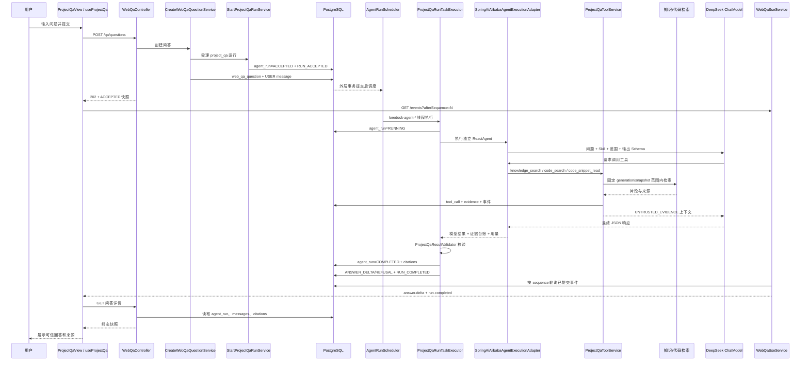

# LoreDock 项目问答全链路排查指南

本文按当前代码说明一次 Web 项目问答从用户输入到前端最终展示的真实链路，用于快速定位“问题已提交但没有回答”“模型有响应但前端看不到”“有工具结果但引用为空”等问题。

## 1. 先明确三个关键事实

1. 创建问题接口只返回 `202 Accepted` 和运行快照，不在 HTTP 请求线程内等待模型回答。
2. 当前不是模型 token 直接流向浏览器。后端先完整收集模型响应、解析 JSON、校验证据和引用，再把可信回答按最多 500 个 Unicode 码点拆成 `answer.delta` 事件供 SSE 推送。
3. `agent_run` 是最终运行事实来源。SSE 和 `web_qa_message` 都是下游事件或展示投影；排查时先看 `agent_run`，不要只看浏览器是否收到事件。

## 2. 全链路总览



## 3. 阶段一：前端接收并提交问题

入口文件：

- `frontend/src/views/ProjectQaView.vue`
- `frontend/src/qa/useProjectQa.ts`
- `frontend/src/api/qa.ts`

处理过程：

1. `ProjectQaView.submitQuestion()` 调用 `qa.submit(question)`。
2. `useProjectQa.submit()` 对问题执行 `trim()`，限制为 1～2000 个 Unicode 字符。
3. 请求签名由 `branch + "\n" + question` 组成。同一请求结果未知时复用同一个 `idempotencyKey`；用户主动点击“使用新运行重试”时清空旧键并创建新运行。
4. 前端发送：

```http
POST /api/projects/{identifier}/qa/questions
Content-Type: application/json

{
  "idempotencyKey": "客户端 UUID",
  "branch": "main",
  "question": "用户原始问题"
}
```

5. 创建成功后，前端保存返回快照，并立即从快照的 `lastEventSequence` 打开 SSE。

前端排查点：

- Network 中 POST 是否为 `202`。
- 请求体中的 `identifier`、`branch`、`question` 是否正确。
- 响应是否包含不同用途的 `questionId` 与 `runId`。
- `status` 通常应为 `ACCEPTED` 或已经很快进入 `RUNNING`。
- `submitError` 只代表创建阶段失败；创建成功后的运行失败体现在详情的 `status/errorCode`。

## 4. 阶段二：创建 Web 问答和受理 Agent 运行

入口文件：

- `backend/src/main/java/io/github/loredock/qa/infrastructure/web/WebQaController.java`
- `backend/src/main/java/io/github/loredock/qa/application/CreateWebQaQuestionService.java`
- `backend/src/main/java/io/github/loredock/agent/application/StartProjectQaRunService.java`
- `backend/src/main/java/io/github/loredock/agent/application/AgentRunAcceptanceService.java`

`WebQaController.create()` 取得当前登录用户后，将请求交给 `CreateWebQaQuestionService.create()`。该用例在一个外层短事务中完成：

1. 解析启用项目和目标分支。
2. 检查 Web 问答幂等键；同键不同请求返回 `AGENT_RUN_IDEMPOTENCY_CONFLICT`。
3. 调用 `StartProjectQaRunService.start()`。
4. 固定本次运行范围和版本：
   - 项目 ID、项目标识；
   - 分支 ID、分支名；
   - 当前活动代码 `snapshotId/commit`，没有索引时为空；
   - 当前活动知识 `generationId`，没有时为空；
   - 启用的 `project_qa` Skill 版本和内容摘要；
   - 模型、输出 Schema、工具策略和限制策略版本。
5. 写入 `agent_run`，状态为 `ACCEPTED`。
6. 写入第一条 `agent_run_event`：`RUN_ACCEPTED`。
7. 写入 `web_qa_question`。
8. 把用户问题原文写入 `web_qa_message`，角色为 `USER`。

注意：`agent_run` 只保存问题摘要和长度；问题原文保存在 `web_qa_message`，同时存在于本次内存中的 `AgentExecutionRequest`。

创建阶段常见阻断：

| 现象/错误码 | 检查内容 |
|---|---|
| `AUTH_LOGIN_REQUIRED` | 浏览器会话是否有效，请求是否携带 Cookie |
| 项目接口 404 | 项目是否启用、标识和分支是否存在 |
| `AGENT_RUNTIME_UNAVAILABLE` | `LOREDOCK_AGENT_ENABLED=true` 是否生效 |
| `AGENT_MODEL_UNAVAILABLE` | 模型 base URL 和 API Key 是否配置 |
| `AGENT_SKILL_UNAVAILABLE` | `project_qa` Skill 是否存在、启用、内容和输出 Schema 是否通过校验 |
| `AGENT_RUN_IDEMPOTENCY_CONFLICT` | 是否错误复用了另一个问题的幂等键 |

## 5. 阶段三：事务提交后异步调度

入口文件：

- `backend/src/main/java/io/github/loredock/agent/application/TransactionAwareAgentRunDispatchCoordinator.java`
- `backend/src/main/java/io/github/loredock/agent/infrastructure/runtime/BoundedAgentRunScheduler.java`
- `backend/src/main/java/io/github/loredock/agent/application/ProjectQaRunTaskExecutor.java`

`dispatchAfterCommit()` 只有在创建问答的外层事务提交后才向专用线程池提交任务，避免工作线程读取到未提交的 `agent_run` 或 USER 消息。

执行线程名为 `loredock-agent-{n}`。默认线程池配置：核心线程 2、最大线程 4、队列 16。

任务开始时：

1. `agent_run` 通过 CAS 从 `ACCEPTED` 更新为 `RUNNING`。
2. 写入 `RUN_STARTED`、`SKILL_PINNED`、`MODEL_STARTED` 事件。
3. 调用 `AgentExecutionPort`。

如果调度器拒绝任务，运行会以 `AGENT_RUNTIME_BUSY` 结束；如果应用在提交后、调度前崩溃，应检查启动恢复逻辑是否将遗留的 `ACCEPTED/RUNNING` 运行收敛到终态。

## 6. 阶段四：ReactAgent 与模型循环

入口文件：

- `backend/src/main/java/io/github/loredock/agent/infrastructure/config/AgentApplicationConfiguration.java`
- `backend/src/main/java/io/github/loredock/agent/infrastructure/model/DeepSeekChatModelFactory.java`
- `backend/src/main/java/io/github/loredock/agent/infrastructure/model/SpringAiAlibabaAgentExecutionAdapter.java`

每次运行都会创建独立的 `ReactAgent` 和 `MemorySaver`，不会复用上一题会话。模型收到的核心内容包括：

- 已发布 `project_qa` Skill Markdown；
- 本次固定项目、分支和代码快照可用状态；
- 用户问题；
- 三个只读工具定义；
- `project-qa-v1` 输出 JSON Schema。

模型使用 Spring AI 的 OpenAI 兼容实现，当前默认设置为：

- 模型：`deepseek-v4-flash`；
- `temperature=0`；
- 禁止并行工具调用；
- JSON Object 响应格式；
- 默认总超时 90 秒；
- 最大 8 次模型调用、最大 8 个总步骤；
- 只对有限瞬时错误按配置重试。

`agent.streamMessages(question)` 虽然使用流式模型 API，但当前实现会 `collectList().block()`，等待本轮 Agent 全部完成。`finalAnswer()` 在遇到工具调用消息时清空之前累计的 Assistant 文本，只聚合最后一次工具调用之后的最终回答。

控制台只保留三类 stdout：

```text
project_qa.question
<用户问题>

project_qa.tool_result tool=knowledge_search resultCount=2 evidenceCount=2
<最多 500 个 Unicode 码点的工具上下文预览>

project_qa.model_response
<模型最终原始 JSON>
```

这里的工具预览只影响控制台显示；实际交给模型的上下文仍按运行配置限制，默认单片段最多 2000 字、总上下文最多 24000 字。

## 7. 阶段五：三个只读工具与检索范围

入口文件：

- `backend/src/main/java/io/github/loredock/agent/application/ProjectQaToolRegistry.java`
- `backend/src/main/java/io/github/loredock/agent/application/ProjectQaToolService.java`
- `backend/src/main/java/io/github/loredock/knowledge/application/search/KnowledgeSearchService.java`
- `backend/src/main/java/io/github/loredock/code/application/CodeSearchService.java`
- `backend/src/main/java/io/github/loredock/code/application/CodeSnippetService.java`

允许的工具只有：

| 工具 | 实际行为 | 关键限制 |
|---|---|---|
| `knowledge_search` | 项目范围内执行 HYBRID 知识检索 | 固定活动 generation；关键词与语义候选经 RRF 融合；再复核文档仍已发布且范围有效 |
| `code_search` | 在活动代码索引中搜索路径/符号/正文 | 固定本次 snapshot 和 commit；没有代码快照时返回空结果 |
| `code_snippet_read` | 精确读取命中文件的有限行片段 | 最多 200 行；路径必须是仓库相对路径；固定 snapshot 和 commit |

每次工具调用都会：

1. 检查运行仍为 `RUNNING`。
2. 检查当前知识 generation 或代码 snapshot/commit 与运行受理时固定的版本一致。
3. 写入 `agent_tool_call` 的开始状态和 `TOOL_STARTED` 事件。
4. 执行检索。
5. 将来源登记为 `AgentEvidence` 并写入 `agent_evidence`。
6. 写入 `SOURCE_FOUND`、`TOOL_COMPLETED` 事件和工具计数。
7. 以以下格式把保留的片段交给模型：

```text
UNTRUSTED_EVIDENCE_BEGIN
evidenceId=<UUID>
title=<知识标题> 或 path=<仓库路径>
content=<有界片段>
UNTRUSTED_EVIDENCE_END
```

知识证据只有相关度达到 `minimum-relevance`（默认 0.20）且没有超过结果/上下文上限时才标记为 `retained=true`。模型可以看到并引用的必须是保留证据。

排查工具结果时要区分：

- `resultCount=0`：工具成功，但没有可交给模型的结果；
- `evidenceCount>resultCount`：召回了来源，但部分因相关度或上下文上限未保留；
- `AGENT_EVIDENCE_VERSION_CHANGED`：问答期间重新索引，活动 generation 或 snapshot/commit 改变；
- `AGENT_TOOL_SCOPE_VIOLATION`：返回来源不属于固定项目、分支或快照；
- `AGENT_INTERNAL_ERROR`：检索基础设施或未分类工具异常。

## 8. 阶段六：模型 JSON 解析

模型最终响应必须能解析出：

- `resultType`：`ANSWER` 或 `REFUSAL`；
- `answerBasis`：`BUSINESS_RULE`、`CURRENT_IMPLEMENTATION`、`MIXED`，拒答时可以为空；
- `text`：最终回答或拒答文本；
- `refusalReason`：拒答原因；
- `citations`：模型选择的 evidence UUID 数组，最多 20 个。

解析器允许模型在 JSON 前后附带少量文本或 Markdown fence：实现会截取第一个 `{` 到最后一个 `}`。以下情况会变成 `AGENT_MODEL_RESPONSE_INVALID`：

- 没有 JSON 对象；
- 枚举值不合法；
- 缺少必需字段；
- 回答超过默认 8000 字；
- `citations` 不是数组、数量超限或 UUID 不合法。

如果工具检索成功但最终没有任何可保留证据，且 Agent 因步骤上限、模型调用上限或无效响应终止，适配器会收敛为 `INSUFFICIENT_EVIDENCE` 业务拒答，避免在前端表现成系统故障。

## 9. 阶段七：可信引用校验

入口文件：`backend/src/main/java/io/github/loredock/agent/domain/ProjectQaResultValidator.java`

模型 JSON 仍是不可信结果。只有通过以下校验，回答正文才会进入 `agent_run.result_text`：

1. 每个 citation UUID 必须存在于本次运行的证据台账。
2. 被引用证据必须为 `retained=true`。
3. 证据的 `runId` 必须等于当前运行。
4. `ANSWER` 至少有一个引用。
5. `BUSINESS_RULE` 必须引用知识证据。
6. `CURRENT_IMPLEMENTATION` 必须引用代码证据，并且本次运行存在代码快照。
7. `MIXED` 必须同时引用知识和代码证据。
8. 模型不得声称自己已经发布正式知识、批准发布或修改项目配置。

引用不合法时不会展示模型原回答，而会生成稳定的拒答：

```text
resultType=REFUSAL
refusalReason=AGENT_CITATION_INVALID 或相应原因
text=当前知识库没有足够依据
```

因此，如果 stdout 中 `project_qa.model_response` 有完整答案，但 `agent_run.result_text` 是拒答文本，应优先检查模型返回的 citation UUID 和 `answerBasis`，而不是排查 SSE。

## 10. 阶段八：完成运行、保存引用并发布事件

入口文件：

- `backend/src/main/java/io/github/loredock/agent/application/ProjectQaRunTaskExecutor.java`
- `backend/src/main/java/io/github/loredock/agent/infrastructure/persistence/MybatisPlusAgentRunRepository.java`

可信校验通过后：

1. `agent_run` 通过 CAS 从 `RUNNING` 更新为 `COMPLETED`。
2. 写入 `result_type`、`answer_basis`、`result_text`、`refusal_reason`、步骤/模型调用/Token/耗时。
3. 在同一短事务写入 `agent_citation`，引用顺序从 1 开始。
4. 如果是回答，把 `result_text` 按最多 500 个 Unicode 码点拆成多条 `ANSWER_DELTA`。
5. 如果是拒答，写入一条 `REFUSAL`。
6. 最后写入 `RUN_COMPLETED`。

失败则进入：

- `FAILED`：普通模型/工具/内部失败；
- `TERMINATED`：超时、证据版本变化、步骤上限或模型调用上限。

终态写入采用数据库 CAS。若另一个终态已经先写入，迟到的模型回答和引用会被丢弃。

## 11. 阶段九：SSE 推送与前端终态回读

入口文件：

- `backend/src/main/java/io/github/loredock/qa/infrastructure/web/WebQaSseController.java`
- `backend/src/main/java/io/github/loredock/qa/infrastructure/web/WebQaSseService.java`
- `backend/src/main/java/io/github/loredock/qa/infrastructure/web/WebQaSsePoller.java`
- `backend/src/main/java/io/github/loredock/qa/infrastructure/web/WebQaSseEventMapper.java`
- `frontend/src/qa/useProjectQa.ts`

浏览器连接：

```http
GET /api/projects/{identifier}/qa/questions/{questionId}/events?afterSequence={lastEventSequence}
Accept: text/event-stream
```

后端默认每 500ms 从 `agent_run_event` 读取 `sequence > afterSequence` 的已提交事件。事件 ID 就是数据库 sequence，因此断线后可以从最后序号续读。

前端处理规则：

- 忽略版本不是 `v1` 或 sequence 不递增的事件；
- `answer.delta`：追加到 `partialText`；
- `answer.refusal`：直接替换 `partialText`；
- `run.completed/run.failed/run.terminated`：关闭 SSE，再调用详情接口读取终态快照；
- SSE 中断：保留最后 sequence，500ms 后重连；
- 最终页面以详情接口返回的 `resultText` 和 `citations` 为准，不以累计的 SSE 文本为最终事实。

详情接口读取 `agent_run` 后，会尝试把终态结果投影为唯一的 `web_qa_message/ASSISTANT`。投影失败不会覆盖已经完成的 `agent_run`，后续详情读取会再次尝试。

## 12. 数据库逐段排查 SQL

先从浏览器响应拿到 `questionId` 和 `runId`，然后按顺序执行。以下使用命名占位符，实际执行时替换为 UUID。

### 12.1 问题和运行是否正确绑定

```sql
select q.id as question_id,
       q.run_id,
       q.project_identifier,
       q.branch_name,
       q.operator_id,
       q.created_at,
       m.content as user_question
from web_qa_question q
left join web_qa_message m
       on m.question_id = q.id and m.role = 'USER'
where q.id = :question_id;
```

### 12.2 Agent 运行停在哪个状态

```sql
select id,
       status,
       result_type,
       answer_basis,
       refusal_reason,
       error_code,
       result_text,
       project_identifier,
       branch_name,
       snapshot_id,
       commit_hash,
       knowledge_generation_id,
       skill_name,
       skill_version,
       model_name,
       event_sequence,
       step_count,
       model_call_count,
       retrieval_count,
       trimmed_character_count,
       accepted_at,
       started_at,
       finished_at
from agent_run
where id = :run_id;
```

状态判断：

- 一直 `ACCEPTED`：事务后调度没有执行、线程池拒绝、进程异常或恢复未收敛；
- 一直 `RUNNING`：模型/工具卡住、超时处理未执行或进程中断；
- `FAILED/TERMINATED`：直接依据 `error_code` 排查；
- `COMPLETED` 且 `result_text` 正确：模型、校验和主结果持久化已经成功，继续查事件/SSE/详情投影。

### 12.3 事件是否完整且严格递增

```sql
select sequence,
       event_type,
       payload ->> 'value' as payload,
       created_at
from agent_run_event
where run_id = :run_id
order by sequence;
```

正常回答至少应看到：

```text
RUN_ACCEPTED
RUN_STARTED
SKILL_PINNED
MODEL_STARTED
若干 TOOL_STARTED / SOURCE_FOUND / TOOL_COMPLETED
若干 ANSWER_DELTA
RUN_COMPLETED
```

如果 `agent_run` 已 `COMPLETED` 但没有 `ANSWER_DELTA/RUN_COMPLETED`，问题位于完成结果之后、事件发布之前；详情接口仍应能直接返回 `agent_run.result_text`。

### 12.4 工具是否成功以及返回多少结果

```sql
select call_sequence,
       tool_name,
       status,
       argument_summary,
       result_count,
       evidence_count,
       error_code,
       started_at,
       finished_at
from agent_tool_call
where run_id = :run_id
order by call_sequence;
```

### 12.5 证据是否被保留

```sql
select id as evidence_id,
       evidence_key,
       source_type,
       retained,
       relevance,
       document_id,
       snapshot_id,
       project_identifier,
       branch_name,
       commit_hash,
       repository_path,
       title,
       source_updated_at
from agent_evidence
where run_id = :run_id
order by evidence_key;
```

模型 citations 中的 UUID 必须对应这里的 `id`，不是 `evidence_key`、`document_id` 或 `snapshot_id`。

### 12.6 最终引用是否落库

```sql
select c.citation_order,
       c.evidence_id,
       e.source_type,
       e.retained,
       e.title,
       e.repository_path,
       e.commit_hash
from agent_citation c
join agent_evidence e on e.id = c.evidence_id and e.run_id = c.run_id
where c.run_id = :run_id
order by c.citation_order;
```

### 12.7 助手消息投影是否完成

```sql
select role,
       result_type,
       refusal_reason,
       content,
       created_at
from web_qa_message
where question_id = :question_id
order by created_at, id;
```

`agent_run=COMPLETED` 但没有 `ASSISTANT` 行时，详情接口或 SSE 终态轮询会尝试补写。即使该投影暂时失败，详情响应中的顶层 `resultText` 仍来自 `agent_run.result_text`。

## 13. 按现象快速定位

| 现象 | 最可能断点 | 首先检查 |
|---|---|---|
| 点击提交立即报“能力不可用” | 创建/受理阶段 | POST 响应错误码、Agent enabled/API Key/Skill |
| POST 202，但一直 `ACCEPTED` | 提交后调度 | `agent_run`、调度器拒绝日志、`loredock-agent-*` 线程 |
| 一直 `RUNNING`，没有工具日志 | 模型首轮调用 | `project_qa.question` 后是否有上游异常、模型超时配置 |
| 有模型响应，没有完成结果 | JSON 解析或可信校验 | `project_qa.model_response`、模型 citations、`answerBasis`、`agent_evidence.retained` |
| 工具 `resultCount=0` | 检索没有保留结果 | 活动 generation、索引状态、检索词、相关度阈值 |
| 工具有文档，最终却拒答 | 引用/依据类型不匹配 | 模型 citation UUID 是否引用同运行 retained 证据 |
| `agent_run=COMPLETED`，页面仍转圈 | 事件或 SSE | `agent_run_event` 是否有 `RUN_COMPLETED`、浏览器 afterSequence |
| SSE 有 `run.completed`，页面没正文 | 终态详情回读或前端状态 | GET 详情的 `resultText`、`refreshTerminal()` 是否执行 |
| 正文有，来源为 0 | citation 持久化/HTTP 映射 | `agent_citation`、`agent_evidence`、详情 `citations` |
| 每次追问出现新历史项 | 当前设计如此 | 每次 submit 都建立独立 question/run；页面内不会把追问追加到旧运行 |

## 14. 推荐的最短排查顺序

1. 在浏览器 Network 记录 POST 返回的 `questionId/runId/status/lastEventSequence`。
2. 在控制台按一次运行找到连续的 `project_qa.question`、`project_qa.tool_result`、`project_qa.model_response`。
3. 查询 `agent_run`：确认是活动、失败、拒答还是可信完成。
4. 如果没有完成，查 `agent_tool_call` 和 `agent_evidence`。
5. 如果模型有答案但数据库是拒答，核对 citations UUID、`retained` 和 `answerBasis`。
6. 如果数据库已完成但页面没答案，查 `agent_run_event` 是否有 `ANSWER_DELTA/RUN_COMPLETED`。
7. 直接调用详情接口；如果详情已有 `resultText`，问题只在 SSE 或前端状态合并。
8. 最后检查 `web_qa_message/ASSISTANT` 和前端 `refreshTerminal()`，不要反过来从 UI 猜模型是否成功。

## 15. 关键配置位置

配置文件：`backend/src/main/resources/application.yml`

当前主要环境变量：

```text
LOREDOCK_AGENT_ENABLED
LOREDOCK_AGENT_MODEL_NAME
LOREDOCK_AGENT_MODEL_BASE_URL
LOREDOCK_AGENT_MODEL_API_KEY
LOREDOCK_AGENT_MODEL_CONNECT_TIMEOUT
LOREDOCK_AGENT_MODEL_READ_TIMEOUT
LOREDOCK_AGENT_MODEL_MAX_RETRIES
LOREDOCK_AGENT_MAX_STEPS
LOREDOCK_AGENT_MAX_MODEL_CALLS
LOREDOCK_AGENT_TOTAL_TIMEOUT
LOREDOCK_AGENT_MAX_RESULTS_PER_TOOL
LOREDOCK_AGENT_MAX_SNIPPET_CHARACTERS
LOREDOCK_AGENT_MAX_CONTEXT_CHARACTERS
LOREDOCK_AGENT_MAX_ANSWER_CHARACTERS
LOREDOCK_AGENT_MINIMUM_RELEVANCE
LOREDOCK_AGENT_EXECUTOR_CORE_POOL_SIZE
LOREDOCK_AGENT_EXECUTOR_MAX_POOL_SIZE
LOREDOCK_AGENT_EXECUTOR_QUEUE_CAPACITY
LOREDOCK_QA_SSE_POLL_INTERVAL
LOREDOCK_QA_SSE_HEARTBEAT_INTERVAL
LOREDOCK_QA_SSE_MAX_DURATION
```

