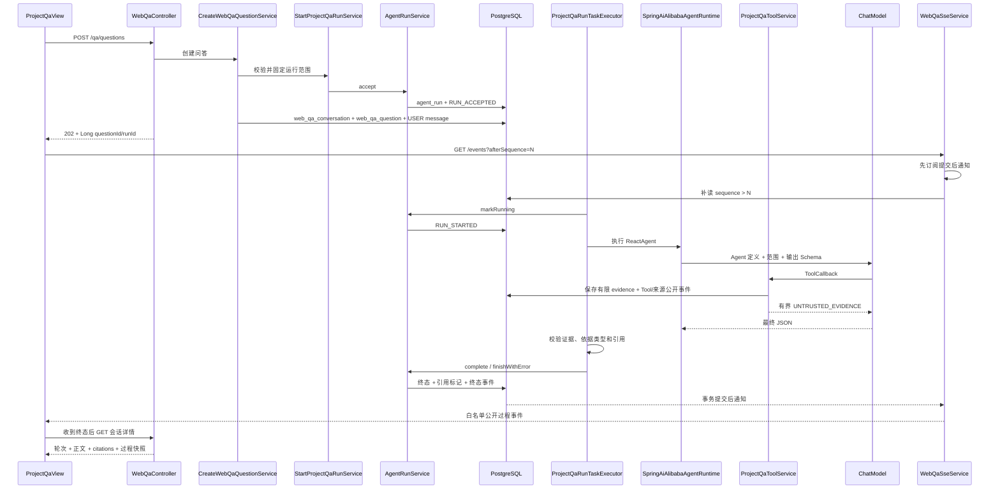

# LoreDock 项目问答全链路排查指南

本文按当前严格 MVC 代码说明一次 Web 项目问答从提交到最终展示的真实链路，用于定位“问题已提交但没有回答”“模型有响应但前端看不到”“有工具结果但引用为空”等问题。

## 1. 当前链路的关键事实

1. 创建问题接口只返回 `202 Accepted` 和运行快照，不在 HTTP 请求线程内等待模型。
2. Spring AI Alibaba `ReactAgent` 负责模型/工具编排和框架流式执行；后端聚合最终结构化结果后再校验证据与引用。
3. 数据库只保存白名单公开过程事件：回答增量最多保留 200 个 Unicode 码点，拒答不保存正文分片。最终正文以 `agent_run.result_text` 和唯一 `ASSISTANT` 消息为准。
4. SSE 先订阅当前进程的事务提交后通知，再从数据库补读 `afterSequence` 之后的已提交事件；在线等待不固定轮询数据库。
5. 所有数据库业务主键是自增 `BIGINT`，Java/API 使用 `Long`，前端使用 `number`。客户端幂等键仍可使用 UUID 字符串。

## 2. 全链路总览



## 3. 创建与受理

主要入口：

- `backend/src/main/java/io/github/loredock/qa/controller/WebQaController.java`
- `backend/src/main/java/io/github/loredock/qa/service/CreateWebQaQuestionService.java`
- `backend/src/main/java/io/github/loredock/agent/service/StartProjectQaRunService.java`
- `backend/src/main/java/io/github/loredock/agent/service/AgentRunService.java`

请求示例：

```http
POST /api/projects/{identifier}/qa/questions
Content-Type: application/json

{
  "idempotencyKey": "客户端生成的幂等键",
  "conversationId": 101,
  "branch": "main",
  "question": "用户原始问题"
}
```

`conversationId` 可选；省略时创建新会话，传入时只能继续当前操作者在当前项目中的会话。同一会话有活动轮次时返回冲突，不会重复启动 Agent run。

Service 会固定项目、实际分支、活动代码 snapshot/commit、活动知识 generation、classpath Agent 名称、模型名称和必要配置摘要。当前阶段没有数据库 Skill 版本、工具策略版本或限制策略版本。

`agent_run` 只保存问题哈希和 Unicode 长度；问题原文保存到 `web_qa_message/USER`。每个问题归属一个 `web_qa_conversation`，只有同操作者、同项目、同会话中已完成的最新 8 轮会被按 8000 码点上限裁剪并作为非证据对话上下文注入。运行受理与 `RUN_ACCEPTED` 在同一短事务中完成，外层问答事务提交后才调度执行。

常见阻断：

| 错误 | 首先检查 |
|---|---|
| `AUTH_LOGIN_REQUIRED` | 浏览器会话和 Cookie |
| 项目/分支 404 | 项目是否启用，分支是否存在 |
| `AGENT_RUNTIME_UNAVAILABLE` | `LOREDOCK_AGENT_ENABLED` |
| `AGENT_MODEL_UNAVAILABLE` | 是否存在可用 `ChatModel` Bean、base URL 和 secret |
| `AGENT_SKILL_UNAVAILABLE` | classpath 中 `project_qa` Agent 定义和输出 Schema |
| `AGENT_RUN_IDEMPOTENCY_CONFLICT` | 是否把同一幂等键用于不同问题或范围 |

## 4. Agent Runtime 与工具

主要入口：

- `backend/src/main/java/io/github/loredock/agent/service/impl/SpringAiAlibabaAgentRuntime.java`
- `backend/src/main/java/io/github/loredock/agent/service/ProjectQaToolService.java`
- `backend/src/main/java/io/github/loredock/knowledge/service/search/KnowledgeSearchService.java`
- `backend/src/main/java/io/github/loredock/code/service/CodeSearchService.java`
- `backend/src/main/java/io/github/loredock/code/service/CodeSnippetService.java`

运行时直接使用 Spring AI Alibaba 的 ReactAgent、Hook 和 ToolCallback。模型调用与工具调用上限交给框架 Hook；业务代码只保留范围固定、上下文裁剪、证据台账、可信引用和拒答规则。

只注册三个只读工具：

| 工具 | 范围约束 |
|---|---|
| `knowledge_search` | 固定项目、分支和活动知识 generation |
| `code_search` | 固定活动 snapshot 和 commit |
| `code_snippet_read` | 固定 snapshot/commit、仓库相对路径和有限行范围 |

每次工具调用必须复核运行仍为 `RUNNING`，并检查活动 generation/snapshot 没有变化。结果经过相关度、数量、片段长度和总上下文上限裁剪后登记到 `agent_evidence`。工具结果正文只进入本次有界模型上下文，不进入事件或证据表。

模型看到的证据块包含自增 `Long` 类型的 `evidenceId`，最终 `citations` 也必须是这些 ID 的数组。`evidence_key` 只是运行内的可读键，不是模型引用 ID。

stdout 只保留：

- `project_qa.question`：用户原始问题；
- `project_qa.tool_result`：工具结果数量和最多 500 个 Unicode 码点的代表性预览；
- `project_qa.model_response`：模型最终原始响应。

不输出向量、完整候选列表、完整 Prompt、每个流式分片或重复解析对象。

## 5. 可信结果与终态

模型最终 JSON 包含 `resultType`、`answerBasis`、`text`、`refusalReason` 和 `citations`。Service 在保存正文前执行确定性校验：

1. 每个 citation ID 属于本运行并且 `retained=true`。
2. `ANSWER` 至少引用一条证据。
3. `BUSINESS_RULE` 至少引用知识证据。
4. `CURRENT_IMPLEMENTATION` 至少引用固定快照代码，并且本次运行存在代码快照。
5. `MIXED` 同时引用知识和代码证据。
6. 越界、被裁剪、伪造或跨运行引用被拒绝。

引用有效时，`AgentRunService.complete()` 在一个短事务中通过 CAS 写入运行终态、把 `agent_evidence.cited/citation_order` 标记为最终引用，并追加 `RUN_COMPLETED`。失败或终止同样使用 CAS，迟到结果不能覆盖先到终态。

持久化的公开事件白名单包括：

```text
RUN_ACCEPTED
RUN_STARTED
MODEL_STARTED
TOOL_STARTED
TOOL_COMPLETED
SOURCE_DISCOVERED
CITATION_VALIDATION
PUBLIC_DECISION_SUMMARY
ANSWER_DELTA
RUN_COMPLETED
RUN_FAILED
RUN_TERMINATED
```

事件同时保存 `subject_type`，区分 Agent、模型、Tool、来源、引用校验和终态。payload 只保存允许公开的状态、脱敏参数摘要、工具结果数量、代表性标题、耗时、结果类型或错误码。不保存完整 Prompt、隐藏消息、原始思维链、全量证据正文或拒答正文；`PUBLIC_DECISION_SUMMARY` 是显式标注的公开决策摘要，不是内部推理。

## 6. SSE 与终态回读

主要入口：

- `backend/src/main/java/io/github/loredock/qa/controller/WebQaSseController.java`
- `backend/src/main/java/io/github/loredock/qa/service/WebQaSseService.java`
- `backend/src/main/java/io/github/loredock/agent/service/AgentEventService.java`
- `backend/src/main/java/io/github/loredock/qa/converter/WebQaSseEventMapper.java`
- `backend/src/main/java/io/github/loredock/qa/service/DefaultWebQaAssistantMessageMaterializer.java`

浏览器连接：

```http
GET /api/projects/{identifier}/qa/questions/{questionId}/events?afterSequence={lastEventSequence}
Accept: text/event-stream
```

建连顺序固定为：订阅当前进程的提交后通知、从数据库补读历史、等待新事件。事件只在事务提交后发布；事务回滚既不落库也不唤醒 SSE。若通知序号出现缺口，下一轮从数据库补齐；断线重连同样从最后 sequence 续读。心跳间隔用于保持连接和复核会话，不是数据库查询间隔。

前端收到 `run.completed`、`run.failed` 或 `run.terminated` 后关闭 SSE 并调用会话详情接口。最终页面以详情返回的轮次、`resultText`、`citations` 和过程事件快照为准，SSE 仅负责实时增量。刷新和断线后重新读取 REST 快照并按 sequence 去重收敛。

会话接口：

```http
GET /api/projects/{identifier}/qa/conversations?cursor={cursor}&limit=20
GET /api/projects/{identifier}/qa/conversations/{conversationId}
```

## 7. 数据库排查 SQL

浏览器响应中的 `questionId`、`runId` 是十进制 `BIGINT`，替换下面的命名占位符即可。

### 7.1 问答与运行

```sql
select q.id as question_id,
       q.conversation_id,
       q.run_id,
       q.project_identifier,
       q.branch_name,
       r.status,
       r.result_type,
       r.answer_basis,
       r.refusal_reason,
       r.error_code,
       r.event_sequence,
       r.result_text
from web_qa_question q
join agent_run r on r.id = q.run_id
where q.id = :question_id;
```

### 7.2 有序事件

```sql
select sequence, subject_type, event_type, payload, created_at
from agent_run_event
where run_id = :run_id
order by sequence;
```

sequence 应从 1 严格递增。可出现白名单 Tool、来源、引用校验、公开决策摘要和有界 `ANSWER_DELTA`；不应出现 `REFUSAL`、完整答案/拒答正文、系统提示词、隐藏消息、内部路径或证据正文。

### 7.3 证据与最终引用

```sql
select id as evidence_id,
       evidence_key,
       source_type,
       retained,
       cited,
       citation_order,
       relevance,
       document_id,
       snapshot_id,
       project_identifier,
       branch_name,
       commit_hash,
       repository_path,
       title
from agent_evidence
where run_id = :run_id
order by id;
```

模型 citations 必须对应这里的 `id`。最终来源是 `cited=true` 的行，并按 `citation_order` 排序；当前基线不存在 `agent_citation` 或 `agent_tool_call` 表。

### 7.4 用户与助手消息

```sql
select id, role, result_type, refusal_reason, content, created_at
from web_qa_message
where question_id = :question_id
order by created_at, id;
```

每个问题最多一条 USER 和一条 ASSISTANT。运行已完成但 ASSISTANT 暂未投影时，详情读取会幂等补写；顶层 `resultText` 仍直接来自 `agent_run`。

## 8. 按现象定位

| 现象 | 首先检查 |
|---|---|
| POST 202 后一直 `ACCEPTED` | 提交后调度、专用执行器容量、`RUN_STARTED` 是否存在 |
| 一直 `RUNNING` 且无工具摘要 | 首次模型调用、总超时、`MODEL_STARTED` |
| 工具结果为 0 | 活动 generation/snapshot、检索词、相关度和范围 |
| stdout 有模型答案但数据库拒答 | citation Long ID、`retained`、`answerBasis` |
| 数据库已终态但页面转圈 | 终态事件、浏览器 afterSequence、会话是否仍有效 |
| 收到终态但页面无正文 | 详情接口 `resultText`、终态刷新是否执行 |
| 正文存在但来源为空 | `agent_evidence.cited/citation_order` 和详情映射 |
| SSE 重连后缺事件 | 最后 sequence、数据库事件是否连续；不要查已删除的 Poller |

最短排查顺序：浏览器记录 `questionId/runId`；查一次运行的三类 stdout；查 `agent_run`；再查 `agent_run_event` 和 `agent_evidence`；数据库已终态时直接调用详情接口，最后才排查前端状态合并。

## 9. 关键配置

配置文件：`backend/src/main/resources/application.yml`。

```text
LOREDOCK_AGENT_ENABLED
LOREDOCK_AGENT_MODEL_NAME
LOREDOCK_AGENT_MODEL_BASE_URL
LOREDOCK_AGENT_MODEL_API_KEY
LOREDOCK_AGENT_MODEL_CONNECT_TIMEOUT
LOREDOCK_AGENT_MODEL_READ_TIMEOUT
LOREDOCK_AGENT_MODEL_MAX_RETRIES
LOREDOCK_AGENT_MAX_STEPS
LOREDOCK_AGENT_MAX_MODEL_CALLS
LOREDOCK_AGENT_TOTAL_TIMEOUT
LOREDOCK_AGENT_MAX_RESULTS_PER_TOOL
LOREDOCK_AGENT_MAX_SNIPPET_CHARACTERS
LOREDOCK_AGENT_MAX_CONTEXT_CHARACTERS
LOREDOCK_AGENT_MAX_ANSWER_CHARACTERS
LOREDOCK_AGENT_MINIMUM_RELEVANCE
LOREDOCK_AGENT_EXECUTOR_CORE_POOL_SIZE
LOREDOCK_AGENT_EXECUTOR_MAX_POOL_SIZE
LOREDOCK_AGENT_EXECUTOR_QUEUE_CAPACITY
LOREDOCK_QA_SSE_HEARTBEAT_INTERVAL
LOREDOCK_QA_SSE_MAX_DURATION
```

当前没有 `LOREDOCK_QA_SSE_POLL_INTERVAL`。聊天模型通过标准 `ChatModel` Bean 替换；知识嵌入模型通过标准 `EmbeddingModel` Bean 替换，替换后必须重建与新维度/模型摘要匹配的知识 generation。
