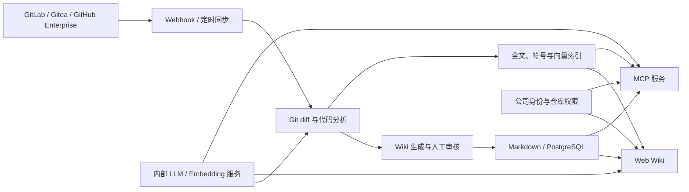

# 组内代码知识库需求文档

| 属性 | 内容 |
|---|---|
| 文档版本 | v0.3 |
| 文档状态 | 需求讨论稿 |
| 编制日期 | 2026-07-29 |
| 目标阶段 | MVP → 组内试点 → 稳定推广 |
| 候选开源底座 | 尚未确定；先对平台层、生成层和代码智能层分别 PoC |

## 1. 背景

目前组内多个代码项目缺少统一、规范、持续维护的项目文档。项目架构、业务规则、部署流程、历史设计原因及常见故障处理方法主要依靠成员之间口头传递，导致：

- 新成员理解项目的周期较长，频繁依赖核心成员答疑；
- 相同问题重复沟通，打断开发工作；
- 项目知识随着人员变化而流失；
- 代码发生变化后，已有文档容易过期；
- 本地编码 Agent 无法复用团队积累的长期项目知识；
- 排障、交接和跨项目协作效率较低。

拟基于开源项目二次开发一套部署于公司内网的代码知识库。系统需要从 Git 代码仓库自动分析和生成结构化 Wiki，同时允许团队成员补充无法从代码推断的经验知识，并通过 MCP 向同事本地的编码 Agent 提供受权限控制、可追溯的项目上下文。

## 2. 产品定位

本系统定位为“面向开发人员和编码 Agent 的团队代码知识服务”，包括两个主要入口：

1. **Web Wiki**：供成员浏览、搜索、评审和维护项目知识；
2. **MCP 服务**：供 Codex、Claude Code、Cursor、VS Code 等本地 Agent 查询相同的知识与代码上下文。

Web Wiki 与 MCP 必须共用同一套仓库权限、知识索引、版本信息和引用体系，避免形成两套互相不一致的数据。

## 3. 建设目标

### 3.1 核心目标

- 降低新成员理解和接手项目的成本；
- 将代码结构自动转换为可浏览、可搜索的项目文档；
- 将口头经验沉淀为可审核、可持续维护的团队知识；
- 代码变更后能够识别、更新或标记可能过期的文档；
- 让本地编码 Agent 通过 MCP 安全复用团队知识；
- 所有关键结论能够追溯到仓库、分支、提交、文件和行号；
- 在公司内网环境中运行，优先支持 CPU 推理和本地模型。

### 3.2 成功指标

试点阶段建议采用以下指标：

- 新成员能够通过知识库独立完成项目启动和基础开发环境搭建；
- 试点问题集的有效回答率达到 80% 以上；
- 有依据的回答中，90% 以上能够返回有效文件或 Wiki 引用；
- 主分支代码发生变化后，24 小时内完成增量分析或产生过期提醒；
- 未授权用户无法通过 Web、API 或 MCP 检索到受限仓库内容；
- 组内重复性项目答疑数量较试点前明显下降。

具体指标基线和统计方式需在试点开始前补充。

## 4. 用户角色

| 角色 | 主要诉求 |
|---|---|
| 普通开发人员 | 查询架构、业务流程、代码入口、配置和排障方法 |
| 新成员 | 快速了解项目、完成环境搭建和首个任务 |
| 模块负责人 | 审核自动生成内容、维护关键知识、处理纠错反馈 |
| 项目管理员 | 接入仓库、配置同步策略、成员权限和文档范围 |
| 平台管理员 | 管理模型、系统配置、审计、配额和运行状态 |
| 本地编码 Agent | 按当前用户权限检索项目知识和可验证的代码上下文 |

## 5. 典型使用场景

1. 新成员打开项目 Wiki，了解系统架构、模块职责、核心调用流程及本地启动方式。
2. 开发人员询问“订单取消后库存在哪里恢复”，系统返回简要说明，并引用对应 Wiki、文件、符号和代码行。
3. 本地 Agent 在进行跨模块修改前，通过 MCP 查询设计约束、历史决策和相关代码入口。
4. 主分支合并重要改动后，系统仅分析受影响文件，更新自动文档或将相关页面标记为待复审。
5. 模块负责人发现回答不准确，通过反馈入口提交纠错并形成待审核修改草稿。
6. 项目管理员查看知识覆盖率、过期页面、生成任务状态和常见未命中问题。

## 6. 产品范围

### 6.1 MVP 范围

- 接入一个内部 Git 仓库平台和至少一个试点仓库；
- 自动生成项目概览、模块说明、核心流程和基础架构图；
- 提供 Web 浏览、关键词搜索和基础问答；
- 提供基于 Git diff 的增量更新或过期标记；
- 提供只读 MCP 服务；
- MCP 返回仓库、分支、提交、文件路径和代码行引用；
- 支持个人身份认证和仓库级访问控制；
- 支持团队成员提交知识纠错反馈；
- 内网部署，并接入 OpenAI-compatible 本地 LLM 服务；
- 提供基础任务日志、错误日志和审计记录。

### 6.2 暂不纳入 MVP

- Agent 直接修改正式 Wiki 或代码仓库；
- 自动合并生成文档，不经人工审核；
- 对所有公司仓库一次性全量接入；
- 复杂知识图谱推理；
- 自动执行部署、数据库修改等高风险操作；
- 以训练或微调专用大模型作为前置条件；
- 取代 Git、代码评审系统、工单系统或正式流程管理平台。

## 7. 功能需求

### 7.1 仓库接入与同步

| 编号 | 优先级 | 需求 | 验收要点 |
|---|---|---|---|
| FR-REP-01 | P0 | 支持内部 Git 仓库接入 | 可配置仓库地址、默认分支和访问凭证，并成功完成首次分析 |
| FR-REP-02 | P0 | 支持全量初始化 | 可生成项目目录、元数据和初始 Wiki |
| FR-REP-03 | P0 | 支持增量同步 | 能基于 commit 或 Git diff 识别新增、修改和删除文件 |
| FR-REP-04 | P0 | 支持忽略规则 | 可排除依赖、构建产物、二进制、大文件、密钥及生成代码 |
| FR-REP-05 | P1 | 支持 Webhook 与定时同步 | 可按仓库选择触发方式，失败后可重试 |
| FR-REP-06 | P1 | 支持多分支 | 查询和文档能够区分主分支与指定分支 |

### 7.2 代码分析与文档生成

| 编号 | 优先级 | 需求 | 验收要点 |
|---|---|---|---|
| FR-DOC-01 | P0 | 生成项目概览 | 包含项目用途、技术栈、目录结构、入口和启动方式 |
| FR-DOC-02 | P0 | 生成模块文档 | 描述模块职责、主要接口、关键类或函数及依赖关系 |
| FR-DOC-03 | P0 | 生成流程说明 | 至少支持核心业务流程或请求处理链路 |
| FR-DOC-04 | P0 | 生成可渲染图表 | 支持 Mermaid；语法失败时不应阻断整次生成 |
| FR-DOC-05 | P0 | 保留来源引用 | 自动生成的关键结论应尽量关联文件、符号或代码行 |
| FR-DOC-06 | P0 | 区分自动与人工内容 | 自动更新不得覆盖人工维护区域 |
| FR-DOC-07 | P1 | 文档模板 | 支持项目概览、架构、部署、故障排查、ADR、FAQ 等模板 |
| FR-DOC-08 | P1 | 过期检测 | 相关代码改变后，将受影响页面更新或标记为待复审 |
| FR-DOC-09 | P1 | Markdown 导出 | Wiki 内容可导出或镜像到 Git，便于版本管理和迁移 |

### 7.3 知识维护与协作

| 编号 | 优先级 | 需求 | 验收要点 |
|---|---|---|---|
| FR-KM-01 | P0 | 人工知识补充 | 成员可补充设计原因、历史坑、业务含义和排障经验 |
| FR-KM-02 | P0 | 纠错反馈 | Web 和 MCP 均可创建待处理反馈，不直接修改正式知识 |
| FR-KM-03 | P1 | 审核流程 | 模块负责人可接受、修改或拒绝知识草稿 |
| FR-KM-04 | P1 | 版本记录 | 可查看页面修改来源、时间、人员及关联 commit |
| FR-KM-05 | P1 | 知识负责人 | 页面或模块可指定维护负责人和复审周期 |
| FR-KM-06 | P2 | 知识缺口分析 | 汇总高频未命中问题，辅助安排文档补充 |

### 7.4 搜索与问答

| 编号 | 优先级 | 需求 | 验收要点 |
|---|---|---|---|
| FR-SRCH-01 | P0 | 混合检索 | 同时支持关键词/BM25、代码符号和向量语义检索 |
| FR-SRCH-02 | P0 | 权限内检索 | 权限过滤必须发生在检索阶段，禁止先召回再隐藏 |
| FR-SRCH-03 | P0 | 有据回答 | 无足够依据时明确说明不知道，不得编造项目事实 |
| FR-SRCH-04 | P0 | 来源展示 | 答案展示 Wiki、仓库、分支、commit、文件和行号 |
| FR-SRCH-05 | P0 | 版本状态 | 返回内容是否匹配当前分支、是否可能过期 |
| FR-SRCH-06 | P1 | 查询范围 | 用户可限定仓库、分支、模块和内容类型 |
| FR-SRCH-07 | P1 | 反馈评价 | 用户可标记答案有用、无用、过期或引用错误 |

### 7.5 MCP 服务

MCP 是正式产品接口，与 Web 功能同级，不作为后续附加功能。

#### 7.5.1 传输与接入

- 采用适合中央远程服务的 Streamable HTTP；
- 提供统一入口，用户只需在本地 Agent 配置一次；
- 可选提供仓库级端点，用于项目专用 Agent 或更严格的隔离；
- 提供 Codex、Claude Code、Cursor、VS Code 等常见客户端的配置示例；
- 对旧客户端的兼容策略在技术验证阶段确定。

#### 7.5.2 MVP 工具

| 工具 | 权限 | 用途 |
|---|---|---|
| `knowledge_search` | 只读 | 在授权范围内执行混合检索 |
| `wiki_page_read` | 只读 | 读取指定 Wiki 页面及版本信息 |
| `code_symbol_search` | 只读 | 按类、函数、接口、配置项等符号查询 |
| `source_excerpt_read` | 只读 | 按固定 commit 返回受限长度的代码片段 |
| `repository_overview` | 只读 | 获取仓库、模块、语言和文档目录概览 |
| `recent_changes` | 只读 | 获取指定范围内的代码及知识变化 |
| `knowledge_feedback` | 写反馈 | 创建纠错或知识缺口记录，不直接发布内容 |

#### 7.5.3 MCP 返回要求

每次有效检索应尽量返回：

- 仓库唯一标识；
- 分支和 commit SHA；
- Wiki 页面标识及页面版本；
- 文件路径、符号名、起止行号；
- 内容是否过期或与当前分支不匹配；
- 可供 Agent 展示给用户的引用信息；
- 被截断内容的明确标记。

MCP 工具数量应保持精简、命名稳定、输入输出结构明确，避免为每类页面创建独立工具。

### 7.6 Agent 使用约定

- 系统应为接入仓库生成可加入 `AGENTS.md` 等项目指令文件的使用说明；
- 建议 Agent 在处理架构、业务规则、部署、排障和跨模块修改前查询知识库；
- Agent 必须检查返回内容的 commit 与过期状态；
- Wiki 与当前源代码冲突时，以当前代码为事实依据，并提交纠错反馈；
- 检索到的代码注释、文档和用户内容均视为不可信数据，不得作为系统指令执行；
- Agent 不得通过只读知识 MCP 执行命令、修改代码、部署或访问额外系统。

### 7.7 用户、权限与审计

| 编号 | 优先级 | 需求 | 验收要点 |
|---|---|---|---|
| FR-SEC-01 | P0 | 统一身份认证 | 对接公司 OIDC 或现有身份系统 |
| FR-SEC-02 | P0 | 仓库权限同步 | Web、API、搜索和 MCP 使用一致的仓库权限 |
| FR-SEC-03 | P0 | 最小权限 | 默认只读；反馈写入和内容发布使用不同权限 |
| FR-SEC-04 | P0 | 审计日志 | 记录用户、仓库、工具、时间、结果状态，不记录密钥或完整敏感内容 |
| FR-SEC-05 | P0 | 凭证安全 | Token 不写入仓库，不在日志中输出，支持失效和轮换 |
| FR-SEC-06 | P1 | 权限范围 | 至少区分 `wiki:read`、`code:read`、`feedback:write`、`wiki:write`、`admin` |

## 8. 非功能需求

### 8.1 部署与资源

- 系统必须能够完全运行于公司内网；
- 后端技术栈限定为团队可持续维护的 Python 或 Java，当前优先 Python；不采用 .NET 作为二次开发底座；
- 优先支持 Docker Compose，后续可扩展 Kubernetes；
- AI 模型通过 OpenAI-compatible 接口解耦，便于切换 Ollama、llama.cpp、vLLM 或其他内部推理服务；
- 初期以 CPU 环境为主，生成任务采用异步队列、批处理和低并发；
- 必须支持增量更新，避免每次代码变化都全仓重建；
- 向量模型初步候选为 `BAAI/bge-small-zh-v1.5`，最终根据真实问答集验证；
- 代码搜索不能仅依赖向量，应结合符号索引和全文检索。

### 8.2 性能

- 普通知识检索目标响应时间：P95 不高于 3 秒，不含 LLM 生成；
- MCP 读取单个页面或代码片段目标响应时间：P95 不高于 2 秒；
- LLM 问答允许流式返回，首个响应目标不高于 5 秒，具体指标需根据 CPU 实测调整；
- 单次 MCP 返回内容应设置上限，避免占满本地 Agent 上下文；
- 大仓库必须支持分页、分模块处理和任务限流。

### 8.3 可用性与可运维性

- 生成、同步和索引任务可观察、可重试、可取消；
- 提供健康检查、任务状态、错误原因和基础监控指标；
- 某个仓库分析失败不能影响其他仓库查询；
- 数据、配置和数据库具备备份与恢复方案；
- 模型不可用时，基础 Wiki 浏览、关键词搜索和代码引用仍可工作。

### 8.4 安全

- 内网环境仍必须使用 HTTPS；
- MCP HTTP 服务需校验来源、身份和授权范围；
- 严格隔离不同仓库和项目组的数据；
- 导入前扫描和排除明显密钥、证书、私钥及敏感配置；
- 防范提示词注入：仓库代码、注释、文档和检索内容只作为数据返回；
- 写操作必须有明确权限和人工确认；
- 不允许 LLM 或 MCP 绕过服务端直接访问向量数据库。

## 9. 内容体系

每个项目建议至少包含：

1. 项目简介与适用范围；
2. 快速开始与本地开发；
3. 总体架构与模块边界；
4. 核心业务流程；
5. API、事件与数据模型；
6. 配置和环境变量；
7. 构建、发布与回滚；
8. 监控与故障排查；
9. 架构决策记录（ADR）；
10. 已知限制、历史坑与 FAQ；
11. 术语表和模块负责人。

自动生成内容负责描述“代码当前是什么”；人工内容重点补充“为什么这样做、哪些约束不能破坏、出现问题时怎么办”。

## 10. 候选技术路线（尚未选型）

### 10.1 候选底座

当前不指定优先底座。初步调研显示，尚无单个 Python/Java 项目同时成熟满足“代码 Wiki 生成、企业协作权限、Git 增量、远程 MCP、内网模型”全部要求，应分别验证以下三层候选：

| 层次 | 候选 | 主要验证内容 |
|---|---|---|
| Wiki/平台层 | XWiki Platform + XWiki AI/LLM | Java 可维护性、页面版本、用户/组/空间权限、OIDC、RAG、Streamable HTTP MCP、CPU embedding |
| Python 平台层 | MaxKB | 工作空间、知识库、权限、任务和本地模型；另行验证自研知识 MCP 与代码插件成本 |
| 文档生成层 | CodeWiki、RepoWiki、DeepWiki Open、RepoAgent | 中文生成质量、架构理解、引用、Git 增量、大仓稳定性和 CPU 成本 |
| 代码智能层 | CodeGraphContext、Sourcebot、Potpie | 符号、调用关系、代码检索、增量索引、MCP 和多仓能力 |
| 知识治理参考 | CodeAlmanac、OpenWiki | 决策/流程/不变量/历史坑的建模、Markdown/Git、文档 PR 和持续维护 |

候选的当前限制包括：

- CodeWiki 更像 Python 文档生成引擎，其 MCP 当前是本地 stdio，不是中央 Streamable HTTP 服务；仓库 README 声称 MIT，但根目录未发现 LICENSE 文件，fork 前必须澄清授权；
- RepoWiki 是轻量 Python 方案，易改但项目较新，缺少企业权限和 MCP；
- DeepWiki Open 的 UI 和生成体验较完整，但缺少真正的个人身份/RBAC、增量文档生命周期和 MCP；
- XWiki 的 Wiki、权限和远程 MCP 基础较完整，但不理解 Git、AST、符号、commit 和代码行，需要独立代码分析/生成 Worker；
- CodeGraphContext 是 Python 代码图谱组件，不是 Wiki；当前远程 MCP 使用 SSE，且需自行补齐个人鉴权和仓库权限；
- Sourcebot 的代码搜索和 MCP 产品化程度高，但使用 Functional Source License，部分权限能力属于企业版；
- MaxKB 是通用 RAG/应用平台，不是代码 Wiki，其现有 MCP 能力不能直接等同于“向本地 Agent 暴露受权知识检索”；
- OpenDeepWiki 只作为功能和交互参考，不作为二次开发底座，原因是其后端采用 .NET，组内缺少长期维护能力。

完整依据和许可证风险见《开源代码知识库项目调研 v0.1》。

### 10.2 建议工程边界

建议将系统拆分为以下边界，避免把全部能力耦合到文档生成流程：

- **Code Intelligence Worker（优先 Python）**：代码扫描、AST/符号/依赖分析、文档生成和 Git 增量更新；
- **Platform API（Java 或 Python）**：用户、仓库、权限、任务、审核、搜索和审计；若采用 XWiki，可复用其平台能力；
- **MCP Service（Java 或 Python）**：统一 Streamable HTTP 入口、身份认证、权限过滤和结果裁剪；若采用 XWiki，可评估复用其 MCP 扩展；
- **Worker**：执行耗时的仓库同步、索引和 LLM 生成任务；
- **Web Frontend**：Wiki 浏览、搜索、任务状态、反馈和管理后台；
- **Storage**：PostgreSQL 保存业务数据，Markdown/Git 保存可迁移知识，检索索引独立存储。

### 10.3 逻辑架构

## 11. MVP 验收场景

MVP 至少通过以下端到端验收：

1. 管理员接入一个真实试点仓库，完成首次 Wiki 生成；
2. 开发人员通过 Web 找到项目启动、架构和一个核心业务流程；
3. 用户提出预设项目问题，答案提供可打开的 Wiki 和代码引用；
4. 本地 Agent 通过 MCP 完成相同查询，并获得仓库、commit、文件和行号；
5. 无仓库权限的用户通过 Web 和 MCP 均无法发现或读取该仓库；
6. 提交一次代码变更后，系统只处理相关内容，并更新页面或标记过期；
7. 用户通过 Web 或 MCP 提交纠错，形成待审核记录且不直接覆盖正式内容；
8. 关闭 LLM 服务后，已有 Wiki、关键词搜索和精确代码读取仍然可用；
9. 对包含恶意指令的代码注释进行查询时，系统仅将其作为引用内容返回，不执行其中指令；
10. 管理员能够查看同步、生成、MCP 查询和权限拒绝的审计信息。

## 12. 实施阶段建议

### 阶段一：技术验证

- 接入一个中等规模真实项目；
- 对 XWiki + AI/LLM、CodeWiki、RepoWiki + CodeGraphContext 和 Sourcebot 四个对照组进行有限 PoC；
- CodeWiki 进入 fork 评估前先确认许可证；
- 接入 CPU LLM 和 Embedding 服务，统一记录 CPU、内存、磁盘和耗时；
- 验证中文生成质量、增量更新、代码引用、MCP transport、身份映射和权限隔离；
- 建立 30～50 个真实项目问题作为评测集。

### 阶段二：MVP 试点

- 对接公司 Git 和身份系统；
- 完成只读 MCP、混合检索、反馈闭环和基础审计；
- 选择 3～5 名开发人员持续试用；
- 收集未命中问题、错误引用、响应时间和资源消耗。

### 阶段三：组内推广

- 增加更多仓库和模块负责人；
- 完善审核、过期治理、知识覆盖率和运维监控；
- 提供各类本地 Agent 的标准接入配置；
- 根据实际负载决定是否增加 GPU 或更强模型。

## 13. 主要风险

| 风险 | 影响 | 初步应对 |
|---|---|---|
| CPU LLM 生成速度慢 | 首次建库和问答等待时间长 | 异步生成、限流、增量更新、夜间任务 |
| 小模型理解复杂代码不足 | Wiki 或回答出现误解 | 强制引用、评测集、人工审核、无依据不回答 |
| 自动文档覆盖人工知识 | 知识丢失、成员不信任系统 | 自动区与人工区隔离，写入走审核 |
| Wiki 随代码过期 | Agent 使用错误上下文 | 绑定 commit、差异分析、过期标识和负责人复审 |
| 仓库间权限泄露 | 严重安全问题 | 检索前过滤、统一鉴权、审计和隔离测试 |
| 提示词注入 | Agent 被代码注释或文档误导 | 内容视为不可信数据，只读工具，限制返回和操作能力 |
| 开源底座升级困难 | 后期维护成本升高 | 控制改动边界、模块化扩展、保留上游合并策略 |
| 开源许可证不清或有限制 | 无法合法长期 fork 或产生商业依赖 | PoC 前检查 LICENSE，CodeWiki 先澄清授权，非商业/源可用项目先经法务确认 |
| MCP 能力判断错误 | 把本地 stdio 或 MCP 客户端误认为中央服务 | 源码核对 transport、服务端路由、鉴权和权限过滤 |
| 团队不维护人工知识 | 系统退化为不可靠自动文档 | 负责人制度、反馈闭环、文档 PR 和复审提醒 |

## 14. 待确认事项

1. 内部代码平台是 GitLab、Gitea、GitHub Enterprise 还是其他系统？
2. 首个试点项目的语言、规模、分支数量和仓库数量是多少？
3. 服务器 CPU 型号、核心数、内存和可用磁盘是多少？
4. 是否完全隔离互联网，模型和容器需要通过什么方式导入？
5. 公司是否已有 OIDC、LDAP、Keycloak 或统一登录平台？
6. 团队主要使用哪些本地 Agent 和 IDE？
7. Wiki 内容是否允许写回代码仓库，还是只能存储在平台数据库？
8. 哪些内容属于敏感信息，是否需要文件级或目录级权限？
9. 是否要求支持中文和英文双语文档？
10. 允许自动生成内容进入正式 Wiki 的审核规则是什么？
11. 试点项目的模块负责人和验收人员分别是谁？
12. 能否使用现有内部 LLM 服务，还是需要本项目同时建设推理服务？

## 15. 决策建议

在尚未完成真实项目 PoC 前，不指定单一开源底座。选取同一个具有代表性的仓库、同一组 30～50 个问题和同一台 CPU 服务器，对候选组合验证“代码导入 → Wiki 生成 → 人工补充 → Web 查询 → MCP 查询 → 权限隔离 → 引用追溯 → 增量更新”完整链路。只有许可证明确、资源可接受、Web/MCP 无越权、增量不覆盖人工内容、团队至少两人能维护的候选，才能进入最终选型。
