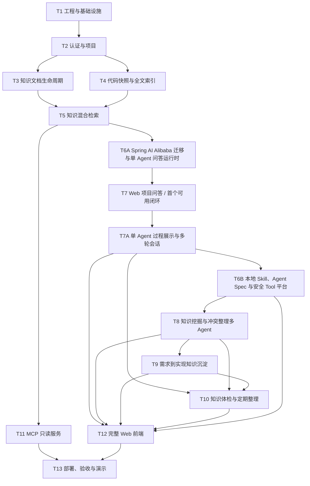

# LoreDock MVP 功能开发计划

| 属性 | 内容 |
|---|---|
| 计划目标 | 在不裁剪需求基线 P0/P1 功能的前提下，按功能任务逐项完成 LoreDock MVP |
| 计划方式 | 按功能和依赖关系拆分，不按日期拆分 |
| 当前进度 | T1～T5、T6A、T7 已完成，首个可用闭环和第一阶段后端模块化重构已验收；下一阶段先完成 T7A，再建设 T6B，并进入 T8 知识挖掘与冲突整理 |
| 需求依据 | `项目业务上下文知识库_MVP需求文档_v1.0.md` |
| 执行方法 | 每个功能任务分别遵循 OpenSpec、接口优先和 TDD |

## 1. 使用说明

本计划用于确定 MVP 的功能开发顺序、任务边界和完成条件，不替代需求基线或有效 OpenSpec 规格。

原计划中的“T0：完整 MVP OpenSpec 与集中技术验证”已根据当前开发安排跳过，不再作为独立任务。实际开发从 T1 开始，但这不表示跳过项目的 SDD 要求：每个后续功能任务在实现前仍须创建或更新对应 OpenSpec change；依赖 DeepSeek、MCP、Embedding、Lucene 或索引切换的技术验证，放入首次使用该能力的功能任务中完成。

任务状态约定：

- `[ ]`：尚未开始；
- `[~]`：进行中；
- `[x]`：已完成，并满足本计划第 5 节的完成门禁。

### 首个可用闭环

为尽早验证 LoreDock 的核心用户价值，当前首个可用闭环收口为：管理员上传并发布知识，用户随后可以在指定项目内进行混合检索与带引用问答。代码快照和前端分支操作均已退出当前 MVP；后端保留既有分支能力，所有 Web 流程省略分支并使用默认 `main`。

首个可用闭环不等同于需求基线定义的完整 MVP。近期先用 T7A 补齐单 Agent 的安全过程展示、流式事件和多轮会话；随后由 T6B 将平台检索、读文档、写草稿、校验证据等能力工具化，并建立本地文件 Skill、Agent Spec、安全 Tool Registry 和持久化 Graph Checkpoint。T8 起使用这些通用能力编排知识挖掘与冲突整理 Agent。短时 QA 续跑、单个模型/Tool 调用内部精确续传、项目长期记忆、Web Skill 市场和运行时任意创建 Agent 不进入当前 MVP。

## 2. 功能依赖关系

## 3. 功能任务

### [x] T1：工程骨架与基础设施

目标：建立后续业务功能共同依赖的可运行工程和基础设施。

功能范围：

- 建立 Java 21、Spring Boot 后端以及 Vue 3、TypeScript、Vite 前端；
- 建立 PostgreSQL、pgvector、Flyway 和 Docker Compose；
- 实现本地持久化文件存储接口，为后续 S3 适配保留稳定边界；
- 建立统一错误响应、参数校验、日志、审计字段和时间规范；
- 建立后台导入任务表、受控线程池和任务状态机；
- 配置单元测试、数据库集成测试及前端测试环境；
- 在本任务中冻结实际采用的 Spring Boot、Spring AI、pgvector 和 Lucene 版本。

完成条件：应用、数据库和前端可以统一启动；数据库迁移可以重复执行；后台任务能够成功结束或保留明确的失败信息。

### [x] T2：认证与项目管理

目标：建立 Web、管理操作和 MCP 共用的身份及范围基础。

覆盖需求：FR-AUTH-01～03、FR-PROJ-01～04。

功能范围：

- 管理员账号和组内共享只读账号登录；
- 管理员与只读用户的写权限隔离；
- MCP Token 的独立认证边界；
- 项目创建、查看、启用和停用；
- 管理接口和只读接口分离；
- 支持准备两个验收项目；前端不提供分支添加和选择，Web 统一使用默认 `main`。

重点验收：错误密码被拒绝；只读账号不能写入；停用项目不出现在普通查询入口；无效 MCP Token 无法访问内部内容。

### [x] T3：知识文档完整生命周期

目标：完成正式知识从导入、编辑、审核到退出检索的生命周期。

覆盖需求：FR-DOC-01～11。

功能范围：

- 新建和编辑 Markdown、纯文本知识；
- 上传 Markdown、纯文本以及包含 Markdown 的 ZIP；
- 展示批量导入的成功、失败和忽略结果；
- 支持通用和项目两级知识范围；
- 维护标签、来源、原文件名、Wiki URL 和人工整理说明；
- 支持草稿、已发布和已归档状态；
- 只有管理员确认发布的文档进入正式检索；
- 支持新旧文档替代关系；
- 普通成员按项目和目录浏览文档；
- 父目录递归展示自身及后代文档，目录计数不受当前分页影响；
- 管理员可勾选当前页导入草稿并原子批量发布，随后统一手动重新索引；
- 文档变化后可手动触发重新索引。

重点验收：草稿不可检索；归档文档退出默认检索；项目文档不跨项目；ZIP 部分失败不会掩盖成功与失败明细；父目录不会因文档都位于后代目录而错误显示为空；批量发布任一状态冲突时不得留下半发布结果。

### [x] T4：代码快照与 Lucene 检索（历史实现，已退出 MVP）

目标：记录已完成的实验性实现；当前 MVP 默认关闭全部入口，不再继续建设。

覆盖需求：FR-CODE-01～07。

功能范围：

- 历史实现通过 ZIP 导入本地代码快照，并关联项目和 commit；
- 防止路径穿越、符号链接、压缩炸弹和超大文件风险；
- 排除依赖、构建产物、二进制、`.git`、`.env`、证书和密钥类文件；
- 使用 Lucene 建立文件路径与文件内容索引；
- 支持按路径和内容搜索，并受限读取代码片段；
- 为新快照建立独立索引 generation，验证成功后原子切换；
- 新索引失败时继续使用旧活动快照；
- 显示活动快照 commit、索引时间和变化提示。

当前处置：后端代码保留为实验性架子，HTTP 默认关闭，前端、问答和 MCP 不提供入口。

### [x] T5：知识关键词、语义与混合检索

目标：建立严格遵守项目、知识范围和发布状态的知识检索服务。

覆盖需求：FR-SRCH-01～06，以及需求文档第 5、6 节的范围规则。

功能范围：

- 对标题、正文和标签执行关键词检索；
- 使用 CPU 中文 Embedding 和 pgvector 执行语义检索；
- 融合关键词和向量结果并完成排序；
- 在查询层强制应用通用、项目和发布状态过滤；
- 区分全局知识查询和项目查询；
- 支持按标签、知识类型和来源类型过滤；
- 返回范围、标题、片段、来源、更新时间和相关性；
- 建立 15～20 个真实问题的检索基准集。

重点验收：至少 80% 的有答案问题在 Top-5 中出现正确来源；任何入口都不发生跨项目召回；没有代码快照时仍可返回允许范围内的人工知识。

### [x] T6A：Spring AI Alibaba 迁移与单 Agent 问答运行时

目标：先完成 AI 技术栈迁移并建立受控、可追溯的单 Agent 问答运行时，为 T7 尽快形成可试用的检索问答闭环。

覆盖需求：FR-AGENT-01～07，以及 FR-AGENT-03 中的 `project_qa` 场景。

功能范围：

- 将现有 Spring Boot 4.1.0、Spring AI 2.0.0 基线切换到 Spring Boot 3.5.x、Spring AI 1.1.2 和 Spring AI Alibaba 1.1.2.x 正式版本；
- 通过隔离 PoC 从 Maven Central 可用正式构件中锁定 Spring Boot 3.5.x 和 Spring AI Alibaba 1.1.2.x 的具体补丁版本，并记录最终依赖树；
- 替换 MyBatis-Plus、Sa-Token 等 Boot 4 专用 Starter，清理不兼容或重复的 Spring AI 依赖，禁止同时混入 Spring AI 1.1.x 与 2.0.x；
- 重新运行 T1～T5 的单元测试、PostgreSQL 集成测试和应用启动检查，确认迁移没有破坏认证、项目范围、文档生命周期和检索行为；
- 基于 Spring AI Alibaba Agent Framework 定义单 Agent 运行适配边界，提供 DeepSeek `deepseek-v4-flash` OpenAI 兼容 `ChatModel` 实现和测试用 Fake Model；
- 从 classpath 加载固定的 `project_qa` Agent 定义，使用受控 `ReactAgent` 调用 T4 代码检索和 T5 知识混合检索能力；
- 在服务端强制校验工具白名单、项目、知识范围和工具参数，禁止提示词扩大权限；
- 限制最大步骤数、超时、检索数量、上下文长度和模型调用次数；
- 保存 Agent/模型配置摘要、输入来源、引用、Token、耗时和运行状态，并提供 T7 所需的粗粒度流式阶段事件；
- Agent 只允许读取授权证据并生成回答或知识缺口，不得修改或发布正式知识。

重点验收：依赖树中不存在 Spring Boot 4 或 Spring AI 2.0 残留；T1～T5 相关测试在新版本基线上通过；`project_qa` 能在指定项目内调用知识检索工具并返回引用；越权工具调用、跨范围读取和无依据回答被拒绝；达到步骤或时间限制后安全停止。

### [ ] T6B：本地 Skill、Agent Spec 与安全 Tool 平台

目标：在 T6A 的统一运行时上，把平台能力沉淀为受服务端约束的安全 Tool，并用可下载、可编辑的本地文件定义 Skill、协调 Agent 和预定义子 Agent，同时接通长任务持久化 Checkpoint，为 T8～T10 提供可迭代的编排基础。

覆盖需求：FR-AGENT-01～20 中的本地定义、Tool Registry、子 Agent 编排、运行固定、对话式长任务、版本化草稿、暂停恢复与安全边界；FR-AGENT-08 由 T8 完成业务接入，FR-AGENT-09 由 T10 完成定时触发。

功能范围：

- Skill 采用本地目录和 Markdown 文件，Agent Spec 采用带 YAML frontmatter 的本地 Markdown；开发环境读取仓库目录，部署环境读取挂载目录；
- 新运行开始时重新加载定义，并记录 Skill、Agent Spec、模型和工具集合的内容摘要，已有运行不受文件中途修改影响；
- 建立安全 Tool Registry，首批提供项目知识检索、文档读取、证据核验、引用校验、任务会话、草稿创建/读取/增量更新、修订 Diff、冲突候选保存和运行事件记录等平台能力；
- Tool 在服务端强制校验身份、项目范围、知识状态、参数、结果数量、超时和写入目标，Skill 或提示词不能扩大权限；
- 使用 Spring AI Alibaba `AgentTool`、`TaskTool`、`TaskToolsBuilder`、`AgentSpecLoader` 或等价扩展，让协调 Agent 自主选择是否检索、调用哪个预定义子 Agent 以及是否补充核验；
- 预定义 `knowledge_researcher`、`evidence_reviewer`、`conflict_reviewer`、`answer_writer`、`document_writer` 等子 Agent；Java 只负责注册、调度、安全边界和事件，不硬编码“检索→审查→写作”的业务顺序；
- 统一限制总步骤数、总模型调用次数、并发子 Agent 数、Token、超时、检索数量和中间产物大小；
- 将现有 `PostgresSaver` 接入可恢复长任务，使用稳定运行 `threadId` 和 Flyway 管理的 Graph 表保存节点级 Checkpoint；应用启动时识别未完成长任务并从最近已提交节点继续；
- 建立长期任务会话与 Agent 运行边界：首次系统/人工触发创建 run，等待状态下的用户指导恢复当前 run，正常完成后的追加调整创建新 run；每个 run 拥有独立状态、用量与错误；
- 定义 `PAUSE_REQUESTED → WAITING_FOR_USER → RUNNING` 安全暂停语义，只在当前模型/Tool 步骤结束并提交 Checkpoint 后等待和接受用户指导；
- 草稿先创建空基线或绑定待修订文档，再通过 `draft_read` 和 `draft_update(baseRevision, idempotencyKey, operations, sourceRefs)` 进行区块级插入、替换和删除；事实修改引用 evidenceId，用户要求的措辞/结构修改可引用用户消息；禁止模型最终消息直接覆盖全文；
- 每次成功更新生成不可变草稿修订和 Markdown Diff；基础修订冲突必须拒绝并重新读取，不自动覆盖；
- 为草稿修订、报告、冲突候选和人工决定等写 Tool 定义稳定幂等键与重复提交语义，防止暂停、恢复或节点重放造成重复副作用；
- 保存 Agent/Tool 开始、结束、失败、输入输出摘要、来源引用和最终结果等安全事件，不保存或展示原始思维链、完整系统提示词和全量证据正文；
- 本地下载的 Skill/Agent 文件按不可信配置处理，只能引用 Registry 中已授权的 Tool，不允许执行任意脚本、命令或网络请求；
- 写入能力仅允许生成草稿、报告、冲突候选和知识缺口，禁止 Agent 自动发布或覆盖正式知识；
- Graph 只作为 Agent Framework 的状态与恢复底座，不用于硬编码知识挖掘的固定业务节点顺序；Checkpoint 不承诺恢复正在传输的模型 Token 或单个 Tool 调用内部状态；当前阶段不为短时 QA 建设续跑，也不建设项目长期记忆、数据库/Web Skill 市场、可视化编排器、运行时任意创建 Agent 或多实例自动抢占。

重点验收：修改本地 Skill 或 Agent Spec 后，新运行无需修改 Java 业务流程即可体现行为变化；协调 Agent 可以按任务动态调用零个或多个预定义子 Agent；所有 Tool 调用均经过服务端授权和范围校验；重启后可恢复长任务从 PostgreSQL 最近 Checkpoint 继续且不重复已提交写入；暂停只在安全步骤边界生效；草稿更新产生可追溯修订和 Diff，旧基础修订不能覆盖新内容；失败运行不产生半发布状态；运行记录可说明所用定义摘要、工具、来源和结果，但不泄露原始思维链。

### [x] T7：Web 项目问答与知识缺口

目标：为所选项目提供带引用、可拒答、可反馈的可信文档问答，并形成 LoreDock 首个可内部试用的完整业务闭环。

覆盖需求：FR-QA-01～08，以及需求文档第 7.7、8 节。

功能范围：

- 用户选择项目后提出自然语言问题；
- 自动使用 `project_qa` Skill；
- 流式展示回答；
- 展示知识文档来源和更新时间；
- 只使用已发布文档作为项目事实来源；
- 证据不足或超出项目范围时明确拒答；
- 已发布文档互相冲突时展示冲突来源；
- 支持“没有回答、回答错误、知识已过期”反馈；
- 模型不可用时，文档浏览和普通检索继续可用。

重点验收：用户可以从已发布知识获得流式回答；所有项目事实回答至少包含一个来源；无依据问题不编造；当前项目回答不使用其他项目文档冒充事实；模型不可用时仍可使用普通检索。

### [ ] T7A：单 Agent 过程展示与多轮会话

目标：在不暴露原始思维链和敏感上下文的前提下，让用户实时看到当前 QA Agent 做了什么，并能在同一项目会话中连续追问和查看历史对话。

覆盖需求：FR-QA-09～12，以及 FR-AGENT-15～16 在 `project_qa` 场景中的落地。

功能范围：

- 在回答区增加可折叠“处理过程”，流式展示运行开始、模型处理、Tool 调用、检索结果摘要、证据/引用校验、最终回答和失败信息；
- RAG 过程展示命中的文档标题、数量、范围、更新时间和引用关系；长标题单行截断并可悬停查看完整名称；
- Tool 事件仅展示工具名称、用途、脱敏参数摘要、耗时和结果摘要，不展示完整系统提示词、隐藏消息、全量证据正文或原始模型思维链；
- 如需展示“为何继续检索/为何拒答”等解释，由模型生成明确标注的公开决策摘要，并与内部推理分离；
- SSE 增量事件与最终详情快照收敛到同一展示模型，刷新后仍可查看已保存的安全过程事件；
- 引入会话标识；同一会话的每次提问仍创建独立 Agent run，并只注入同项目、同用户、同会话内已完成且数量受限的问题与最终回答；
- 支持会话列表、会话详情、最近对话和继续追问；历史记录以问题、最终回答、状态和时间为主；
- 当前不做生成中断后的续跑、检查点恢复、详细中间状态恢复、自动摘要或长期记忆；后端重启时进行中的轮次失败，已完成问答仍可继续使用。

重点验收：处理过程随 Agent 执行实时出现，最终事件顺序与详情一致；用户能看到 RAG 命中文档和 Tool 结果摘要但无法读取敏感内部上下文；第二轮问题能基于同一会话已完成问答正确理解指代；不同项目、用户和会话的历史不会串入模型上下文；重启后已完成历史仍可查看，未完成轮次明确失败且可重新提问。

### [ ] T8：知识挖掘与冲突整理多 Agent

目标：基于 T6B 的本地 Skill、预定义子 Agent 和平台 Tool，让协调 Agent 以可暂停、可继续的任务对话自主完成知识发现、证据复核、冲突整理和草稿增量修订，并由管理员通过 Diff 审核发布。

覆盖需求：FR-KG-01～06、FR-KG-08～15、FR-AGENT-08、FR-AGENT-17～20。

功能范围：

- 管理员选择项目和已有文档；
- 手动触发时创建知识任务会话；系统将项目范围、触发原因和整理目标写为首条系统消息，再运行本地 `knowledge_curator` Skill；
- 由协调 Agent 自主决定调用知识检索、文档读取、冲突候选、草稿读取/更新和 Diff Tool；
- 将每次知识挖掘/冲突整理标记为可恢复长任务，在完成关键节点和进入人工等待前提交 PostgreSQL Checkpoint；
- 协调 Agent 可按需调用 `knowledge_researcher`、`evidence_reviewer`、`conflict_reviewer`、`document_writer` 等预定义子 Agent，调用数量和顺序不由 Java 固定；
- 从已发布知识中挖掘主题、重复内容、相互矛盾的结论、过期线索和缺失信息，并保留原始来源；
- 对冲突候选分别陈列各方证据、适用范围、更新时间、置信情况和待人工判断项，不自动选择或覆盖正式结论；
- 创建空草稿或绑定待修订正式文档作为基线，Agent 通过结构化 `draft_update` 分区块生成合并、补充、拆分、归档或更新建议，不把一次全量模型输出直接保存为草稿；
- 每次更新生成不可变修订、来源关系和基线到当前修订的 Markdown Diff；Agent 最终消息只总结修改和引用修订；
- 保存源文档、可选 commit、生成时间和模型信息；
- 展示实际发生的子 Agent 和 Tool 事件、来源、不确定项、冲突、审查问题和需要人工补充的事项；
- 管理员可以请求暂停；运行在当前步骤安全结束后进入等待，管理员追加指导消息再恢复；
- 一轮完成后任务会话保持可继续，管理员追加意见时创建新的 Agent run，并基于当前草稿修订继续修改；
- 管理员查看修订历史和 Diff，可直接编辑形成新修订，确认明确修订后发布；
- 发布后触发知识索引更新；
- 所有模型生成内容禁止自动发布。

重点验收：协调 Agent 能根据材料自主决定是否追加检索、复核或冲突分析；修改本地 Skill 可改变编排行为而无需修改 Java 流程；任务以对话持续展示系统触发、用户指导、Agent/Tool 过程和草稿修订；暂停只在安全边界生效，完成后仍可继续调整；每个结论和冲突候选可追溯到已授权来源；服务重启后从最近节点继续且不重复修订、报告或冲突候选；审批展示真实 Diff，管理员发布前不可进入正式检索。

### [ ] T9：需求到代码实现的知识沉淀

目标：把需求、PR、代码改动和测试证据整理为可审核、可双向追溯的知识单元。

覆盖需求：FR-CHANGE-01～10。

功能范围：

- 创建关联项目的变更知识单元；
- 导入需求、PR 元数据、base/head commit、diff/patch、变更文件列表和测试说明；
- 运行本地 `change_documenter` Skill，由协调 Agent 按材料自主调用需求、代码、测试证据和审查子 Agent，再通过同一版本化草稿 Tool 增量生成需求条目到模块、文件和变更摘要的映射；
- 只读取本次上传的需求、PR、diff/patch、文件列表和测试说明；
- 输出调用链、业务规则、接口、数据结构、配置、兼容性和测试证据；
- 单独列出未实现需求、实现偏差和无法确认的关系；
- 使用上下文隔离的独立审查子 Agent 检查无引用事实、版本混淆、遗漏证据和虚假映射；是否补充检索或返工由 Skill 和协调 Agent 在统一运行上限内决定，仍有阻断问题时等待人工指导；
- 展示各 Agent 阶段、中间产物、引用、审查返工历史和人工决定；
- 草稿经管理员审核后发布；
- 实现需求、PR、commit、文件路径和知识文档双向追溯；
- 支持连续导入多个历史变更；
- PR 的 base/head commit、diff 和文件列表彼此不一致时提示材料版本差异，不依赖活动代码快照。

重点验收：需求、代码和测试证据角色可以并行工作；主要实现结论可以追溯到原始材料；独立审查不读取编写角色的隐藏推理；无法确认的映射不会被模型猜测补全；人工可以在证据不足时指导后续整理；发布文档和变更知识单元可以互相访问。

### [ ] T10：知识整理运营与定期任务

目标：把 T8 的知识挖掘与冲突整理能力接入知识缺口反馈和每周调度，形成可重复运行、可失败降级的知识运营闭环。

覆盖需求：FR-KG-07、FR-AGENT-09，以及 FR-KG-06、FR-KG-08 的运营入口。

功能范围：

- 管理员从知识体检入口手动重用 T8 的 `knowledge_curator` 运行能力；
- 把文档来源更新、同主题新文档、重复/冲突候选和问答知识缺口整理为 Tool 可查询的运营输入；
- 手动和每周任务均创建同一种知识任务会话并触发同一个本地 `knowledge_curator` Skill；定时任务只负责写入系统触发消息，不在调度器中复制编排流程；
- 复用 T8 已建设的 Tool、预定义子 Agent、报告、待审核草稿和人工处理边界；
- 实现每周知识整理任务；
- 任务失败只保存失败信息，不影响已发布知识和检索；
- 定期任务不得自动修改或发布正式知识。

### [ ] T11：Streamable HTTP MCP 只读服务

目标：让 Claude Code 等本地 Agent 使用与 Web 同源、同范围规则的原始业务上下文。

覆盖需求：FR-MCP，以及需求文档第 7.8 节。

功能范围：

- 实现 `knowledge_search`；
- 实现 `document_read`；
- 两个工具复用 Web 和内部 Agent 的知识查询服务；
- 返回项目、来源、文件路径、commit、更新时间、相关性和截断状态；
- 使用共享 Token，保持只读，不调用 DeepSeek 生成最终答案；
- 验证 Claude Code 的连接、中文参数、工具调用和错误响应兼容性。

重点验收：Claude Code 能获取与 Web 同源的知识；错误 Token 被拒绝；MCP 不能执行写入、命令或任意网络访问。

### [ ] T12：完整 MVP Web 前端

目标：提供需求基线定义的全部最小 Web 页面和管理入口。

功能范围：

- 登录页；
- 项目列表页及通用业务知识入口；
- 项目详情页中的项目、文档目录和维护功能；
- 变更知识单元、需求和 PR 材料导入；
- 普通知识草稿和变更知识草稿的修订历史、Markdown Diff、编辑、审核和发布；
- 项目知识任务会话和运行详情，以对话方式展示系统触发、用户指导、协调 Agent、已调用子 Agent、Tool、来源、草稿修订、公开决策摘要、错误和配置摘要；
- 运行中提供请求暂停；等待人工时提供补充方向、允许保留待核实项、要求重写、恢复、重试和取消；完成后仍可追加消息要求 AI 调整当前草稿；
- 知识体检和整理报告；
- 问答页中的多轮会话、流式回答、可折叠安全处理过程、引用、冲突和缺口反馈；
- 只读展示当前运行加载的 Skill/Agent Spec 名称和内容摘要；本地文件由部署和运维管理，不建设 Web 编辑、发布或版本市场；
- 管理员和只读用户权限在界面与接口两层生效。

完成条件：管理员可以通过 Web 完成全部数据准备、Agent 运行观察与必要干预、冲突整理和审核操作；只读用户只能浏览、搜索、问答、查看授权运行和反馈。

### [ ] T13：集成、部署、验收与演示

目标：将所有功能组合为可重复部署和现场演示的完整 MVP。

功能范围：

- 完成 Docker Compose 内网单机部署；
- 编写数据库、文件、模型、索引和 Token 配置说明；
- 验证数据备份、恢复和索引重建；
- 导入两个项目、Wiki Markdown、场景包文档和真实变更样例；
- 执行 15～20 个检索问题集；
- 完成 Web、Agent、MCP、权限、安全和故障降级验收；
- 验证多轮 QA 隔离、对话式知识任务、过程事件、增量草稿 Tool、修订 Diff、模型自主调用预定义子 Agent、独立审查、安全暂停和完成后继续调整；后端重启后 QA 活动轮次明确失败，知识长任务从最近 Checkpoint 恢复且不重复业务写入；
- 编写 README、架构、数据模型、Skill、MCP 配置和已知限制；
- 固化现场演示脚本和验收结果。

完成条件：需求文档第 11 节的全部 MVP 验收项通过，最终交付物与需求文档第 13 节一致。

## 4. 完整功能覆盖说明

本计划保留需求基线中的全部 P0 和 P1 功能，包括但不限于：

- 项目停用、批量导入结果和知识替代关系；
- 本地文件化场景 Skill、协调 Agent 与预定义子 Agent，以及受服务端约束的平台 Tool Registry；当前阶段不建设项目长期记忆、数据库/Web 版本目录或任意 Agent 市场；
- 历史变更的连续沉淀；
- 快照变化提示和搜索条件过滤；
- 手动知识体检、整理建议和每周整理任务；
- Web、内部 Agent 与 MCP 的统一范围和权限规则。

需求基线已经明确排除的后续能力，如自动连接公司 Wiki/Git/Welink、全量代码向量化、完整 AST/调用图、复杂组织权限和自动发布，不属于本计划。

## 5. 每个任务的完成门禁

每个功能任务只有同时满足以下条件，才能从 `[ ]` 或 `[~]` 更新为 `[x]`：

1. 已创建或更新对应 OpenSpec change，且 proposal、specs、必要的 design 和 tasks 与实现一致；
2. 后端先定义 API 契约、DTO、领域端口或 Java 接口；
3. 已先编写带中文业务说明的失败测试，并确认测试因为目标行为缺失而失败；
4. 已完成最小实现并使相关测试通过，必要重构处于测试保护下；
5. 公共接口、实现类和关键业务分支具备符合 `AGENTS.md` 的中文注释；
6. 已运行与风险相称的单元、集成、契约或端到端验证；
7. OpenSpec `tasks.md` 已同步，必要文档已经更新；
8. 已同步主规格并归档完成的 change，且没有遗留未说明的必需工作。

## 6. Agent 执行约定

Agent 接到某个功能的开发请求时，应先读取本计划并确认对应任务的目标、范围、依赖和状态，再读取需求基线与当前 OpenSpec 工件。Agent 不得因为本计划列出了任务，就跳过 OpenSpec、接口优先、TDD、中文测试注释或中文 Javadoc。

如果实现过程中发现本计划与需求基线或有效 OpenSpec 冲突，应按 `AGENTS.md` 的事实优先级处理，并同步修订本计划，避免后续 Agent 继续依赖过期任务信息。
