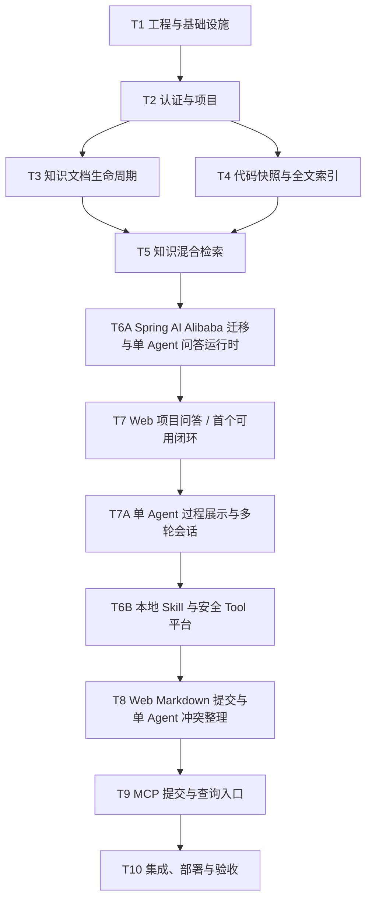

# LoreDock MVP 功能开发计划

| 属性 | 内容 |
|---|---|
| 计划目标 | 在不裁剪需求基线 P0/P1 功能的前提下，按功能任务逐项完成 LoreDock MVP |
| 计划方式 | 按功能和依赖关系拆分，不按日期拆分 |
| 当前进度 | T1～T7A、T9 已完成；T8 的代码与自动化测试已完成，待真实模型演示验收；剩余主线为 T8 演示验收与 T10 集成验收 |
| 需求依据 | `项目业务上下文知识库_MVP需求文档_v1.0.md` |
| 执行方法 | 每个功能任务分别遵循 OpenSpec、接口优先和 TDD |

## 1. 使用说明

本计划用于确定 MVP 的功能开发顺序、任务边界和完成条件，不替代需求基线或有效 OpenSpec 规格。

原计划中的“T0：完整 MVP OpenSpec 与集中技术验证”已根据当前开发安排跳过，不再作为独立任务。实际开发从 T1 开始，但这不表示跳过项目的 SDD 要求：每个后续功能任务在实现前仍须创建或更新对应 OpenSpec change；依赖 DeepSeek、MCP、Embedding、Lucene 或索引切换的技术验证，放入首次使用该能力的功能任务中完成。

任务状态约定：

- `[ ]`：尚未开始；
- `[~]`：进行中；
- `[x]`：已完成，并满足本计划第 5 节的完成门禁。

### 首个可用闭环

为尽早验证 LoreDock 的核心用户价值，当前首个可用闭环收口为：管理员上传并发布知识，用户随后可以在指定项目内进行混合检索与带引用问答。代码快照和前端分支操作均已退出当前 MVP；后端保留既有分支能力，所有 Web 流程省略分支并使用默认 `main`。

首个可用闭环不等同于需求基线定义的完整 MVP。T6B 已接入 Spring AI Alibaba 的本地 Skill、Hook、原生模型/Tool 循环和受控 Tool 基础。后续不再建设多 Agent、同 run 人工等待恢复、需求/PR/代码服务端生成、定期整理或额外运营任务；只完成 Web Markdown 提交、平台文档检索与读取 Tool、单一 `knowledge-curator` Workflow、多文档 Diff 和人工原子发布，再增加复用同一 Service 的 MCP 入口。

## 2. 功能依赖关系

## 3. 功能任务

### [x] T1：工程骨架与基础设施

目标：建立后续业务功能共同依赖的可运行工程和基础设施。

功能范围：

- 建立 Java 21、Spring Boot 后端以及 Vue 3、TypeScript、Vite 前端；
- 建立 PostgreSQL、pgvector、Flyway 和 Docker Compose；
- 实现本地持久化文件存储接口，为后续 S3 适配保留稳定边界；
- 建立统一错误响应、参数校验、日志、审计字段和时间规范；
- 建立后台导入任务表、受控线程池和任务状态机；
- 配置单元测试、数据库集成测试及前端测试环境；
- 在本任务中冻结实际采用的 Spring Boot、Spring AI、pgvector 和 Lucene 版本。

完成条件：应用、数据库和前端可以统一启动；数据库迁移可以重复执行；后台任务能够成功结束或保留明确的失败信息。

### [x] T2：认证与项目管理

目标：建立 Web、管理操作和 MCP 共用的身份及范围基础。

覆盖需求：FR-AUTH-01～03、FR-PROJ-01～04。

功能范围：

- 管理员账号和组内共享只读账号登录；
- 管理员与只读用户的写权限隔离；
- MCP Token 的独立认证边界；
- 项目创建、查看、启用和停用；
- 管理接口和只读接口分离；
- 支持准备两个验收项目；前端不提供分支添加和选择，Web 统一使用默认 `main`。

重点验收：错误密码被拒绝；只读账号不能写入；停用项目不出现在普通查询入口；无效 MCP Token 无法访问内部内容。

### [x] T3：知识文档完整生命周期

目标：完成正式知识从导入、编辑、审核到退出检索的生命周期。

覆盖需求：FR-DOC-01～11。

功能范围：

- 新建和编辑 Markdown、纯文本知识；
- 上传 Markdown、纯文本以及包含 Markdown 的 ZIP；
- 展示批量导入的成功、失败和忽略结果；
- 支持通用和项目两级知识范围；
- 维护标签、来源、原文件名、Wiki URL 和人工整理说明；
- 支持草稿、已发布和已归档状态；
- 只有管理员确认发布的文档进入正式检索；
- 支持新旧文档替代关系；
- 普通成员按项目和目录浏览文档；
- 父目录递归展示自身及后代文档，目录计数不受当前分页影响；
- 管理员可勾选当前页导入草稿并原子批量发布，随后统一手动重新索引；
- 文档变化后可手动触发重新索引。

重点验收：草稿不可检索；归档文档退出默认检索；项目文档不跨项目；ZIP 部分失败不会掩盖成功与失败明细；父目录不会因文档都位于后代目录而错误显示为空；批量发布任一状态冲突时不得留下半发布结果。

### [x] T4：代码快照与 Lucene 检索（历史实现，已退出 MVP）

目标：记录已完成的实验性实现；当前 MVP 默认关闭全部入口，不再继续建设。

覆盖需求：FR-CODE-01～07。

功能范围：

- 历史实现通过 ZIP 导入本地代码快照，并关联项目和 commit；
- 防止路径穿越、符号链接、压缩炸弹和超大文件风险；
- 排除依赖、构建产物、二进制、`.git`、`.env`、证书和密钥类文件；
- 使用 Lucene 建立文件路径与文件内容索引；
- 支持按路径和内容搜索，并受限读取代码片段；
- 为新快照建立独立索引 generation，验证成功后原子切换；
- 新索引失败时继续使用旧活动快照；
- 显示活动快照 commit、索引时间和变化提示。

当前处置：后端代码保留为实验性架子，HTTP 默认关闭，前端、问答和 MCP 不提供入口。

### [x] T5：知识关键词、语义与混合检索

目标：建立严格遵守项目、知识范围和发布状态的知识检索服务。

覆盖需求：FR-SRCH-01～06，以及需求文档第 5、6 节的范围规则。

功能范围：

- 对标题、正文和标签执行关键词检索；
- 使用 CPU 中文 Embedding 和 pgvector 执行语义检索；
- 融合关键词和向量结果并完成排序；
- 在查询层强制应用通用、项目和发布状态过滤；
- 区分全局知识查询和项目查询；
- 支持按标签、知识类型和来源类型过滤；
- 返回范围、标题、片段、来源、更新时间和相关性；
- 建立 15～20 个真实问题的检索基准集。

重点验收：至少 80% 的有答案问题在 Top-5 中出现正确来源；任何入口都不发生跨项目召回；没有代码快照时仍可返回允许范围内的人工知识。

### [x] T6A：Spring AI Alibaba 迁移与单 Agent 问答运行时

目标：先完成 AI 技术栈迁移并建立受控、可追溯的单 Agent 问答运行时，为 T7 尽快形成可试用的检索问答闭环。

覆盖需求：FR-AGENT-01～07，以及 FR-AGENT-03 中的 `project-qa` 场景。

功能范围：

- 将现有 Spring Boot 4.1.0、Spring AI 2.0.0 基线切换到 Spring Boot 3.5.x、Spring AI 1.1.2 和 Spring AI Alibaba 1.1.2.x 正式版本；
- 通过隔离 PoC 从 Maven Central 可用正式构件中锁定 Spring Boot 3.5.x 和 Spring AI Alibaba 1.1.2.x 的具体补丁版本，并记录最终依赖树；
- 替换 MyBatis-Plus、Sa-Token 等 Boot 4 专用 Starter，清理不兼容或重复的 Spring AI 依赖，禁止同时混入 Spring AI 1.1.x 与 2.0.x；
- 重新运行 T1～T5 的单元测试、PostgreSQL 集成测试和应用启动检查，确认迁移没有破坏认证、项目范围、文档生命周期和检索行为；
- 直接使用 Spring AI Alibaba Agent Framework 的 `ReactAgent`，提供 DeepSeek `deepseek-v4-flash` OpenAI 兼容 `ChatModel` 实现和标准 `ChatModel` 测试替身；
- 从 classpath 加载固定的 `project-qa` Skill，使用受控 `ReactAgent` 调用 T5 知识混合检索能力；当前不把代码检索 Tool 注册给项目问答；
- 在服务端强制校验工具白名单、项目、知识范围和工具参数，禁止提示词扩大权限；
- 限制最大步骤数、超时、检索数量、上下文长度和模型调用次数；
- 保存 Agent/模型配置摘要、输入来源、引用、Token、耗时和运行状态，并提供 T7 所需的粗粒度流式阶段事件；
- Agent 只允许读取授权证据并生成回答或知识缺口，不得修改或发布正式知识。

重点验收：依赖树中不存在 Spring Boot 4 或 Spring AI 2.0 残留；T1～T5 相关测试在新版本基线上通过；`project-qa` 能在指定项目内调用知识检索工具并返回引用；越权工具调用、跨范围读取和无依据回答被拒绝；达到步骤或时间限制后安全停止。

### [x] T6B：Spring AI Alibaba Skill 与平台 Tool 基础

目标：直接复用 Spring AI Alibaba Agent Framework 的 Skill、Hook 和模型/Tool 循环，只把 LoreDock 平台业务能力实现为受服务端约束的安全 Tool，为 T8～T10 提供可迭代的单 Agent 基础。当前 MVP 不启用 Human-in-the-Loop 或同 run Checkpoint 恢复。

覆盖需求：FR-AGENT-01～20 中仍属于当前产品边界的框架接入、平台 Tool、运行固定、对话式任务、版本化草稿与安全边界；实际业务接入由 T8 完成。

功能范围：

- 对照项目锁定的 Spring AI Alibaba 版本核对本地源码/API 与官方资料；框架已提供的 Agent 循环、Skill Registry、Tool 解析、Hook、Checkpoint 和 Human-in-the-Loop 不得由 LoreDock 重复实现；
- 使用共享 `ClasspathSkillRegistry` 从应用资源加载问答与知识整理 Skill，每个 run 创建独立 `SkillsAgentHook` 并通过 `groupedTools` 渐进披露业务 Tool；LoreDock 记录本次运行实际定义和 Tool 集合摘要；
- 知识整理不使用 Agent Spec、Task/Agent Tool 或子 Agent；一个 `ReactAgent` 激活一个 `knowledge-curator` Workflow Skill 并完成检索、核对、发现记录和草稿生成；
- 使用 Spring AI `@Tool`、`@ToolParam`、`MethodToolCallbackProvider` 和 `ToolCallbackResolver` 注册 LoreDock Tool，不自建通用 Tool Registry；候选 Tool 集合不包含 Shell、任意 HTTP、数据库管理、任意文件系统或正式知识发布能力；
- 首批 LoreDock Tool 提供项目知识检索、指定文档读取、证据来源读取、草稿创建/读取/增量更新、修订 Diff、整理报告、冲突候选和知识缺口保存；引用与来源完整性、运行事件记录和正式发布门禁由服务端强制执行，不依赖模型主动调用；
- Tool 使用框架 `ToolContext`/运行配置取得操作者、项目、run、会话和截止时间，模型请求不得携带或扩大这些范围；Tool 内强制校验知识状态、参数、结果数量、超时、来源、幂等键和写入目标；
- 使用框架 `ModelCallLimitHook`、`ToolCallLimitHook` 及既有服务端上限限制调用；如需运行级聚合统计，只通过 Hook/事件做薄扩展，不另建运行时；
- 建立长期任务会话与 Agent 运行边界：首次系统/人工触发创建 run，模型提问、正常完成、失败或取消后的追加消息都创建新 run；每个 run 拥有独立状态、用量与错误；
- 新 run 注入同项目、同操作者、同会话内有界的历史用户消息与各轮最终回复，不注入历史过程消息、Tool 调用、参数或结果；工作区事实由当前 run 重新读取；
- 草稿先创建空基线或绑定待修订文档，再通过 `draft_read` 和 `draft_update(baseRevision, idempotencyKey, operations, sourceRefs)` 进行区块级插入、替换和删除；事实修改引用 evidenceId，用户要求的措辞/结构修改可引用用户消息；禁止模型最终消息直接覆盖全文；
- 每次成功更新生成不可变草稿修订和 Markdown Diff；基础修订冲突必须拒绝并重新读取，不自动覆盖；
- 为草稿修订等写 Tool 定义稳定幂等键与重复提交语义，防止重试造成重复副作用；
- 从 ReactAgent/Graph 的模型、Tool、Hook 输出投影并保存开始、结束、失败、输入输出摘要、来源引用和最终结果等安全事件，不提供让模型自行声明事件的 Tool；
- 本地 Skill 文件按不可信配置处理，只能引用服务端显式提供的 ToolCallback，不允许执行任意脚本、命令或网络请求；
- 写入能力仅允许新增或修订工作草稿，禁止 Agent 自动发布或覆盖正式知识；警告、冲突、缺口和待确认问题由最终 AssistantMessage 说明，不使用专用记录 Tool；
- 当前阶段不建设同 run 恢复、项目长期记忆、数据库/Web Skill 市场、可视化编排器、运行时任意创建 Agent 或多实例自动抢占。

重点验收：实现中没有自建 Skill Loader、通用 Tool Registry 或模型/Tool 循环；修改本地 Skill 后新运行通过框架加载并体现变化；一个 ReactAgent 只能取得批准的 LoreDock Tool；草稿更新产生可追溯修订和 Diff；运行记录来自框架真实事件且不泄露原始思维链。

### [x] T7：Web 项目问答与知识缺口

目标：为所选项目提供带引用、可拒答、可反馈的可信文档问答，并形成 LoreDock 首个可内部试用的完整业务闭环。

覆盖需求：FR-QA-01～08，以及需求文档第 7.7、8 节。

功能范围：

- 用户选择项目后提出自然语言问题；
- 自动使用 `project-qa` Skill；
- 流式展示回答；
- 展示知识文档来源和更新时间；
- 只使用已发布文档作为项目事实来源；
- 证据不足或超出项目范围时明确拒答；
- 已发布文档互相冲突时展示冲突来源；
- 支持“没有回答、回答错误、知识已过期”反馈；
- 模型不可用时，文档浏览和普通检索继续可用。

重点验收：用户可以从已发布知识获得流式回答；所有项目事实回答至少包含一个来源；无依据问题不编造；当前项目回答不使用其他项目文档冒充事实；模型不可用时仍可使用普通检索。

### [x] T7A：单 Agent 过程展示与多轮会话

目标：在不暴露原始思维链和敏感上下文的前提下，让用户实时看到当前 QA Agent 做了什么，并能在同一项目会话中连续追问和查看历史对话。

覆盖需求：FR-QA-09～12，以及 FR-AGENT-15～16 在 `project-qa` 场景中的落地。

功能范围：

- 在回答区增加可折叠“处理过程”，流式展示运行开始、模型处理、Tool 调用、检索结果摘要、证据/引用校验、最终回答和失败信息；
- RAG 过程展示命中的文档标题、数量、范围、更新时间和引用关系；长标题单行截断并可悬停查看完整名称；
- Tool 事件仅展示工具名称、用途、脱敏参数摘要、耗时和结果摘要，不展示完整系统提示词、隐藏消息、全量证据正文或原始模型思维链；
- 如需展示“为何继续检索/为何拒答”等解释，由模型生成明确标注的公开决策摘要，并与内部推理分离；
- SSE 增量事件与最终详情快照收敛到同一展示模型，刷新后仍可查看已保存的安全过程事件；
- 模型先判断本轮是否需要 RAG：项目事实自主调用知识检索并保留引用门禁，闲聊、能力说明和会话历史类问题不检索也不因零引用拒答；
- 最终结构化结果生成期间实时推送尚未校验的回答正文，页面明确提示待最终校验；引用校验在末尾收敛为回答或拒答，不阻塞用户先看到生成内容；
- 引入会话标识；同一会话的每次提问仍创建独立 Agent run，并只注入同项目、同用户、同会话内已完成且数量受限的问题与最终回答；
- 活动 run 在后端重启后以稳定中断错误终结；知识任务仍可基于已提交工作区创建新一轮。

重点验收：处理过程随 Agent 执行实时出现，最终事件顺序与详情一致；用户能看到 RAG 命中文档和 Tool 结果摘要但无法读取敏感内部上下文；第二轮问题能基于同一会话已完成问答正确理解指代；不同项目、用户和会话的历史不会串入模型上下文；重启后已完成历史仍可查看，未完成轮次明确失败且可重新提问。

### [x] T8：Web 待处理草稿与单 Agent 合并整理

目标：让管理员先将多份 Markdown 放入待处理草稿池，再勾选 `1～N` 份草稿手动启动单 Agent 整理，通过多轮对话、多文档工作区和 Diff 完成人工审核发布。

覆盖需求：FR-KG-01～16、FR-AGENT-08～09、FR-AGENT-17～20。

功能范围：

- 复用现有 Markdown 导入和 `DRAFT` 生命周期形成待处理草稿池，上传本身不创建会话、不调用模型；
- 管理员只能勾选同一项目的 `1～N` 份待处理草稿；点击“合并整理”后才原子创建长期任务会话和首轮 run；
- 在会话中固定勾选草稿 ID，原草稿作为不可变输入；任务按稳定知识主题生成或修改最多 10 份工作文档；
- 直接使用框架 `ReactAgent`、`ClasspathSkillRegistry`/`SkillsAgentHook` 和 ToolCallback，不使用 Agent Spec、子 Agent 或项目自建运行时；
- 完善 `knowledge-curator` Workflow Skill，让模型自主读取勾选草稿、恢复多文档工作区、查看目录、检索并读取已发布文档全文，再修订相关工作文档；
- 补齐 `selected_draft_list/read`、`workspace_document_list`、`knowledge_directory_list`、`knowledge_document_list/read`、`knowledge_search`、`knowledge_grep`、`draft_create/read/update/diff` 等受控 Tool；
- Tool 内强制项目、文档状态、会话固定输入、参数上限、来源完整性、幂等和发布边界；
- 工作文档使用带基础修订号和幂等键的结构化更新，每次更新保存不可变修订并由服务端生成 Markdown Diff；
- 重复、冲突、过期、缺口和待确认问题由模型在最终回复中说明，不调用专用警告 Tool，也不写入工作文档正文；
- 任务页把每轮过程与 Tool Invocation 整体折叠，折叠区外展示安全 Markdown 最终回复、本轮多文档变更和累计 Diff；
- Agent 永远不获得发布 Tool；只有管理员明确审核当前全部有效修订后才原子发布，并触发一次知识索引更新。

重点验收：上传后仅出现在待处理列表；勾选后点击合并才启动 Agent；Agent 只能读取本次固定草稿和授权的已发布知识；一个任务可安全新增或修改多篇文档；多轮指导携带有界问答历史并从当前工作区继续；人工发布前不进入正式检索。

### [x] T9：MCP 草稿提交与知识查询

目标：让本地 Agent 复用平台的知识查询和待处理草稿上传能力，不在 MCP 复制整理或发布流程。

功能范围：

- 提供 `knowledge_search`、`knowledge_directory_list`、`knowledge_document_list`、`knowledge_document_read` 和 `knowledge_grep`，复用 Web 与内部 Agent 的同一查询 Service；
- 提供 `knowledge_draft_submit`，复用 Web Markdown 上传 Service 创建待处理 `DRAFT` 文档；
- 提交 Tool 只返回新建草稿 ID，不创建会话、不触发 Agent、不发布知识；
- 查询和提交使用分离权限，错误 Token、跨项目请求和非法参数被明确拒绝；
- 验证 Codex/Claude Code 等客户端的连接、中文参数、工具调用和错误响应兼容性。

重点验收：真实 Streamable HTTP 协议测试已验证工具发现、读写 Token 隔离和草稿落库；提交后仍须由管理员在 Web 勾选并启动合并。

### [ ] T10：集成、部署、验收与演示

目标：将所有功能组合为可重复部署和现场演示的完整 MVP。

功能范围：

- 完成 Docker Compose 内网单机部署；
- 编写数据库、文件、模型、索引和 Token 配置说明；
- 验证数据备份、恢复和索引重建；
- 导入两个项目、Wiki Markdown、场景包文档和真实变更样例；
- 执行 15～20 个检索问题集；
- 完成 Web、Agent、MCP、权限、安全和故障降级验收；
- 验证多轮 QA 隔离、草稿池上传、勾选整理、对话式知识任务、安全 Tool 事件、原生 AssistantMessage、多文档修订 Diff、原子发布和 MCP 草稿提交；
- 编写 README、架构、数据模型、Skill、MCP 配置和已知限制；
- 固化现场演示脚本和验收结果。

完成条件：需求文档第 11 节的全部 MVP 验收项通过，最终交付物与需求文档第 13 节一致。

## 4. 完整功能覆盖说明

本计划保留需求基线中的全部 P0 和 P1 功能，包括但不限于：

- 项目停用、批量导入结果和知识替代关系；
- Spring AI Alibaba 原生加载的本地 Workflow Skill、单一 `ReactAgent` 和通过框架 `ToolCallback` 机制提供的受服务端约束的 LoreDock 业务 Tool；
- 待处理草稿池、勾选合并、多轮整理、Diff 和人工发布；
- 快照变化提示和搜索条件过滤；
- Web、内部 Agent 与 MCP 的统一范围和权限规则。

需求基线已经明确排除的后续能力，如自动连接公司 Wiki/Git/Welink、全量代码向量化、完整 AST/调用图、复杂组织权限和自动发布，不属于本计划。

## 5. 每个任务的完成门禁

每个功能任务只有同时满足以下条件，才能从 `[ ]` 或 `[~]` 更新为 `[x]`：

1. 已创建或更新对应 OpenSpec change，且 proposal、specs、必要的 design 和 tasks 与实现一致；
2. 后端先定义 API 契约、DTO、领域端口或 Java 接口；
3. 已先编写带中文业务说明的失败测试，并确认测试因为目标行为缺失而失败；
4. 已完成最小实现并使相关测试通过，必要重构处于测试保护下；
5. 公共接口、实现类和关键业务分支具备符合 `AGENTS.md` 的中文注释；
6. 已运行与风险相称的单元、集成、契约或端到端验证；
7. OpenSpec `tasks.md` 已同步，必要文档已经更新；
8. 已同步主规格并归档完成的 change，且没有遗留未说明的必需工作。

## 6. Agent 执行约定

Agent 接到某个功能的开发请求时，应先读取本计划并确认对应任务的目标、范围、依赖和状态，再读取需求基线与当前 OpenSpec 工件。Agent 不得因为本计划列出了任务，就跳过 OpenSpec、接口优先、TDD、中文测试注释或中文 Javadoc。

如果实现过程中发现本计划与需求基线或有效 OpenSpec 冲突，应按 `AGENTS.md` 的事实优先级处理，并同步修订本计划，避免后续 Agent 继续依赖过期任务信息。
