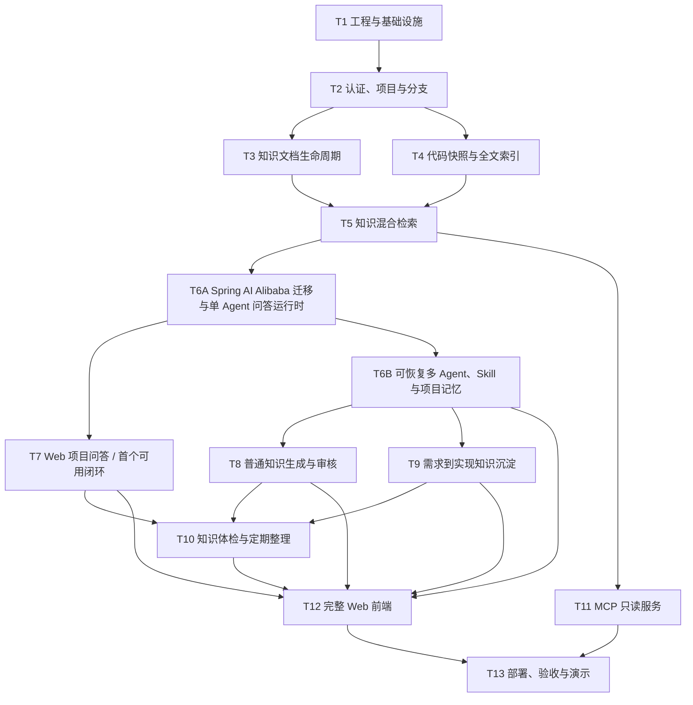

# LoreDock MVP 功能开发计划

| 属性 | 内容 |
|---|---|
| 计划目标 | 在不裁剪需求基线 P0/P1 功能的前提下，按功能任务逐项完成 LoreDock MVP |
| 计划方式 | 按功能和依赖关系拆分，不按日期拆分 |
| 当前进度 | T1、T2、T3、T4、T5、T6A 已完成；下一个任务为 T7 Web 项目问答；T7 完成后形成首个可用闭环 |
| 需求依据 | `项目业务上下文知识库_MVP需求文档_v1.0.md` |
| 执行方法 | 每个功能任务分别遵循 OpenSpec、接口优先和 TDD |

## 1. 使用说明

本计划用于确定 MVP 的功能开发顺序、任务边界和完成条件，不替代需求基线或有效 OpenSpec 规格。

原计划中的“T0：完整 MVP OpenSpec 与集中技术验证”已根据当前开发安排跳过，不再作为独立任务。实际开发从 T1 开始，但这不表示跳过项目的 SDD 要求：每个后续功能任务在实现前仍须创建或更新对应 OpenSpec change；依赖 DeepSeek、MCP、Embedding、Lucene 或索引切换的技术验证，放入首次使用该能力的功能任务中完成。

任务状态约定：

- `[ ]`：尚未开始；
- `[~]`：进行中；
- `[x]`：已完成，并满足本计划第 5 节的完成门禁。

### 首个可用闭环

为尽早验证 LoreDock 的核心用户价值，T4、T5、T6A、T7 构成首个可用闭环：管理员上传并发布知识、导入代码快照并建立索引，用户随后可以在指定项目和分支内进行混合检索与带引用问答。T7 完成后即可作为内部试用版本，不等待多 Agent 文档整理、MCP、知识体检和完整管理前端。

首个可用闭环不等同于需求基线定义的完整 MVP。T6B 继续补齐多 Agent、持久恢复、人在回路、项目记忆和完整 Skill 管理，T8～T13 继续完成知识生成、变更沉淀、知识治理、MCP、完整前端和最终验收。

## 2. 功能依赖关系

## 3. 功能任务

### [x] T1：工程骨架与基础设施

目标：建立后续业务功能共同依赖的可运行工程和基础设施。

功能范围：

- 建立 Java 21、Spring Boot 后端以及 Vue 3、TypeScript、Vite 前端；
- 建立 PostgreSQL、pgvector、Flyway 和 Docker Compose；
- 实现本地持久化文件存储接口，为后续 S3 适配保留稳定边界；
- 建立统一错误响应、参数校验、日志、审计字段和时间规范；
- 建立后台导入任务表、受控线程池和任务状态机；
- 配置单元测试、数据库集成测试及前端测试环境；
- 在本任务中冻结实际采用的 Spring Boot、Spring AI、pgvector 和 Lucene 版本。

完成条件：应用、数据库和前端可以统一启动；数据库迁移可以重复执行；后台任务能够成功结束或保留明确的失败信息。

### [x] T2：认证、项目与分支管理

目标：建立 Web、管理操作和 MCP 共用的身份及范围基础。

覆盖需求：FR-AUTH-01～03、FR-PROJ-01～04。

功能范围：

- 管理员账号和组内共享只读账号登录；
- 管理员与只读用户的写权限隔离；
- MCP Token 的独立认证边界；
- 项目创建、查看、启用和停用；
- 项目分支添加和查询，项目查询默认使用 `main`；
- 管理接口和只读接口分离；
- 支持准备两个验收项目，以及网络设计工具的两个分支。

重点验收：错误密码被拒绝；只读账号不能写入；停用项目不出现在普通查询入口；无效 MCP Token 无法访问内部内容。

### [x] T3：知识文档完整生命周期

目标：完成正式知识从导入、编辑、审核到退出检索的生命周期。

覆盖需求：FR-DOC-01～11。

功能范围：

- 新建和编辑 Markdown、纯文本知识；
- 上传 Markdown、纯文本以及包含 Markdown 的 ZIP；
- 展示批量导入的成功、失败和忽略结果；
- 支持通用、项目和分支三级知识范围；
- 维护标签、来源、原文件名、Wiki URL 和人工整理说明；
- 支持草稿、已发布和已归档状态；
- 只有管理员确认发布的文档进入正式检索；
- 支持新旧文档替代关系；
- 普通成员按项目和目录浏览文档；
- 文档变化后可手动触发重新索引。

重点验收：草稿不可检索；归档文档退出默认检索；分支文档不跨分支；ZIP 部分失败不会掩盖成功与失败明细。

### [x] T4：代码快照与 Lucene 检索

目标：为指定项目、分支和 commit 建立可恢复、可隔离的代码全文检索能力。

覆盖需求：FR-CODE-01～07。

功能范围：

- 通过 ZIP 导入本地代码快照，并关联项目、分支和 commit；
- 防止路径穿越、符号链接、压缩炸弹和超大文件风险；
- 排除依赖、构建产物、二进制、`.git`、`.env`、证书和密钥类文件；
- 使用 Lucene 建立文件路径与文件内容索引；
- 支持按路径和内容搜索，并受限读取代码片段；
- 为新快照建立独立索引 generation，验证成功后原子切换；
- 新索引失败时继续使用旧活动快照；
- 显示活动快照 commit、索引时间和变化提示。

重点验收：不同分支的同名文件严格隔离；敏感文件不会被索引；新索引失败不破坏旧查询入口；20 万行级脱敏或模拟代码可完成索引和查询。

### [x] T5：知识关键词、语义与混合检索

目标：建立严格遵守项目、分支、知识范围和发布状态的知识检索服务。

覆盖需求：FR-SRCH-01～06，以及需求文档第 5、6 节的范围规则。

功能范围：

- 对标题、正文和标签执行关键词检索；
- 使用 CPU 中文 Embedding 和 pgvector 执行语义检索；
- 融合关键词和向量结果并完成排序；
- 在查询层强制应用通用、项目、分支和发布状态过滤；
- 区分全局知识查询和项目查询；
- 支持按标签、知识类型和来源类型过滤；
- 返回范围、标题、片段、来源、更新时间和相关性；
- 建立 15～20 个真实问题的检索基准集。

重点验收：至少 80% 的有答案问题在 Top-5 中出现正确来源；任何入口都不发生跨项目或跨分支召回；分支无代码快照时仍可返回允许范围内的人工知识。

### [x] T6A：Spring AI Alibaba 迁移与单 Agent 问答运行时

目标：先完成 AI 技术栈迁移并建立受控、可追溯的单 Agent 问答运行时，为 T7 尽快形成可试用的检索问答闭环。

覆盖需求：FR-AGENT-01～07，以及 FR-AGENT-03 中的 `project_qa` 场景。

功能范围：

- 将现有 Spring Boot 4.1.0、Spring AI 2.0.0 基线切换到 Spring Boot 3.5.x、Spring AI 1.1.2 和 Spring AI Alibaba 1.1.2.x 正式版本；
- 通过隔离 PoC 从 Maven Central 可用正式构件中锁定 Spring Boot 3.5.x 和 Spring AI Alibaba 1.1.2.x 的具体补丁版本，并记录最终依赖树；
- 替换 MyBatis-Plus、Sa-Token 等 Boot 4 专用 Starter，清理不兼容或重复的 Spring AI 依赖，禁止同时混入 Spring AI 1.1.x 与 2.0.x；
- 重新运行 T1～T5 的单元测试、PostgreSQL 集成测试和应用启动检查，确认迁移没有破坏认证、项目范围、文档生命周期和检索行为；
- 基于 Spring AI Alibaba Agent Framework 定义单 Agent 运行适配边界，提供 DeepSeek `deepseek-v4-flash` OpenAI 兼容 `ChatModel` 实现和测试用 Fake Model；
- 加载并版本化 `project_qa` Skill，使用受控 `ReactAgent` 调用 T4 代码检索和 T5 知识混合检索能力；
- 在服务端强制校验工具白名单、项目、分支、Commit、知识范围和工具参数，禁止提示词扩大权限；
- 限制最大步骤数、超时、检索数量、上下文长度和模型调用次数；
- 保存 Skill 版本、模型、工具调用摘要、输入来源、引用、Token、耗时和运行状态，并提供 T7 所需的流式阶段事件；
- Agent 只允许读取授权证据并生成回答或知识缺口，不得修改或发布正式知识。

重点验收：依赖树中不存在 Spring Boot 4 或 Spring AI 2.0 残留；T1～T5 相关测试在新版本基线上通过；`project_qa` 能在指定项目和分支内调用检索工具并返回引用；越权工具调用、跨范围读取和无依据回答被拒绝；达到步骤或时间限制后安全停止。

### [ ] T6B：可恢复多 Agent、Skill 与项目记忆

目标：在 T6A 的统一运行时上补齐可从检查点恢复的多 Agent 文档工作流、项目记忆、人在回路和完整 Skill 管理，为 T8～T10 提供共同基础。

覆盖需求：FR-AGENT-09～16，以及 FR-AGENT-02～07 在文档生成和知识整理场景中的扩展；FR-AGENT-08 由 T10 完成业务接入。

功能范围：

- 使用 Spring AI Alibaba Graph 实现证据并行提取、编写、独立审查、最多一次返工和人工暂停的固定多 Agent 工作流；
- 加载并版本化 `document_writer`、`change_documenter`、`knowledge_audit`、`knowledge_curator` 及需求、代码、测试证据和独立审查角色 Skill；
- 为每个项目提供可编辑、可版本化的 `PROJECT_MEMORY.md`，并在运行开始时固定 Skill、项目记忆、工作流、模型和输出结构版本；
- 对所有角色复用 T6A 的工具白名单、范围校验和运行限制，并增加一次审查返工和并行模型调用上限；
- 使用 PostgreSQL 保存运行、步骤、事件和 Graph 检查点，使用 ObjectStorage 保存大型中间 Markdown 产物；
- 支持后端重启后把遗留运行标记为可恢复，由管理员手动从最后可靠检查点继续，已完成节点和幂等写入不得重复；
- 支持 Skill 启用、停用和版本更新；
- 支持证据不足或独立审查阻断时暂停，并由管理员补充方向、允许保留待核实项、要求重写或取消；
- 将写入能力限制为草稿、报告和知识缺口，禁止 Agent 发布正式知识；
- 将项目记忆版本快照接入 T7 问答运行，新版本只影响后续新运行，不阻塞 T7 首个可用版本交付。

重点验收：需求、代码和测试证据节点可以并行执行；失败运行保留成功中间产物且不产生半发布状态；修改 Skill 或项目记忆后新旧运行结果可区分；证据不足时能够暂停并接受管理员决定；IDEA 停止并重启后端后可继续原运行且不重复已完成节点或草稿写入。

### [x] T7：Web 项目问答与知识缺口

目标：为所选项目和分支提供带引用、可拒答、可反馈的可信问答，并形成 LoreDock 首个可内部试用的完整业务闭环。

覆盖需求：FR-QA-01～08，以及需求文档第 7.7、8 节。

功能范围：

- 用户选择项目和分支后提出自然语言问题；
- 自动使用 `project_qa` Skill；
- 流式展示回答；
- 展示知识文档、代码路径、分支、commit 和索引时间；
- 按“当前实现事实”和“业务设计原因”使用不同事实来源；
- 证据不足、分支无快照或超出范围时明确拒答；
- 代码与人工知识冲突时同时展示冲突和版本信息；
- 支持“没有回答、回答错误、知识已过期”反馈；
- 模型不可用时，文档浏览和普通检索继续可用。

重点验收：用户可以从已发布知识或活动代码快照获得流式回答；所有项目事实回答至少包含一个来源；无依据问题不编造；当前分支回答不使用其他分支代码冒充事实；模型不可用时仍可使用普通检索。

### [ ] T8：普通知识生成与审核发布

目标：允许 Agent 基于受控材料生成可追溯草稿，并由管理员完成审核发布。

覆盖需求：FR-KG-01～05。

功能范围：

- 管理员选择项目、分支、已有文档和有限代码片段；
- 复用统一多 Agent 文档工作流，由可用材料对应的证据角色提取依据，`document_writer` 生成 Markdown 草稿，独立审查角色检查后再进入人工审核；
- 保存源文档、代码快照、分支、commit、生成时间和模型信息；
- 单独展示各证据角色的中间产物、不确定项、来源冲突、独立审查问题和需要人工补充的事项；
- 管理员编辑、审核和发布草稿；
- 发布后触发知识索引更新；
- 所有模型生成内容禁止自动发布。

重点验收：生成内容经过证据提取和独立审查后始终先进入草稿；缺少某类材料时明确标记而不虚构结论；发布前普通检索和问答不可见；管理员发布后 Web 与 MCP 可以检索到同一文档。

### [ ] T9：需求到代码实现的知识沉淀

目标：把需求、PR、代码改动和测试证据整理为可审核、可双向追溯的知识单元。

覆盖需求：FR-CHANGE-01～10。

功能范围：

- 创建关联项目和目标分支的变更知识单元；
- 导入需求、PR 元数据、base/head commit、diff/patch、变更文件列表和测试说明；
- 使用固定多 Agent Graph 并行提取需求、代码和测试证据，再由 `change_documenter`/文档编写角色生成需求条目到模块、文件和变更摘要的映射；
- 从对应分支的代码快照补充读取有限上下文；
- 输出调用链、业务规则、接口、数据结构、配置、兼容性和测试证据；
- 单独列出未实现需求、实现偏差和无法确认的关系；
- 使用上下文隔离的独立审查角色检查无引用事实、版本混淆、遗漏证据和虚假映射；最多自动返工一次，仍有阻断问题时等待人工指导；
- 展示各 Agent 阶段、中间产物、引用、审查返工历史和人工决定；
- 草稿经管理员审核后发布；
- 实现需求、PR、commit、文件路径和知识文档双向追溯；
- 支持连续导入多个历史变更；
- PR head commit 与活动快照不一致时提示版本差异。

重点验收：需求、代码和测试证据角色可以并行工作；主要实现结论可以追溯到原始材料；独立审查不读取编写角色的隐藏推理；无法确认的映射不会被模型猜测补全；人工可以在证据不足时指导后续整理；发布文档和变更知识单元可以互相访问。

### [ ] T10：知识体检、整理建议与定期任务

目标：发现知识过期、重复、冲突和缺口，并以报告或草稿形式提供受控修订建议。

覆盖需求：FR-KG-06～08、FR-AGENT-08。

功能范围：

- 管理员手动运行 `knowledge_audit`；
- 检测文档引用的代码快照已更新；
- 检测多篇文档内容疑似重复；
- 检测文档与当前分支代码快照疑似冲突；
- 汇总问答中反复出现的知识缺口；
- 使用 `knowledge_curator` 生成合并、补充、归档和更新建议；
- 整理建议复用统一运行时并由独立审查角色检查，证据不足时保留待核实项或等待人工；
- 将整理建议转换为待审核草稿；
- 实现每周知识整理任务；
- 任务失败只保存失败信息，不影响已发布知识和检索；
- 定期任务不得自动修改或发布正式知识。

### [ ] T11：Streamable HTTP MCP 只读服务

目标：让 Claude Code 等本地 Agent 使用与 Web 同源、同范围规则的原始业务上下文。

覆盖需求：FR-MCP，以及需求文档第 7.8 节。

功能范围：

- 实现 `knowledge_search`；
- 实现 `document_read`；
- 实现 `code_search`；
- 三个工具复用 Web 和内部 Agent 的查询服务；
- 返回项目、分支、来源、文件路径、commit、更新时间、相关性和截断状态；
- 使用共享 Token，保持只读，不调用 DeepSeek 生成最终答案；
- 验证 Claude Code 的连接、中文参数、工具调用和错误响应兼容性。

重点验收：Claude Code 能获取与 Web 同源的知识；错误 Token 被拒绝；MCP 不能执行写入、命令或任意网络访问。

### [ ] T12：完整 MVP Web 前端

目标：提供需求基线定义的全部最小 Web 页面和管理入口。

功能范围：

- 登录页；
- 项目列表页及通用业务知识入口；
- 项目详情页中的项目、分支、文档目录和维护功能；
- 代码快照上传、索引状态和重新索引；
- 变更知识单元、需求和 PR 材料导入；
- 普通知识草稿和变更知识草稿的生成、编辑、审核和发布；
- 项目 Agent 运行列表和运行详情，展示阶段、并行角色、中间产物、来源、审查返工、错误和版本；
- 等待人工时提供补充方向、允许保留待核实项、要求重写、恢复、重试和取消入口；
- 项目 `PROJECT_MEMORY.md` 与全局 Skill 的 Markdown 编辑、预览、版本、启停和权限入口；
- 知识体检和整理报告；
- 问答页中的项目与分支选择、流式回答、引用、冲突和缺口反馈；
- 管理员和只读用户权限在界面与接口两层生效。

完成条件：管理员可以通过 Web 完成全部数据准备、Agent 运行干预、项目记忆与 Skill 管理和审核操作；只读用户只能浏览、搜索、问答、查看授权运行和反馈。

### [ ] T13：集成、部署、验收与演示

目标：将所有功能组合为可重复部署和现场演示的完整 MVP。

功能范围：

- 完成 Docker Compose 内网单机部署；
- 编写数据库、文件、模型、索引和 Token 配置说明；
- 验证数据备份、恢复和索引重建；
- 导入两个项目、两个分支、Wiki Markdown、场景包文档和真实变更样例；
- 执行 15～20 个检索问题集；
- 完成 Web、Agent、MCP、权限、安全和故障恢复验收；
- 验证多 Agent 并行证据、独立审查、人工介入、项目记忆隔离和后端重启后的手动恢复；
- 编写 README、架构、数据模型、Skill、MCP 配置和已知限制；
- 固化现场演示脚本和验收结果。

完成条件：需求文档第 11 节的全部 MVP 验收项通过，最终交付物与需求文档第 13 节一致。

## 4. 完整功能覆盖说明

本计划保留需求基线中的全部 P0 和 P1 功能，包括但不限于：

- 项目停用、批量导入结果和知识替代关系；
- 五个场景 Skill、多 Agent 角色 Skill、项目记忆及其版本化配置管理；
- 历史变更的连续沉淀；
- 快照变化提示和搜索条件过滤；
- 手动知识体检、整理建议和每周整理任务；
- Web、内部 Agent 与 MCP 的统一范围和权限规则。

需求基线已经明确排除的后续能力，如自动连接公司 Wiki/Git/Welink、全量代码向量化、完整 AST/调用图、复杂组织权限和自动发布，不属于本计划。

## 5. 每个任务的完成门禁

每个功能任务只有同时满足以下条件，才能从 `[ ]` 或 `[~]` 更新为 `[x]`：

1. 已创建或更新对应 OpenSpec change，且 proposal、specs、必要的 design 和 tasks 与实现一致；
2. 后端先定义 API 契约、DTO、领域端口或 Java 接口；
3. 已先编写带中文业务说明的失败测试，并确认测试因为目标行为缺失而失败；
4. 已完成最小实现并使相关测试通过，必要重构处于测试保护下；
5. 公共接口、实现类和关键业务分支具备符合 `AGENTS.md` 的中文注释；
6. 已运行与风险相称的单元、集成、契约或端到端验证；
7. OpenSpec `tasks.md` 已同步，必要文档已经更新；
8. 已同步主规格并归档完成的 change，且没有遗留未说明的必需工作。

## 6. Agent 执行约定

Agent 接到某个功能的开发请求时，应先读取本计划并确认对应任务的目标、范围、依赖和状态，再读取需求基线与当前 OpenSpec 工件。Agent 不得因为本计划列出了任务，就跳过 OpenSpec、接口优先、TDD、中文测试注释或中文 Javadoc。

如果实现过程中发现本计划与需求基线或有效 OpenSpec 冲突，应按 `AGENTS.md` 的事实优先级处理，并同步修订本计划，避免后续 Agent 继续依赖过期任务信息。
