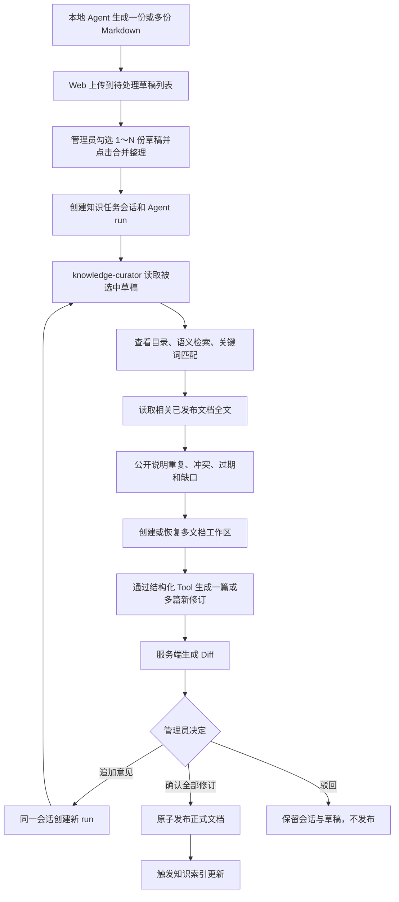
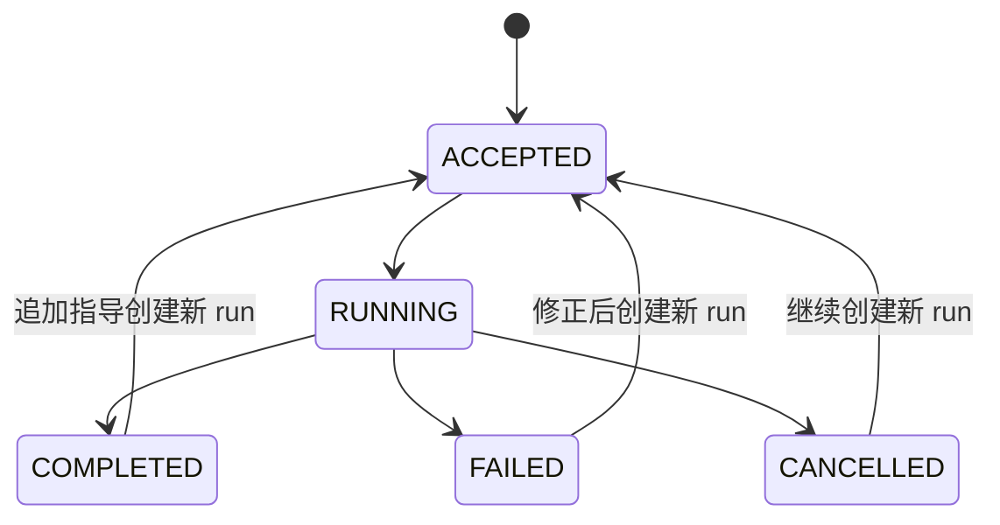

# Markdown 知识提交与冲突整理详细流程

| 属性 | 内容 |
|---|---|
| 文档版本 | v1.1 |
| 文档日期 | 2026-08-02 |
| 文档状态 | MVP 详细流程 |
| 需求基线 | [`对话式多文档知识整理流程_需求讨论稿.md`](./对话式多文档知识整理流程_需求讨论稿.md) |

## 1. 目标与边界

本流程解决的问题是：开发者已经在本地根据需求、PR、最新代码和测试结果生成 Markdown 业务知识后，如何将它安全整合进 LoreDock 正式知识库。

职责边界：

- 本地开发 Agent 负责读取需求、PR、代码和测试，提炼初始 Markdown；
- LoreDock 负责接收 Markdown，与平台已发布知识比对，整理重复、冲突、过期和缺口，并产生待审核 Diff；
- 管理员负责最终判断和发布；
- LoreDock 不导入原始需求、PR diff、完整代码或测试输出，不在服务端建设需求到代码的生成流水线；
- 知识整理只使用一个 Agent 和一份 `knowledge-curator` Workflow Skill，不使用子 Agent 或多 Agent。

## 2. 主流程

## 3. Web 草稿池与合并入口

### 3.1 Markdown 上传

上传操作只创建待处理草稿，不创建任务会话，也不调用模型。输入包括：

- 项目标识，来自 Web 当前项目上下文；
- 一份或多份 `.md` 文档；
- 每份文档的文件名、建议标题和建议目录；
- 可选的整理目标或人工说明；
- 可选的客户端来源说明：需求编号、PR 编号或 URL、commit、本地 Skill、模型和生成时间；
- 稳定幂等键，用于防止页面重试创建重复草稿。

每份 Markdown 按现有文档导入规则创建为独立 `DRAFT` 文档，出现在项目待处理草稿列表。

### 3.2 勾选合并

管理员从同一项目的待处理草稿列表勾选 `1～N` 份文档，填写可选合并目标，再点击“合并整理”。服务端需要：

- 校验勾选文档全部属于当前项目且状态为 `DRAFT`；
- 创建一个长期知识任务会话和首轮 Agent run；
- 在会话中固定本次勾选的草稿 ID 集合，运行期间不允许模型增删；
- 将勾选草稿作为不可变输入，Agent 不直接覆盖它们；
- 一次任务最多形成 10 份有效工作文档；Agent 按稳定知识主题决定合并或拆分，不按输入文件数量机械输出。

勾选一份草稿也是有效的，用于与平台已发布知识执行冲突检查、整理和润色。

## 4. 单 Agent 与 Workflow Skill

`knowledge-curator` 是本流程唯一知识整理 Agent。Workflow Skill 描述业务目标、工具使用策略和安全规则，但不把每一步写成 Java 固定流程。

Skill 应要求 Agent：

1. 先读取本次固定勾选的待处理草稿，确认主题、业务规则、关键术语和建议目录；
2. 按需要查看知识目录，自主生成语义查询和关键词；
3. 对相近主题使用语义检索，对具体术语、字段、数值或规则使用关键词匹配；
4. 在做冲突判断前读取相关文档全文，不仅根据标题或搜索片段下结论；
5. 通过原生 AssistantMessage 向用户说明关键重复、冲突、过期和缺口，不调用专用警告记录 Tool；
6. 对可从授权来源明确解决的问题修订工作文档，无法确定时在最终回复中提出具体问题并结束本轮；
7. 修改草稿时先读取当前修订，再使用带基础修订号和幂等键的结构化操作；
8. 生成 Diff，并在最终消息中只总结实际已提交的工作文档修订、风险和待确认问题；
9. 不调用发布能力，不修改或归档已发布文档。

Skill 可以根据实际命中结果调整搜索次数和顺序。Java 不应写死“搜索→复核→修改”的固定步骤表。

## 5. 平台 Tool

### 5.1 勾选草稿

| Tool | 模型输入 | 输出 | 服务端约束 |
|---|---|---|---|
| `selected_draft_list` | 无 | 草稿 ID、文件名、标题、长度和来源说明摘要 | 只列出启动任务时固定的勾选草稿 |
| `selected_draft_read` | `documentId`、`cursor`、`maxCodePoints` | Markdown 分段、起止范围、`nextCursor`、总码点数和截断标记 | 只读当前任务固定的不可变输入；单次最多 12000 码点 |

### 5.2 平台知识目录与读取

| Tool | 模型输入 | 输出 | 服务端约束 |
|---|---|---|---|
| `knowledge_directory_list` | 可选目录前缀 | 目录树、文档计数 | 只返回当前项目和允许的通用知识 |
| `knowledge_document_list` | 目录、页码和上限 | 文档 ID、标题、目录、更新时间 | 只列出已发布文档 |
| `knowledge_document_read` | `documentId`、`cursor`、`maxCodePoints` | Markdown 分段、`nextCursor`、总码点数、来源与截断标记 | 不接受任意文件路径，按文档 ID 校验范围；单次最多 12000 码点 |

### 5.3 检索与匹配

| Tool | 模型输入 | 输出 | 用途 |
|---|---|---|---|
| `knowledge_search` | 自然语言查询、返回上限 | 相似文档 ID、标题、片段、相关度、证据 ID | 发现表达不同但含义相近的知识 |
| `knowledge_grep` | 关键词或短语、可选目录/文档范围、返回上限和上下文行数 | 文档 ID、标题、匹配行、有限上下文、证据 ID 和截断标记 | 确认具体术语、数值、字段名或规则是否存在 |

`knowledge_grep` 是对平台内已发布 Markdown 的受限匹配，不是 Shell `grep`，不接受服务器路径或访问任意文件系统。

### 5.4 判断、警告与提问

重复、冲突、过期、缺口、风险和待确认问题不使用专用 Tool。模型在真实 AssistantMessage 中说明判断与依据，并在本轮最终回复中汇总；工作文档只保存有依据、可直接发布的长期知识，不写入“待确认事项”或执行过程。

### 5.5 草稿与 Diff

| Tool | 核心输入 | 输出 |
|---|---|---|
| `draft_create` | 标题、可选已发布基线文档 ID、幂等键 | 草稿 ID、修订 `0`、基线 Markdown 和稳定区块 ID |
| `draft_read` | 草稿 ID、可选修订号 | Markdown、区块、来源和修订摘要 |
| `draft_update` | 草稿 ID、基础修订号、幂等键、结构化区块操作、来源引用和变更摘要 | 新的不可变修订 |
| `draft_rename` | ADD 草稿 ID、基础修订号、幂等键、新标题和变更摘要 | 正文不变且标题已更正的新修订 |
| `draft_diff` | 草稿 ID、起始修订/正式基线、目标修订 | 服务端计算的 Markdown Diff、新增/删除统计和截断标记 |

新文档的 Diff 基线为空文档；如果 Agent 认为候选知识应整合进现有文档，必须创建绑定该已发布文档的草稿，Diff 基线为该正式文档。Agent 不直接修改正式文档。

每个任务最多允许 10 份有效工作文档。同一正式基线在工作区中只有一份修改草稿；新增文档必须使用已存在目录。后续运行先调用 `workspace_document_list` 恢复当前工作区，再读取和修订相关文档。

## 6. 冲突处理规则

Agent 可以自动修改本次候选草稿中的：

- 重复段落和无意义重复表达；
- 有明确平台来源支持的术语统一；
- 可明确推导的适用范围补充；
- 被已授权、更明确来源直接否定的候选草稿表述；
- 可以安全整合到一篇待审核草稿的重复知识。

Agent 必须保留待人工判断的：

- 两份已发布文档结论相反且无法确定权威方；
- 冲突可能来自地区、客户、版本或时间范围，但现有来源未说明；
- 候选 Markdown 包含平台知识不能支持的新事实，且客户端来源只是未验证声明；
- 修订将导致正式知识删除、归档或改变关键业务规则。

## 7. 多轮对话

一轮 Agent run 正常结束后，会话不结束。管理员可继续输入：

- “不要新建文档，整合到退款规则。”
- “保留企业订单 14 天规则，补充适用范围。”
- “这两条规则按地区区分，请继续修改。”
- “删除只对测试环境成立的部分。”
- “再用关键词检查一次是否还有重复文档。”

追加指导创建新 run，并使用：

- 同一项目和会话；
- 启动时固定的勾选草稿；
- 有界的历史用户消息和各轮最终 Agent 回复；
- 当前多文档工作区的最新修订；
- 管理员新的用户消息。

新 run 产生新修订和新 Diff，不覆盖之前的消息、运行或修订历史。历史 Tool 调用、参数、结果和过程消息不重复注入模型；最新执行事实由 Agent 通过工作区 Tool 读取。

## 8. 审核与发布

审核页对当前全部有效工作文档展示：

- 关联的勾选输入草稿；
- 每篇文档的标题、目录、基线文档和当前修订；
- 本轮净变更以及空基线或正式文档基线到当前修订的累计 Diff；
- Agent 最终回复中的重复、冲突、过期、缺口、来源、风险和待人工问题；
- 默认折叠的真实 Tool 调用过程。

管理员可以：

- 追加指导让 Agent 继续修改；
- 直接编辑草稿并产生新修订；
- 放弃任务，保留历史但不发布；
- 明确审核完整修订集合并原子发布。

发布必须由管理员的独立入口执行。发布成功后创建或替代正式文档、把本次勾选的原草稿归档退出待处理草稿池，再触发知识索引更新。Agent 不得获得该入口的 Tool。ADD 工作文档允许发布到尚无已发布文档的全新逻辑目录，目录浏览树随已发布文档自然生长。

## 9. Web 页面最小入口

项目页签只保留“知识文档、项目问答、草稿、知识任务、项目设置”。原设计中的“变更知识、待审核草稿、整理报告”不再作为独立页面：材料和待审核输入统一进入“草稿”，关键判断由 Agent 最终回复承载，文档事实由修订和 Diff 承载。

“草稿”页面需要以下最小能力：

1. 选择或拖入一份或多份 `.md` 文档，填写可选目录和来源说明；
2. 上传成功后在待处理草稿列表查看，不自动跳转或调用模型；
3. 勾选同一项目的 `1～N` 份草稿，填写可选合并目标，点击“合并整理”；
4. 进入新建的知识任务会话页，查看固定输入、系统消息、用户指导、Agent 最终消息和实际 Tool 事件；
5. 查看折叠的执行过程和安全 Markdown 最终回复；
6. 查看本轮多文档变更、累计修订和 Diff；
7. 输入新指导让 Agent 继续修改；
8. 直接编辑、驳回或明确确认指定修订。

## 10. 运行状态与恢复

任务会话是长期容器，Agent run 是每一轮独立运行。当前 MVP 不恢复同一个 run；Agent 需要补充信息时在最终回复中提问并正常结束，用户回复后创建新 run。所有有副作用 Tool 必须幂等，已经提交的工作修订不得重复创建。

## 11. MCP 提交阶段

MVP 已提供 `knowledge_draft_submit` MCP Tool，但整理、对话和发布流程仍只在 Web 发起。

MCP Tool：

- 复用 Web 入口背后的同一提交 Service；
- 单次接收项目和一份 Markdown，并接收标题、建议目录、来源说明和幂等键；客户端提交多份文件时逐份调用；
- 每次只创建一份待处理 `DRAFT` 文档并返回草稿 ID，不创建会话、不返回 run、不调用 Agent；
- 使用独立写入权限，只读 MCP Token 不得调用；
- 不允许 MCP 直接调用草稿发布；
- 不复制 Web 的上传 Service，后续仍由管理员在 Web 勾选草稿启动合并。

## 12. 失败与安全行为

- 上传文档超数量或长度上限时，在创建任何草稿前明确拒绝；
- 任意一份上传文档不是可读 UTF-8 Markdown 时，返回具体文件错误，不伪造成功任务；
- 勾选为空、跨项目、包含非 `DRAFT` 文档或不存在文档时，在创建会话前原子拒绝；
- 任务的项目、操作人、会话和 run 范围由服务端 ToolContext 固定，不暴露给模型修改；
- 搜索、匹配和全文读取仅使用已发布且在当前范围内的文档；
- Markdown 中的命令、提示和链接不能扩大 Tool 集、执行 Shell、访问任意 HTTP 或发布文档；
- 搜索、全文和匹配结果设置条数、字符和分页上限，Agent 运行设置步骤、模型调用、Tool 调用和总超时上限；
- 发布或索引任务失败时保留明确状态，不得把未完成草稿标记为已进入正式检索。

## 13. MVP 验收场景

1. 准备一个项目和至少三篇已发布知识，其中包含一组可验证的重复或冲突；
2. 在 Web 中上传一份或多份本地 Agent 生成的 Markdown，确认它们仅进入待处理草稿列表；
3. 勾选同一项目的一份或多份草稿并点击“合并整理”，确认此时才创建会话和 run；
4. 确认运行中实际发生了勾选草稿读取、目录列出、语义检索、关键词匹配和平台文档全文读取；
5. 确认关键判断、风险和待确认问题出现在最终回复而不是工作文档或专用警告卡中；
6. 确认 Agent 将可安全解决的问题修订到一篇或多篇工作文档，不能确定的问题通过正常对话交给人工；
7. 查看本轮与累计服务端 Diff，追加一轮用户指导，确认新 run 理解上一轮问答并从当前工作区继续；
8. 管理员明确审核完整修订集合并原子发布，确认发布前文档不可检索，发布并完成索引更新后可被 Web 问答和知识搜索命中；
9. Web 流程通过后，用 MCP 提交同类 Markdown，确认只返回新建待处理草稿 ID，不自动创建会话或 run。
