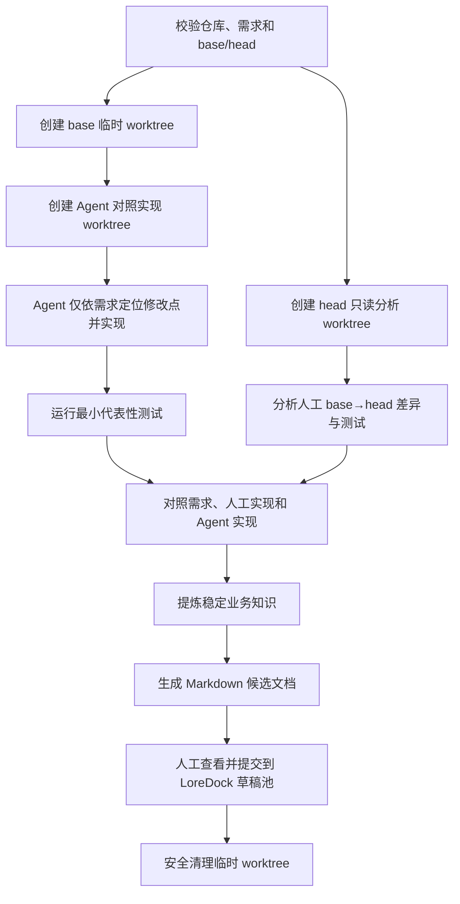

# 本地 PR 业务知识提炼 Skill 详细流程

| 属性 | 内容 |
|---|---|
| 文档版本 | v1.0 |
| 文档日期 | 2026-08-02 |
| 文档状态 | 本地 Workflow Skill 规划 |
| 平台衔接 | [`Markdown知识提交与冲突整理详细流程.md`](./Markdown知识提交与冲突整理详细流程.md) |

## 1. 目标与事实边界

该 Skill 运行在开发者本地，读取需求文档、PR 实际代码、测试和 Git 历史，生成可提交给 LoreDock 的 Markdown 业务知识。

三类材料的事实地位不同：

- 需求文档表达预期业务行为；
- 人工完成的 PR/head commit 表达实际交付行为；
- Agent 从 base commit 独立生成的对照实现只是差异分析工具，不能当作业务事实或代码基线。

## 2. 输入

必填输入：

- Git 仓库；
- 需求文档；
- PR 的 base commit 和 head commit，或能稳定解析出两者的 PR 引用。

可选输入：补充设计说明、验收用例、测试命令、目标 LoreDock 项目和文档目录。

## 3. 本地工作流



### 3.1 准备与隔离

1. 确认 base/head 均可解析，且 base 是 head 的合理对比基线。
2. 检查开发者当前工作区，不覆盖未提交改动，不切换用户当前分支。
3. 使用唯一临时目录创建 worktree：
   - `base` worktree：固定在变更前 commit；
   - `agent` worktree：从 base 创建临时分支，用于 Agent 对照实现；
   - `head` worktree：固定在人工实现 commit，只用于读取和测试。
4. 记录临时 worktree 的精确路径和 commit，清理时只操作这些已确认目标。

### 3.2 从需求生成独立对照实现

Agent 先把需求转换为业务意图、验收行为、边界和非目标清单，再在 `agent` worktree 中：

1. 根据需求和现有代码定位受影响模块、契约和测试；
2. 实现一份能满足需求的独立对照方案；
3. 运行与需求最相关的最小测试集；
4. 保留修改差异、测试结果和未确认假设，不合并、不推送该临时分支。

### 3.3 三方对照

分别检查：

- 需求 vs 人工实现：哪些预期行为已交付、偏离或未实现；
- 需求 vs Agent 实现：需求在当前代码中可能落地到哪些稳定业务点；
- 人工实现 vs Agent 实现：区分“同一业务行为的不同代码写法”和“真正的业务行为差异”。

差异归类为：行为一致但实现不同、人工额外实现、需求未落地、实现与需求偏差、Agent 未经证实假设、测试缺口。

## 4. 业务知识提炼规则

应输出：

- 业务背景、目标和非目标；
- 用户可观察流程、触发条件和结果；
- 业务规则、适用范围、数据语义和重要失败行为；
- 已有证据支持的兼容原因、历史决策和限制；
- 验收行为与实际测试结果；
- 需求与交付的偏差、仍无法确认的问题；
- 来源元数据，如需求标识、PR、base/head commit 和生成时间。

默认不输出：

- 类名、方法名、行号和内部调用链；
- 某次重构的临时文件布局或代码写法；
- 无法从需求、人工实现或测试中验证的猜测；
- 只对调试有用、容易随代码变化过期的实现细节。

只有当某个技术限制本身构成稳定业务约束时，才在业务知识中保留。

## 5. Markdown 输出结构

```markdown
# <业务主题>

## 背景与目标
## 适用范围与非目标
## 业务流程
## 业务规则与失败行为
## 验收与验证证据
## 需求与实际交付差异
## 待确认问题
## 来源
```

一个 PR 可以产生多份主题独立的 Markdown，但不应为每个代码文件机械生成一份文档。

## 6. 安全与清理

- 禁止在用户活动工作区中执行破坏性清理、切换分支或覆盖未提交改动；
- 临时分支不推送，Agent 对照实现不合并回 PR；
- 安装依赖或执行项目脚本前先遵守仓库安全规范；
- 清理前重新校验临时 worktree 路径与 Git 注册记录；
- 对照实现失败不阻止分析人工 PR，但输出必须标明少了哪一类对照证据。

## 7. 平台衔接

本地 Skill 首先将 Markdown 保存在本地供开发者查看。MVP 通过 Web 上传到 LoreDock 待处理草稿池；MCP 写入 Tool 完成后可直接提交，但仍只创建待处理草稿。两种入口都不自动启动合并 Agent，后续必须由管理员在 Web 勾选草稿。
